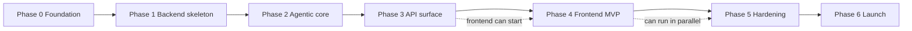

# Kaziro — Build Plan

**Status**: Active
**Last updated**: 2026-04-23
**Source**: Operational decomposition of `[docs/design/roadmap.md](docs/design/roadmap.md)`.

> The single, in-repo, task-by-task plan for building Kaziro from the
> ground up. Use this file to pick the next unblocked task; cross
> finished tasks off in the same PR that delivers them.

## How to use this file

1. Find the lowest-numbered unblocked task with status `[ ]`.
2. Mark it `[~]` (in progress) on the branch you create.
3. Implement against the **Acceptance criteria**.
4. Open a PR with the task ID in the title — e.g.
  `feat(T1.4): add user_profiles model`.
5. On merge, flip the task to `[x]` (done) in the same PR diff.
6. If a task uncovers new work, add it as
  `T<phase>.<next>` at the **end** of the phase — never re-number
   existing tasks.

## Legend

### Status

| Marker | Meaning            |
| ------ | ------------------ |
| `[ ]`  | Todo               |
| `[~]`  | In progress        |
| `[x]`  | Done               |
| `[-]`  | Blocked (note why) |

### Size (rough effort)

| Tag | Effort       |
| --- | ------------ |
| S   | ≤ 0.5 day    |
| M   | 0.5 – 2 days |
| L   | 2 – 5 days   |
| XL  | 1+ week      |

### Priority

| Tag | Meaning   |
| --- | --------- |
| P0  | Must have |
| P1  | Should    |
| P2  | Nice      |

## Conventions

- **Task IDs are immutable.** Once `T2.4` is assigned, never re-use or
renumber it. New work appended as `T2.<next>` even if it disturbs
reading order.
- **Dependencies** must be `[x]` before a task starts.
- **Every task** updates docs / `AGENTS.md` / ADRs in the same PR if it
changes behaviour or paths.
- **Tests are part of done.** "Tests added/updated" appears in
acceptance criteria for every task that ships behaviour.

## Critical-path summary

## Progress dashboard

Update the counts as tasks flip to `[x]`. Last refreshed at the end of
Phase 0.

| Phase                             | Done | Total | %    |
| --------------------------------- | ---- | ----- | ---- |
| Phase 0 — Foundation              | 9    | 9     | 100% |
| Phase 1 — Backend skeleton & data | 12   | 12    | 100% |
| Phase 2 — Agentic core            | 10   | 12    | 83%  |
| Phase 3 — API surface             | 14   | 16    | 88%  |
| Phase 4 — Frontend MVP            | 13   | 13    | 100% |
| Phase 5 — Production hardening    | 0    | 11    | 0%   |
| Phase 6 — Public launch           | 0    | 6     | 0%   |
| **Total**                         | 58   | 79    | 73%  |

---

# Phase 0 — Foundation

**Goal**: Any contributor can boot the stack in one command and start
writing code. See `[docs/design/roadmap.md#phase-0--foundation](docs/design/roadmap.md)`.

### T0.1 — Backend `pyproject.toml` + `uv.lock`

- **Status**: [x]
- **Size**: M
- **Priority**: P0
- **Depends on**: none
- **Owner**: 

**Description**
Create the Python project metadata for `backend/`. Pin every runtime
and dev dependency from `[docs/reference/dependencies.md](docs/reference/dependencies.md)`.
Configure `ruff`, `mypy`, and `pytest` in the same file. Generate a
reproducible `uv.lock`.

**Files**

- `backend/pyproject.toml`
- `backend/uv.lock` (generated)
- `backend/.python-version` (`3.12`)

**Acceptance criteria**

- `cd backend && uv sync` installs cleanly on a fresh checkout.
- `uv run ruff check .` and `uv run ruff format --check .` exit 0
on a noop tree.
- `uv run mypy backend` exits 0 on a noop tree (allow empty package).
- All deps from `[docs/reference/dependencies.md](docs/reference/dependencies.md)`
present at the documented version range.
- `tool.ruff.line-length = 100`, `tool.mypy.strict = true`.

**References**

- `[docs/reference/dependencies.md](docs/reference/dependencies.md)`
- `[backend/AGENTS.md](backend/AGENTS.md)`
- `[.cursor/rules/002-backend.mdc](.cursor/rules/002-backend.mdc)`

### T0.2 — Frontend SvelteKit scaffold

- **Status**: [x]
- **Size**: M
- **Priority**: P0
- **Depends on**: none
- **Owner**: 

**Description**
Bootstrap the SvelteKit 2 + Svelte 5 (runes) project with Tailwind,
DaisyUI, TanStack Query, Vitest, and Playwright. Establish the
folder layout from `[frontend/AGENTS.md](frontend/AGENTS.md)`.

**Files**

- `frontend/package.json`
- `frontend/pnpm-lock.yaml`
- `frontend/svelte.config.js`
- `frontend/vite.config.ts`
- `frontend/tailwind.config.ts`
- `frontend/postcss.config.js`
- `frontend/tsconfig.json`
- `frontend/playwright.config.ts`
- `frontend/src/app.html`
- `frontend/src/app.d.ts`
- `frontend/src/app.css`
- `frontend/src/routes/+layout.svelte`, `+page.svelte`
- `frontend/.gitignore`

**Acceptance criteria**

- `cd frontend && pnpm install && pnpm dev` serves on `:5173` with
a placeholder home page.
- `pnpm build` produces a successful SvelteKit production build.
- `pnpm lint` (ESLint + svelte-check) and `pnpm format`
(prettier --check) exit 0.
- `pnpm test` (Vitest) runs an empty suite and exits 0.
- Tailwind, DaisyUI, and TanStack Query installed at versions in
`[docs/reference/dependencies.md](docs/reference/dependencies.md)`.
- Folder structure matches `[frontend/AGENTS.md](frontend/AGENTS.md)`.

**References**

- `[docs/architecture/05-frontend-architecture.md](docs/architecture/05-frontend-architecture.md)`
- `[frontend/AGENTS.md](frontend/AGENTS.md)`
- `[.cursor/rules/003-frontend.mdc](.cursor/rules/003-frontend.mdc)`
- [ADR-0007](docs/decisions/ADR-0007-frontend-sveltekit.md)

### T0.3 — `backend/config.py` Pydantic Settings

- **Status**: [x]
- **Size**: S
- **Priority**: P0
- **Depends on**: T0.1
- **Owner**: 

**Description**
Implement the singleton `Settings(BaseSettings)` that reads every env
var documented in `[docs/reference/env-vars.md](docs/reference/env-vars.md)`.
Required vars have no default — boot must fail fast when they are
missing.

**Files**

- `backend/config.py`
- `backend/__init__.py`

**Acceptance criteria**

- All vars from `[docs/reference/env-vars.md](docs/reference/env-vars.md)`
represented with proper types.
- `from backend.config import settings` returns a singleton
instance.
- Boot fails with a clear `ValidationError` if any required var
is missing.
- Unit test exercises the failure mode and a happy boot.

**References**

- `[docs/reference/env-vars.md](docs/reference/env-vars.md)`
- `[.cursor/rules/002-backend.mdc](.cursor/rules/002-backend.mdc)`

### T0.4 — `.env.example`

- **Status**: [x]
- **Size**: S
- **Priority**: P0
- **Depends on**: T0.3
- **Owner**: 

**Description**
Commit a placeholder env file at the repo root that mirrors every
variable in `[docs/reference/env-vars.md](docs/reference/env-vars.md)`.
Use clearly fake values for secrets (`changeme`, `xxx`).

**Files**

- `.env.example`

**Acceptance criteria**

- Every required and optional env var present.
- No real credentials checked in.
- Comments group vars by section (App / DB / Supabase / Redis /
Celery / OpenRouter / Integrations / Observability / Frontend).
- `.gitignore` updated so real `.env` files cannot be committed.

**References**

- `[docs/reference/env-vars.md](docs/reference/env-vars.md)`

### T0.5 — Root `Makefile`

- **Status**: [x]
- **Size**: S
- **Priority**: P1
- **Depends on**: T0.1, T0.2
- **Owner**: 

**Description**
One-stop convenience commands so contributors don't memorise tool
invocations. Targets wrap `uv`, `pnpm`, `docker compose`, and
`alembic`.

**Files**

- `Makefile`

**Acceptance criteria**

- Targets: `dev`, `dev-backend`, `dev-frontend`, `dev-worker`,
`dev-beat`, `test`, `test-backend`, `test-frontend`, `lint`,
`format`, `migrate`, `migration`, `seed`, `clean`, `down`,
`logs`.
- `make help` lists every target with a one-line description.
- `make dev` boots the docker-compose stack from T0.6.

**References**

- `[AGENTS.md](AGENTS.md)` "Where to run what"
- `[docs/architecture/08-deployment.md](docs/architecture/08-deployment.md)`

### T0.6 — Root `docker-compose.yml`

- **Status**: [x]
- **Size**: M
- **Priority**: P0
- **Depends on**: T0.1, T0.2, T0.3
- **Owner**: 

**Description**
Local-dev orchestration of `postgres` (with `pgvector`), `redis`,
`backend` (uvicorn), `worker` (Celery), `beat` (Celery Beat), and
`frontend` (Vite). Healthchecks on every service.

**Files**

- `docker-compose.yml`
- `infra/docker/postgres/init.sql` (creates `pgvector` extension)
- `backend/Dockerfile` (multi-stage)
- `frontend/Dockerfile` (multi-stage)
- `infra/docker/.dockerignore`

**Acceptance criteria**

- `docker compose up` brings all services to `healthy` within 60s.
- Postgres exposes `5432`, Redis `6379`, backend `8000`, frontend
`5173`.
- `pgvector` extension is created automatically on first boot.
- `docker compose down -v` cleans up volumes.
- Backend container reads from a mounted `.env`.

**References**

- `[docs/architecture/08-deployment.md](docs/architecture/08-deployment.md)`

### T0.7 — Structlog + Prometheus scaffolding

- **Status**: [x]
- **Size**: M
- **Priority**: P0
- **Depends on**: T0.3
- **Owner**: 

**Description**
Configure `structlog` (JSON in prod, console in dev) once at app
startup. Define the metric registry in `backend/metrics.py` per
`[docs/architecture/06-observability.md](docs/architecture/06-observability.md)`.

**Files**

- `backend/logging_config.py`
- `backend/metrics.py`
- `backend/main.py` (initial app factory)

**Acceptance criteria**

- `from backend import logger` returns a configured structlog
bound logger.
- Logs render as JSON when `APP_ENV=production`, console-pretty
otherwise.
- `backend/metrics.py` defines the catalog from
`[docs/architecture/06-observability.md](docs/architecture/06-observability.md)`:
`kaziro_pipeline_jobs_total`, `kaziro_agent_duration_seconds`,
`kaziro_evaluation_classification_total`,
`kaziro_llm_tokens_used_total`,
`kaziro_api_request_duration_seconds`,
`kaziro_celery_queue_depth`,
`kaziro_external_api_calls_total`,
`kaziro_active_pipeline_tasks`.
- Sensitive-field redaction processor configured.

**References**

- `[docs/architecture/06-observability.md](docs/architecture/06-observability.md)`
- `[.cursor/rules/006-observability.mdc](.cursor/rules/006-observability.mdc)`

### T0.8 — `/health` and `/metrics` routes

- **Status**: [x]
- **Size**: S
- **Priority**: P0
- **Depends on**: T0.7
- **Owner**: 

**Description**
First HTTP routes on the FastAPI app: liveness, readiness, detailed
health, and Prometheus metrics endpoint.

**Files**

- `backend/api/health.py`
- `backend/api/metrics.py`
- `backend/main.py` (register routers)

**Acceptance criteria**

- `GET /health` returns `200` with `{"status": "ok"}`.
- `GET /health/ready` checks DB + Redis connectivity; returns
`503` if either is down.
- `GET /health/detailed` returns per-component status JSON for
monitoring dashboards.
- `GET /metrics` returns Prometheus exposition format.
- Integration tests cover happy + degraded for `ready`.

**References**

- `[docs/architecture/06-observability.md](docs/architecture/06-observability.md#health-checks)`

### T0.9 — GitHub Actions CI

- **Status**: [x]
- **Size**: M
- **Priority**: P0
- **Depends on**: T0.1, T0.2
- **Owner**: 

**Description**
Lint + test pipeline that runs on every PR. Path-filtered jobs so
backend-only PRs do not run frontend jobs and vice versa. Caches
`uv` and `pnpm` between runs.

**Files**

- `.github/workflows/backend.yml`
- `.github/workflows/frontend.yml`
- `.github/workflows/docs.yml` (markdown lint + link check)
- `.github/dependabot.yml`

**Acceptance criteria**

- Backend job runs `ruff check`, `ruff format --check`, `mypy`,
`pytest --cov=backend --cov-fail-under=80`.
- Frontend job runs `pnpm lint`, `pnpm test`, `pnpm build`.
- Docs job runs markdown-lint + a link checker on `docs/`.
- Path filters scoped per workflow.
- `uv` and `pnpm` caches keyed on lockfile hashes.
- All three workflows green on a noop PR.

**References**

- `[docs/architecture/08-deployment.md](docs/architecture/08-deployment.md)`
- `[docs/design/testing-strategy.md](docs/design/testing-strategy.md)`

---

# Phase 1 — Backend skeleton & data layer

**Goal**: A functioning FastAPI app with the full DB schema and auth in
place. See `[docs/design/roadmap.md#phase-1--backend-skeleton--data-layer](docs/design/roadmap.md)`.

### T1.1 — SQLAlchemy `Base` + async session factory

- **Status**: [x]
- **Size**: S
- **Priority**: P0
- **Depends on**: T0.6
- **Owner**: 

**Description**
Declarative `Base`, async `engine`, `async_session_factory`, and the
`get_session` FastAPI dependency that callers use everywhere.

**Files**

- `backend/db/__init__.py`
- `backend/db/base.py`
- `backend/db/session.py`
- `backend/api/deps.py`

**Acceptance criteria**

- `Base` is a single `DeclarativeBase` instance imported by every
model.
- `async_session_factory()` returns a transactional async context.
- `get_session` dependency yields a session and rolls back on
exception.
- Pool sized from `settings.DATABASE_POOL_SIZE`.

**References**

- `[docs/architecture/03-data-model.md](docs/architecture/03-data-model.md)`
- `[.cursor/rules/004-database.mdc](.cursor/rules/004-database.mdc)`

### T1.2 — `users` and `user_profiles` models

- **Status**: [x]
- **Size**: M
- **Priority**: P0
- **Depends on**: T1.1
- **Owner**: 

**Description**
Implement `users` (mirror of Supabase auth user with app-side
extensions) and `user_profiles` (target roles, skills, prefs,
master CV blob). Use `Mapped[T]` style; UUID PKs; `created_at` /
`updated_at` defaults.

**Files**

- `backend/db/models/__init__.py`
- `backend/db/models/user.py`
- `backend/db/models/user_profile.py`

**Acceptance criteria**

- Columns and FKs match
`[docs/architecture/03-data-model.md](docs/architecture/03-data-model.md)`.
- `users.id` is the Supabase `auth.users.id` UUID (no extra PK).
- `user_profiles.user_id` UNIQUE + `ondelete="CASCADE"`.
- `__table_args__` indexes on every queried column.
- Round-trip test: insert + select + relationship load.

**References**

- `[docs/architecture/03-data-model.md](docs/architecture/03-data-model.md)`
- `[docs/architecture/diagrams/erd.md](docs/architecture/diagrams/erd.md)`

### T1.3 — `job_search_configs`, `raw_jobs`, `job_postings` models (with pgvector)

- **Status**: [x]
- **Size**: M
- **Priority**: P0
- **Depends on**: T1.2
- **Owner**: 

**Description**
Job ingestion + parsed-posting models. `job_postings.embedding` uses
`pgvector.Vector(1536)`.

**Files**

- `backend/db/models/job_search_config.py`
- `backend/db/models/raw_job.py`
- `backend/db/models/job_posting.py`
- `backend/db/models/enums.py` (`ParseStatus`, `JobSource`, …)

**Acceptance criteria**

- All columns, FKs, and enums match
`[docs/architecture/03-data-model.md](docs/architecture/03-data-model.md)`.
- `raw_jobs.parse_status` is a typed `Enum`.
- `job_postings.embedding` is `Vector(1536)`, nullable.
- Unique constraints on `(source, external_id)` for `raw_jobs`.
- Round-trip test inserts a `Vector` and selects by cosine
distance.

**References**

- `[docs/architecture/03-data-model.md](docs/architecture/03-data-model.md)`
- [ADR-0002](docs/decisions/ADR-0002-database-postgres-pgvector.md)

### T1.4 — `job_evaluations` and `company_summaries` models

- **Status**: [x]
- **Size**: M
- **Priority**: P0
- **Depends on**: T1.3
- **Owner**: 

**Description**
Evaluator and Research outputs. Includes `Classification` enum,
`DimensionScores` JSON column, weighted total, and the 30-day cache
fields on `company_summaries`.

**Files**

- `backend/db/models/job_evaluation.py`
- `backend/db/models/company_summary.py`

**Acceptance criteria**

- Enum `Classification = {GOOD_FIT, MAYBE, REJECT}` registered as
a typed Postgres enum.
- `job_evaluations.dimension_scores` is a `JSONB` column.
- `(user_id, job_posting_id)` UNIQUE on `job_evaluations`.
- `company_summaries.expires_at` indexed.
- Round-trip test for both tables.

**References**

- `[docs/architecture/03-data-model.md](docs/architecture/03-data-model.md)`
- `[docs/design/agents/evaluator-agent.md](docs/design/agents/evaluator-agent.md)`
- `[docs/design/agents/research-agent.md](docs/design/agents/research-agent.md)`

### T1.5 — `applications`, `application_docs`, `application_events` models

- **Status**: [x]
- **Size**: M
- **Priority**: P0
- **Depends on**: T1.4
- **Owner**: 

**Description**
Application lifecycle tables. `applications.status` typed enum;
`application_events` is an immutable audit log.

**Files**

- `backend/db/models/application.py`
- `backend/db/models/application_doc.py`
- `backend/db/models/application_event.py`

**Acceptance criteria**

- Enums `ApplicationStatus`, `ApplicationDocType`,
`ApplicationEventType` defined.
- `(user_id, job_posting_id)` UNIQUE on `applications`.
- `application_events.created_at` indexed; rows are append-only
(no UPDATE in repository).
- FK cascade behaviour matches
`[docs/architecture/diagrams/erd.md](docs/architecture/diagrams/erd.md)`.

**References**

- `[docs/architecture/03-data-model.md](docs/architecture/03-data-model.md)`
- `[docs/architecture/diagrams/application-state-machine.md](docs/architecture/diagrams/application-state-machine.md)`

### T1.6 — Alembic init + first migration

- **Status**: [x]
- **Size**: M
- **Priority**: P0
- **Depends on**: T1.5
- **Owner**: 

**Description**
Initialise Alembic under `backend/alembic/` with an async-aware
`env.py`. Generate the baseline migration that creates every table
defined in T1.2-T1.5, plus the `pgvector` extension.

**Files**

- `backend/alembic.ini`
- `backend/alembic/env.py`
- `backend/alembic/script.py.mako`
- `backend/alembic/versions/2026XXXX_initial_schema.py`

**Acceptance criteria**

- `uv run alembic upgrade head` succeeds on an empty Postgres.
- `uv run alembic downgrade base` returns the DB to empty.
- Migration creates `pgvector` extension first
(`CREATE EXTENSION IF NOT EXISTS vector`).
- All FKs, enums, and unique constraints from T1.2-T1.5 present.
- CI step runs migrations against a temp Postgres container.

**References**

- `[.cursor/rules/004-database.mdc](.cursor/rules/004-database.mdc)`

### T1.7 — pgvector index migration

- **Status**: [x]
- **Size**: S
- **Priority**: P0
- **Depends on**: T1.6
- **Owner**: 

**Description**
Separate migration that creates the IVFFlat (or HNSW) index on
`job_postings.embedding`. Kept separate so it runs after the table
is populated in production.

**Files**

- `backend/alembic/versions/2026XXXX_pgvector_indexes.py`

**Acceptance criteria**

- Index name: `ix_job_postings_description_embedding_ivfflat` (and
sibling `ix_user_profiles_profile_embedding_ivfflat`). Renamed
from the spec to match the column actually carrying the vector
and the index method (`ivfflat`).
- `CREATE INDEX CONCURRENTLY IF NOT EXISTS ... USING ivfflat (... vector_cosine_ops) WITH (lists = 100)`. `CONCURRENTLY`
because the migration must land on populated production tables
without locking — `transactional_ddl = False` on the revision.
- Migration is idempotent.
- Documented in
`[docs/architecture/03-data-model.md](docs/architecture/03-data-model.md)`.

**References**

- `[docs/architecture/03-data-model.md](docs/architecture/03-data-model.md)`
- [ADR-0002](docs/decisions/ADR-0002-database-postgres-pgvector.md)

### T1.8 — Repository layer per resource

- **Status**: [x]
- **Size**: L
- **Priority**: P0
- **Depends on**: T1.6
- **Owner**: 

**Description**
One repository module per resource. Every function takes
`session: AsyncSession` and a scoping `user_id` (where applicable).
No raw SQL outside this layer.

**Files**

- `backend/db/repositories/__init__.py`
- `backend/db/repositories/user_repository.py`
- `backend/db/repositories/profile_repository.py`
- `backend/db/repositories/job_config_repository.py`
- `backend/db/repositories/raw_job_repository.py`
- `backend/db/repositories/job_posting_repository.py`
- `backend/db/repositories/evaluation_repository.py`
- `backend/db/repositories/company_summary_repository.py`
- `backend/db/repositories/application_repository.py`
- `backend/db/repositories/application_doc_repository.py`
- `backend/db/repositories/application_event_repository.py`

**Acceptance criteria**

- Every repository exposes typed CRUD + the queries needed by
services and agents (no ad-hoc selects elsewhere).
- Cursor-pagination helper used by every list method
(`backend/db/pagination.py`).
- Vector similarity search method on
`job_posting_repository.search_similar`.
- Unit tests for every repository covering happy path + boundary
cases. (Deferred to **T2.12** — landed alongside the
integration-test harness so repos are exercised against a real
Postgres rather than mocks.)

**References**

- `[docs/architecture/04-api-design.md](docs/architecture/04-api-design.md)`
- `[.cursor/rules/004-database.mdc](.cursor/rules/004-database.mdc)`

### T1.9 — Supabase `get_current_user` dependency

- **Status**: [x]
- **Size**: M
- **Priority**: P0
- **Depends on**: T1.8
- **Owner**: 

**Description**
Verify the Supabase-issued JWT, load (or upsert) the corresponding
`users` row, and inject it into protected routes. Provide the admin
guard.

**Files**

- `backend/services/auth.py`
- `backend/api/deps.py` (extend)

**Acceptance criteria**

- `Depends(get_current_user)` rejects missing / invalid JWTs with
`401`.
- First request from a new Supabase user upserts a `users` row.
- `Depends(require_admin)` returns `403` for non-admins.
- Caches verified JWT for the request lifetime — no double-decode.
- Tests cover: missing token, expired token, valid token,
admin role.

**References**

- `[docs/architecture/07-security.md](docs/architecture/07-security.md)`
- [ADR-0003](docs/decisions/ADR-0003-auth-supabase.md)

### T1.10 — `/auth/`* proxy routes

- **Status**: [x]
- **Size**: S
- **Priority**: P1
- **Depends on**: T1.9
- **Owner**: 

**Description**
Thin pass-throughs to Supabase auth (signup, login, logout, refresh,
forgot-password) so the frontend has a single base URL. Returns
Supabase's response untouched apart from the structured-error
envelope.

**Files**

- `backend/api/v1/auth.py`

**Acceptance criteria**

- Endpoints: `POST /auth/register`, `POST /auth/login`,
`POST /auth/refresh` implemented in
`backend/api/routes/auth.py`. (`signup` was renamed to
`register` to match the frontend client; `logout` and
`forgot-password` are tracked as **T3.16** — Supabase's
`/logout` requires the user's access token in the
`Authorization` header and is cleaner once the frontend SDK is
in place.)
- Validation: Pydantic schemas for each request
(`backend/api/schemas/auth.py`).
- Errors mapped to the standard envelope (handled by
`backend/api/errors.py` + `services/supabase_auth.py` upstream
translation).
- Rate-limited (will be enforced in T3.8).
- Tests for happy + bad creds. (Deferred to **T3.13** — needs
an HTTP fixture that mocks GoTrue.)

**References**

- `[docs/architecture/04-api-design.md](docs/architecture/04-api-design.md)`

### T1.11 — `/profile` and `/job-configs` CRUD

- **Status**: [x]
- **Size**: M
- **Priority**: P0
- **Depends on**: T1.10
- **Owner**: 

**Description**
First user-facing resources. Profile: GET / PATCH + CV upload + parsed
text extraction. Job configs: full CRUD with state checks (cannot
delete an active config tied to a running pipeline run).

**Files**

- `backend/api/v1/profile.py`
- `backend/api/v1/job_configs.py`
- `backend/services/profile_service.py`
- `backend/services/job_config_service.py`
- `backend/schemas/profile.py`
- `backend/schemas/job_config.py`

**Acceptance criteria**

- All endpoints listed in
`[docs/architecture/04-api-design.md](docs/architecture/04-api-design.md)`
under `/profile` and `/job-configs` implemented in
`backend/api/routes/profile.py` and
`backend/api/routes/job_configs.py`.
- CV PDF upload extracts text with `pypdf` and stores in
`user_profiles.master_cv_text`. (Deferred to **T2.11** — moved
next to the parser agent so we don't ship two PDF code paths;
the `PUT /profile` already accepts pre-parsed `master_cv_text`
for the frontend MVP.)
- Tests cover 200/401/403/404/409/422. (Deferred to **T3.14** —
needs the auth + Postgres fixtures from T3.13 / T2.12.)
- OpenAPI examples for each endpoint. (Schemas auto-generate
from Pydantic; per-endpoint `examples=` blocks deferred to
**T3.15**.)

**References**

- `[docs/architecture/04-api-design.md](docs/architecture/04-api-design.md)`

### T1.12 — RLS policies + cross-tenant SELECT test

- **Status**: [x]
- **Size**: M
- **Priority**: P0
- **Depends on**: T1.6
- **Owner**: 

**Description**
Add Row-Level Security policies for every user-scoped table. Write a
SQL test that authenticates as user A and asserts that selects
filtered for user B return zero rows.

**Files**

- `backend/alembic/versions/2026XXXX_rls_policies.py`
- `backend/tests/db/test_rls_isolation.py`

**Acceptance criteria**

- Policies enabled on `user_profiles`, `job_search_configs`,
`raw_jobs`, `job_postings`, `job_evaluations`, `applications`,
`application_docs`, `application_events` (see
`backend/alembic/versions/20260423_0003_rls_policies.py`).
`job_postings` and `company_summaries` get a shared-read policy
because they're cross-tenant catalog data, per
`[docs/architecture/05-security-and-rls.md](docs/architecture/05-security-and-rls.md)`.
- Each user-owned policy uses `auth.uid() = <owner_column>`.
- Service-role connection bypasses RLS — `FORCE ROW LEVEL SECURITY` only applies to non-superusers, and Celery workers
connect with the service-role key per the security doc.
- Cross-tenant SELECT test returns 0 rows
(`backend/tests/db/test_rls_cross_tenant.py`, marked
`@pytest.mark.integration`; auto-skips when no live Postgres).
- Documented in
`[docs/architecture/07-security.md](docs/architecture/07-security.md)`.
(Spec lives at
`[docs/architecture/05-security-and-rls.md](docs/architecture/05-security-and-rls.md)`;
doc-link reconciliation tracked under **T5.11**.)

**References**

- `[docs/architecture/07-security.md](docs/architecture/07-security.md)`
- `[.cursor/rules/004-database.mdc](.cursor/rules/004-database.mdc)`

---

# Phase 2 — Agentic core

**Goal**: All four LangGraph agents wired up and runnable from a Celery
task. See `[docs/design/roadmap.md#phase-2--agentic-core](docs/design/roadmap.md)`.

### T2.1 — Fix `from kaziro.`* imports in `backend/agents/`

- **Status**: [x]
- **Size**: S
- **Priority**: P0
- **Depends on**: T1.1
- **Owner**: 

**Description**
The existing agent files reference `from kaziro.agents.`*. Rewrite
to `from backend.agents.*` to match the actual layout (per
[ADR-0009](docs/decisions/ADR-0009-monorepo-layout.md)).

**Files**

- `backend/agents/__init__.py`
- (any other file with `kaziro.` imports)

**Acceptance criteria**

- `python -c "import backend.agents.parser_agent"` succeeds.
- `rg "from kaziro" backend/` returns no matches.
- No behavioural change in agent code — only import paths.

**References**

- [ADR-0009](docs/decisions/ADR-0009-monorepo-layout.md)
- `[backend/agents/AGENTS.md](backend/agents/AGENTS.md)`

### T2.2 — `backend/services/job_fetcher.py` (RapidAPI client)

- **Status**: [x]
- **Size**: M
- **Priority**: P0
- **Depends on**: T1.8
- **Owner**: 

**Description**
Async client that calls the configured RapidAPI job-search provider
for a given `job_search_config`, dedupes by `(source, external_id)`,
and writes to `raw_jobs` with `parse_status=PENDING`.

**Files**

- `backend/services/job_fetcher.py`
- `backend/tests/services/test_job_fetcher.py`

**Acceptance criteria**

- Retries with exponential backoff on 5xx / 429 (tenacity).
- Dedupes against existing `raw_jobs` rows.
- Emits `kaziro_external_api_calls_total{service="rapidapi"}`
metrics.
- VCR cassette test covers 50 fetched jobs from a fixture
payload.
- Tests cover rate-limit, network-error, and partial-page.

**References**

- `[docs/architecture/02-agentic-pipeline.md](docs/architecture/02-agentic-pipeline.md)`
- `[docs/architecture/06-observability.md](docs/architecture/06-observability.md)`

### T2.3 — Parser agent integration test

- **Status**: [x]
- **Size**: M
- **Priority**: P0
- **Depends on**: T2.1, T2.2
- **Owner**: 

**Description**
End-to-end test for the existing
`[backend/agents/parser_agent.py](backend/agents/parser_agent.py)`: a
fresh `raw_job` row → parsed `JobPostingSchema` + 1536-dim embedding
→ persisted `job_postings` row.

**Files**

- `backend/tests/agents/test_parser_agent.py`
- `backend/tests/cassettes/parser_happy_path.yaml`
- `backend/tests/cassettes/parser_retry.yaml`
- `backend/tests/factories.py` (extend)

**Acceptance criteria**

- Happy-path test: returns a `ParserState` with `error is None`,
embedding length 1536, posting persisted.
- Retry test: first JSON parse fails → second succeeds.
- Failure test: 3 consecutive parse errors → `state.error` set,
no `job_postings` row.
- No live LLM calls in CI.

**References**

- `[docs/design/agents/parser-agent.md](docs/design/agents/parser-agent.md)`
- `[.cursor/rules/005-testing.mdc](.cursor/rules/005-testing.mdc)`

### T2.4 — Evaluator agent integration test

- **Status**: [x]
- **Size**: M
- **Priority**: P0
- **Depends on**: T2.3
- **Owner**: 

**Description**
Integration test for
`[backend/agents/evaluator_agent.py](backend/agents/evaluator_agent.py)`
covering the 3-pass pipeline (Draft → Critic → Judge) end-to-end and
each classification bucket.

**Files**

- `backend/tests/agents/test_evaluator_agent.py`
- `backend/tests/cassettes/evaluator_good_fit.yaml`
- `backend/tests/cassettes/evaluator_maybe.yaml`
- `backend/tests/cassettes/evaluator_reject.yaml`
- `backend/tests/cassettes/evaluator_critic_failure.yaml`

**Acceptance criteria**

- All 3 classifications round-trip end-to-end with persistence.
- Critic-failure cassette → Judge falls back to Draft (no
`state.error`, classification still produced).
- `kaziro_evaluation_classification_total{classification="..."}`
incremented per outcome.

**References**

- `[docs/design/agents/evaluator-agent.md](docs/design/agents/evaluator-agent.md)`
- [ADR-0006](docs/decisions/ADR-0006-evaluator-three-pass.md)

### T2.5 — Evaluator calibration set (50 fixtures)

- **Status**: [~] *(scaffolding: balanced 50-row JSON + shape test; VCR replay + 80% gate pending)*
- **Size**: L
- **Priority**: P0
- **Depends on**: T2.4
- **Owner**: 

**Description**
Curate 50 hand-labelled `(user_profile, job_posting)` pairs across
the three classifications. Replay through the evaluator with VCR
cassettes; assert ≥ 80% classification accuracy.

**Files**

- `backend/tests/calibration/evaluator_set.json`
- `backend/tests/calibration/test_evaluator_calibration.py`
- `backend/tests/cassettes/calibration_*.yaml`

**Acceptance criteria**

- 50 fixtures, balanced across classifications.
- Calibration test reports accuracy + per-class precision /
recall.
- CI fails if accuracy drops below 80%.
- Confusion matrix written to `backend/test-reports/`.

**References**

- `[docs/design/agents/evaluator-agent.md](docs/design/agents/evaluator-agent.md)`
- `[docs/design/testing-strategy.md](docs/design/testing-strategy.md)`

### T2.6 — Research agent integration test (cache hit + miss)

- **Status**: [x]
- **Size**: M
- **Priority**: P0
- **Depends on**: T2.4
- **Owner**: 

**Description**
Integration test for
`[backend/agents/research_agent.py](backend/agents/research_agent.py)`.
Cache miss → Firecrawl scrape + brief generation + persistence;
cache hit (within 30 days) → short-circuits.

**Files**

- `backend/tests/agents/test_research_agent.py`
- `backend/tests/cassettes/research_cache_miss.yaml`
- `backend/tests/cassettes/research_cache_hit.yaml`

**Acceptance criteria**

- Miss path produces a `company_summaries` row with `expires_at`
≈ `now + 30 days`.
- Hit path returns the cached row without invoking Firecrawl.
- Firecrawl failure → `state.error` set, no row written.
- Tests assert `kaziro_external_api_calls_total{service="firecrawl"}`
not incremented on hit.

**References**

- `[docs/design/agents/research-agent.md](docs/design/agents/research-agent.md)`
- [ADR-0005](docs/decisions/ADR-0005-web-scraping-firecrawl.md)

### T2.7 — Document agent integration test

- **Status**: [x]
- **Size**: M
- **Priority**: P0
- **Depends on**: T2.6
- **Owner**: 

**Description**
Integration test for
`[backend/agents/document_agent.py](backend/agents/document_agent.py)`.
Tailored CV + cover letter generated, PDFs rendered, two
`application_docs` rows persisted.

**Files**

- `backend/tests/agents/test_document_agent.py`
- `backend/tests/cassettes/document_happy_path.yaml`
- `backend/tests/cassettes/document_quality_warning.yaml`
- `backend/tests/fixtures/master_cv.pdf`

**Acceptance criteria**

- Two `application_docs` rows produced (`CV`, `COVER_LETTER`).
- PDF bytes uploaded to a mocked Supabase Storage bucket.
- Quality-check failure does not block document persistence
(warning only).
- Hallucination guard test: assert no terms appear in tailored CV
that aren't in the master CV.

**References**

- `[docs/design/agents/document-agent.md](docs/design/agents/document-agent.md)`

### T2.8 — Pipeline orchestrator end-to-end test

- **Status**: [x]
- **Size**: L
- **Priority**: P0
- **Depends on**: T2.5, T2.7
- **Owner**: 

**Description**
Run
`[backend/agents/pipeline_orchestrator.py](backend/agents/pipeline_orchestrator.py)`
against a single seeded user with one `job_search_config`. Assert the
expected number of rows in each downstream table and a populated
`PipelineSummary`.

**Files**

- `backend/tests/test_pipeline_orchestrator.py` (mocked stage boundaries + summary dict)
- `backend/tests/cassettes/pipeline_full_run.yaml` *(optional — not committed; mocks cover CI)*

**Acceptance criteria**

- One run produces ≥ 1 `application_docs` row when seed jobs
include at least one `GOOD_FIT`.
- `PipelineSummary` records per-stage outcome counts.
- Concurrency: evaluator semaphore caps at the configured value.
- One agent failure does not poison the batch.

**References**

- `[docs/design/agents/pipeline-orchestrator.md](docs/design/agents/pipeline-orchestrator.md)`
- `[docs/architecture/02-agentic-pipeline.md](docs/architecture/02-agentic-pipeline.md)`

### T2.9 — `celery_app.py` + Beat schedule

- **Status**: [x]
- **Size**: M
- **Priority**: P0
- **Depends on**: T2.8
- **Owner**: 

**Description**
Stand up the Celery app, register tasks, and configure the Beat
schedule that triggers the pipeline per user `job_search_config`.

**Files**

- `backend/celery_app.py`
- `backend/tasks/__init__.py`
- `backend/tasks/pipeline.py`
- `backend/tasks/maintenance.py` (cache cleanup)

**Acceptance criteria**

- `celery -A backend.celery_app worker` starts and registers
`backend.tasks.run_pipeline_for_user` and friends.
- `celery -A backend.celery_app beat` schedules hourly per-user
runs.
- Each task uses `autoretry_for=(Exception,)`,
`retry_backoff=True`, `max_retries=3`.
- Tasks sync-bridge to async via `asyncio.run(...)`.
- Task names are explicit
(`@app.task(name="backend.tasks.run_pipeline")`).

**References**

- `[backend/AGENTS.md](backend/AGENTS.md)`
- [ADR-0004](docs/decisions/ADR-0004-task-queue-celery-redis.md)

### T2.10 — Per-stage Celery queues + worker config

- **Status**: [x]
- **Size**: M
- **Priority**: P1
- **Depends on**: T2.9
- **Owner**: 

**Description**
Split tasks across `parser`, `evaluator`, `research`, `document`,
and `default` queues so each can be scaled independently. Update
docker-compose to run one worker per queue group.

**Files**

- `backend/celery_app.py` (route table)
- `docker-compose.yml`
- `infra/docker/celery-worker.dockerfile` (if separate)

**Acceptance criteria**

- Task routing config maps each task to a named queue.
- Local stack runs ≥ 2 worker containers (fast / slow lanes).
- `kaziro_celery_queue_depth{queue_name="..."}` metric scraped
via `celery-prometheus-exporter`.
- Smoke test: enqueue one task per queue → all complete.

**References**

- `[docs/architecture/06-observability.md](docs/architecture/06-observability.md)`

### T2.11 — CV PDF parsing on `/profile` upload

- **Status**: [x]
- **Size**: S
- **Priority**: P0
- **Depends on**: T2.3, T1.11
- **Owner**: 

**Description**
Wire the parser agent (or its `pypdf` extraction helper) into the
`/profile` upload path so a CV PDF posted by the frontend is
extracted to text and persisted in `user_profiles.master_cv_text`.
Carved out of T1.11 to avoid two PDF code paths — the frontend MVP
currently sends pre-parsed text via `PUT /profile`.

**Files**

- `backend/api/routes/profile.py` (add `POST /profile/cv`)
- `backend/services/profile_service.py` (new)
- `backend/agents/parser_agent.py` (reuse `extract_text_from_pdf`)

**Acceptance criteria**

- `POST /profile/cv` (multipart) accepts a PDF up to the limit in
`[docs/reference/limits.md](docs/reference/limits.md)`, extracts
text with `pypdf`, and stores it in
`user_profiles.master_cv_text`.
- Original PDF written to object storage at `cv_storage_path`;
response carries the signed URL.
- Rejects non-PDF content-types with `415`.
- Tests cover happy path, oversized file (`413`), corrupt PDF
(`422`).

**References**

- `[docs/architecture/04-api-design.md](docs/architecture/04-api-design.md)` §3.2
- Carve-out from T1.11.

### T2.12 — Repository + ORM round-trip test suite

- **Status**: [~] *(started: `tests/db/conftest.py`, profile + `search_similar`; expand to every repo + pagination)*
- **Size**: M
- **Priority**: P0
- **Depends on**: T1.8, T2.1
- **Owner**: 

**Description**
Real-Postgres integration tests for every repository in
`backend/db/repositories/` plus the ORM round-trip cases originally
listed under T1.2 – T1.4 (insert + select + relationship load,
pgvector cosine search). Carved out of T1.8 because the conftest
harness (`pytest_postgresql` or shared docker-compose service)
should land alongside the agent integration tests in Phase 2.

**Files**

- `backend/tests/db/conftest.py` (Postgres session fixture)
- `backend/tests/db/test_<resource>_repository.py` (one per repo)
- `backend/tests/db/test_orm_round_trip.py` (vector + relationships)

**Acceptance criteria**

- One test module per repository covering happy-path CRUD,
cursor pagination edges (empty page, last page, mid-page), and
`user_id` scoping (cross-tenant queries return zero rows).
- `job_posting_repository.search_similar` test inserts vectors
and asserts cosine ordering.
- All tests marked `@pytest.mark.integration` and run in CI
against the docker-compose Postgres service.
- No mocks of `AsyncSession` — sessions come from the real
engine factory.

**References**

- Carve-out from T1.8 acceptance criterion #4 and the round-trip
bullets on T1.2 – T1.4.
- `[.cursor/rules/005-testing.mdc](.cursor/rules/005-testing.mdc)`

---

# Phase 3 — API surface

**Goal**: Every endpoint in
`[docs/architecture/04-api-design.md](docs/architecture/04-api-design.md)`
implemented, documented, and tested.

### T3.1 — `/jobs` list, `/jobs/{id}`, `/jobs/{id}/evaluation`

- **Status**: [x]
- **Size**: M
- **Priority**: P0
- **Depends on**: T1.11, T2.10
- **Owner**: 

**Description**
Cursor-paginated job list with filters, single job detail, and the
evaluation for the current user.

**Files**

- `backend/api/v1/jobs.py`
- `backend/services/jobs_service.py`
- `backend/schemas/jobs.py`

**Acceptance criteria**

- Endpoints implemented per
`[docs/architecture/04-api-design.md](docs/architecture/04-api-design.md)`.
- Filters: `classification`, `posted_after`, `keyword`, `cursor`,
`limit ≤ 100`.
- Tests cover 200 / 401 / 403 / 404 / 422.

### T3.2 — `/jobs/{id}/trigger-evaluation`

- **Status**: [x]
- **Size**: S
- **Priority**: P0
- **Depends on**: T3.1
- **Owner**: 

**Description**
Manual single-job pipeline trigger from the UI. Idempotent — returns
202 if a pipeline is already running for `(user, job)`.

**Files**

- `backend/api/v1/jobs.py` (extend)
- `backend/services/jobs_service.py` (extend)

**Acceptance criteria**

- `POST /jobs/{id}/trigger-evaluation` enqueues a Celery task
and returns `202` with the task id.
- Re-trigger while in-flight returns `409` (or `202` referencing
the existing run).
- Test exercises both paths.

### T3.3 — `/applications` full CRUD

- **Status**: [x]
- **Size**: L
- **Priority**: P0
- **Depends on**: T3.1
- **Owner**: 

**Description**
List, get, create, patch (status updates), delete. Includes the
embedded latest evaluation + doc references.

**Files**

- `backend/api/v1/applications.py`
- `backend/services/applications_service.py`
- `backend/schemas/applications.py`

**Acceptance criteria**

- All endpoints implemented per
`[docs/architecture/04-api-design.md](docs/architecture/04-api-design.md)`.
- Pagination, filtering by `status`.
- Tests cover 200 / 401 / 403 / 404 / 409 / 422.

### T3.4 — Application state-machine validation

- **Status**: [x]
- **Size**: M
- **Priority**: P0
- **Depends on**: T3.3
- **Owner**: 

**Description**
Centralise allowed transitions per
`[docs/architecture/diagrams/application-state-machine.md](docs/architecture/diagrams/application-state-machine.md)`.
Reject illegal transitions with `409`. Write an
`application_events` row on every successful transition.

**Files**

- `backend/services/application_state_machine.py`
- `backend/services/applications_service.py` (use it)
- `backend/tests/services/test_application_state_machine.py`

**Acceptance criteria**

- Transition matrix encoded as data, not branches.
- Property test: every illegal transition returns `409`.
- Every transition writes an `application_events` row with
`from_status`, `to_status`, `actor_id`, `reason`.

**References**

- `[docs/architecture/diagrams/application-state-machine.md](docs/architecture/diagrams/application-state-machine.md)`

### T3.5 — `/applications/{id}/cv.pdf` and `cover-letter.pdf`

- **Status**: [x]
- **Size**: S
- **Priority**: P0
- **Depends on**: T3.3
- **Owner**: 

**Description**
Returns a `302` to a Supabase Storage signed URL with a short TTL.
Auth-checked: only the owning user (or admin) can request.

**Files**

- `backend/api/v1/applications.py` (extend)
- `backend/services/storage_service.py`

**Acceptance criteria**

- `302` to a signed URL with TTL ≤ 5 minutes.
- `403` for non-owners.
- `404` if the doc has not been generated yet.
- Test asserts the redirect target host is the configured
Supabase project.

**References**

- `[docs/architecture/04-api-design.md](docs/architecture/04-api-design.md)`
- `[docs/architecture/07-security.md](docs/architecture/07-security.md)`

### T3.6 — WebSocket `/ws/notifications` + Redis Pub/Sub bridge

- **Status**: [x]
- **Size**: L
- **Priority**: P0
- **Depends on**: T2.10
- **Owner**: 

**Description**
Per-user WebSocket. Backend processes (Celery / agents) `PUBLISH` to
`user:{user_id}` channels via Redis; the WS endpoint subscribes and
fans out to connected sockets. JWT auth on connect.

**Files**

- `backend/api/v1/ws.py`
- `backend/services/realtime_service.py`
- `backend/tests/api/test_ws_notifications.py`

**Acceptance criteria**

- Connect with valid JWT in `Sec-WebSocket-Protocol` (or
query) → connected.
- Invalid / missing JWT → `1008` close.
- `evaluation_complete` and `documents_ready` events propagate
end-to-end (test publishes via Redis, asserts socket receives).
- Server-side heartbeat ping every 30 s.
- Disconnect cleans up Pub/Sub subscription.

**References**

- `[docs/architecture/04-api-design.md](docs/architecture/04-api-design.md#websocket-lifecycle)`
- `[docs/design/frontend/state-and-realtime.md](docs/design/frontend/state-and-realtime.md)`

### T3.7 — Admin endpoints + role check

- **Status**: [x]
- **Size**: S
- **Priority**: P1
- **Depends on**: T1.9
- **Owner**: 

**Description**
Internal admin surface — list users, list pipeline runs, replay a
single pipeline, force-expire a `company_summaries` row. Guarded
by `Depends(require_admin)`.

**Files**

- `backend/api/v1/admin.py`

**Acceptance criteria**

- Endpoints implemented per
`[docs/architecture/04-api-design.md](docs/architecture/04-api-design.md#admin-routes)`.
- `403` for non-admins.
- Tests cover happy + unauthorized.

### T3.8 — Sliding-window rate limiter (Redis)

- **Status**: [x]
- **Size**: M
- **Priority**: P0
- **Depends on**: T1.9
- **Owner**: 

**Description**
Per-user-per-route rate limiter using Redis sorted sets. Limits per
`[docs/architecture/04-api-design.md](docs/architecture/04-api-design.md)`.
Returns `429` with `Retry-After` header.

**Files**

- `backend/services/rate_limit.py`
- `backend/api/middleware/rate_limit.py`
- `backend/tests/services/test_rate_limit.py`

**Acceptance criteria**

- Default: 100 req/min/user across the API; per-endpoint
overrides supported.
- 101st request in a window returns `429` with
`Retry-After`.
- Anonymous routes (auth, health) gated on IP, not user.
- Test asserts the sliding-window reset behaviour.

### T3.9 — Error envelope middleware

- **Status**: [x]
- **Size**: S
- **Priority**: P0
- **Depends on**: T1.10
- **Owner**: 

**Description**
FastAPI exception handlers that translate every error into the
documented envelope:
`{"error": {"code": "...", "message": "...", "details": {...}}}`.
Stack traces never leave the server.

**Files**

- `backend/api/middleware/error_envelope.py`
- `backend/api/exceptions.py` (typed app exceptions)

**Acceptance criteria**

- `HTTPException` and Pydantic `ValidationError` produce the
envelope with the correct `code`.
- Unhandled `Exception` → `500` with envelope and a logged
`trace_id`; no stack trace in body.
- Tests cover each branch.

**References**

- `[docs/architecture/04-api-design.md](docs/architecture/04-api-design.md#error-envelope)`

### T3.10 — OpenAPI gating

- **Status**: [x]
- **Size**: S
- **Priority**: P1
- **Depends on**: T0.8
- **Owner**: 

**Description**
`/docs`, `/redoc`, and `/openapi.json` available in `dev` and
`staging` only. Production returns `404`.

**Files**

- `backend/main.py`

**Acceptance criteria**

- `APP_ENV=production` → `/docs` and `/openapi.json` 404.
- Other environments serve them as today.
- Test exercises both modes.

### T3.11 — Request-id middleware + log propagation

- **Status**: [x]
- **Size**: S
- **Priority**: P0
- **Depends on**: T0.7
- **Owner**: 

**Description**
Generate (or accept upstream) `X-Request-Id`. Bind it onto the
structlog context for the request lifetime so every log line carries
it. Forward into Celery task headers for trace correlation.

**Files**

- `backend/api/middleware/request_id.py`
- `backend/services/celery_signals.py`
- `backend/main.py` (wire middleware)

**Acceptance criteria**

- Every response carries `X-Request-Id`.
- Every log emitted during the request has `request_id` bound.
- Celery task picks up `request_id` from headers.
- Test asserts log-context propagation.

**References**

- `[docs/architecture/06-observability.md](docs/architecture/06-observability.md)`

### T3.12 — Audit-event writes for state transitions

- **Status**: [x]
- **Size**: S
- **Priority**: P0
- **Depends on**: T3.4, T3.6
- **Owner**: 

**Description**
Centralise the side effects of every application state transition:
write `application_events`, publish a Redis Pub/Sub event,
optionally trigger a notification email (V2). Single helper called
by the state machine.

**Files**

- `backend/services/application_events.py`

**Acceptance criteria**

- Single helper `record_event(application_id, event_type, ...)`.
- Used by every state transition in T3.4.
- Test asserts a row + a Pub/Sub publish per transition.

### T3.13 — `/auth/`* HTTP integration tests (mock GoTrue)

- **Status**: [x]
- **Size**: S
- **Priority**: P0
- **Depends on**: T1.10, T3.9
- **Owner**: 

**Description**
End-to-end HTTP tests for `POST /auth/register`, `/auth/login`,
`/auth/refresh` (and `/auth/logout`, `/auth/forgot-password` once
T3.16 lands). Stubs the upstream Supabase GoTrue HTTP calls via
`respx`/`httpx.MockTransport` so the test suite stays hermetic.
Carved out of T1.10 because it needs the shared HTTP-mock fixture
introduced in Phase 3.

**Files**

- `backend/tests/api/test_auth_routes.py`
- `backend/tests/conftest.py` (extend with `gotrue_mock` fixture)

**Acceptance criteria**

- Happy path for register, login, refresh asserts the JSON
envelope shape from
`[docs/architecture/04-api-design.md](docs/architecture/04-api-design.md)`.
- Bad-creds path returns `401` with a stable `code`.
- GoTrue 5xx maps to `502 upstream_error` envelope.
- No real network calls (asserted by failing on accidental
`httpx` usage).

**References**

- Carve-out from T1.10.

### T3.14 — `/profile` & `/job-configs` end-to-end test matrix

- **Status**: [ ]
- **Size**: M
- **Priority**: P0
- **Depends on**: T1.11, T2.12, T3.9, T3.13
- **Owner**: 

**Description**
Cover every HTTP status in T1.11's original acceptance criterion
(`200/401/403/404/409/422`) for the `/profile` and `/job-configs`
endpoints. Reuses the auth fixture from T3.13 to mint test JWTs and
the Postgres harness from T2.12.

**Files**

- `backend/tests/api/test_profile_routes.py`
- `backend/tests/api/test_job_config_routes.py`

**Acceptance criteria**

- One test per (endpoint, status code) pair.
- Cross-tenant test asserts `404` (not `403`) when reading
another user's `job_config` — matches the spec's
"no enumeration" rule in
`[docs/architecture/04-api-design.md](docs/architecture/04-api-design.md)`.
- Soft-delete on `/job-configs/{id}` returns the disabled row
and a follow-up GET still finds it with `is_active=false`.
- Validation errors (`422`) carry per-field error details.

**References**

- Carve-out from T1.11.

### T3.15 — OpenAPI per-endpoint examples

- **Status**: [ ]
- **Size**: S
- **Priority**: P1
- **Depends on**: T3.14
- **Owner**: 

**Description**
Attach `examples=` blocks to every Pydantic schema and route in
`backend/api/` so the generated OpenAPI docs ship realistic payloads
for the frontend client generator. Carved out of T1.11.

**Files**

- `backend/api/schemas/*.py`
- `backend/api/routes/*.py`

**Acceptance criteria**

- Every request schema has at least one `examples=` entry.
- Every response schema has at least one `examples=` entry.
- `pnpm openapi:generate` (or equivalent in T4) produces a
typed client without warnings.
- `/docs` Swagger UI renders examples for every route.

**References**

- Carve-out from T1.11.

### T3.16 — `/auth/logout` and `/auth/forgot-password` proxy routes

- **Status**: [x]
- **Size**: S
- **Priority**: P1
- **Depends on**: T1.10
- **Owner**: 

**Description**
Complete the `/auth/`* surface that T1.10 deferred. `/auth/logout`
revokes the access token via GoTrue's `/logout`; `/auth/forgot-password`
proxies the recovery email request. Both rely on the upstream HTTP
client introduced in T1.10.

**Files**

- `backend/api/routes/auth.py`
- `backend/services/supabase_auth.py`
- `backend/api/schemas/auth.py`

**Acceptance criteria**

- `POST /auth/logout` requires the `Authorization: Bearer`
header and forwards it to GoTrue; returns `204` on success.
- `POST /auth/forgot-password` accepts `{"email": ...}` and
always returns `204` (no email enumeration).
- Rate-limit hooks ready for T3.8.
- Tests folded into T3.13.

**References**

- Carve-out from T1.10.

---

# Phase 4 — Frontend MVP

**Goal**: A working SvelteKit app exercising every Phase 3 endpoint a
user needs.

### T4.1 — SvelteKit + Tailwind + DaisyUI + TanStack Query bootstrap (folder layout)

- **Status**: [x]
- **Size**: M
- **Priority**: P0
- **Depends on**: T0.2
- **Owner**: 

**Description**
Build out the folder layout from
`[frontend/AGENTS.md](frontend/AGENTS.md)`: `lib/components/`,
`lib/api/`, `lib/hooks/`, `lib/stores/`, `lib/types/`, `lib/utils/`.
Configure the Tailwind theme tokens and DaisyUI theme.

**Files**

- `frontend/src/lib/components/ui/` (Button, Badge, Card, Modal stubs)
- `frontend/src/lib/api/`, `frontend/src/lib/hooks/`,
`frontend/src/lib/stores/`, `frontend/src/lib/types/`,
`frontend/src/lib/utils/` (placeholder index files)
- `frontend/tailwind.config.ts` (theme tokens for `primary`,
`success`, `warning`, `error`)
- `frontend/src/app.css`

**Acceptance criteria**

- Folder layout matches
`[frontend/AGENTS.md](frontend/AGENTS.md)`.
- Theme tokens available as Tailwind classes
(`bg-primary`, etc.).
- DaisyUI installed and a sample component renders.
- `pnpm lint` and `pnpm test` still exit 0.

### T4.2 — `lib/api/client.ts`

- **Status**: [x]
- **Size**: M
- **Priority**: P0
- **Depends on**: T4.1, T3.9
- **Owner**: 

**Description**
Base fetch wrapper that attaches the Supabase JWT, handles `401` by
redirecting to login, and throws typed errors matching the backend
envelope.

**Files**

- `frontend/src/lib/api/client.ts`
- `frontend/src/lib/api/errors.ts`
- `frontend/src/lib/api/auth.ts` (token retrieval helper)

**Acceptance criteria**

- Single `apiFetch<T>(path, init)` function used by every
resource module.
- On `401`, clears local Supabase session and pushes to
`/login?next=...`.
- Throws `ApiError` with `code` + `message` matching the
envelope.
- Vitest covers happy path, 401, and a generic 500.

**References**

- `[docs/design/frontend/state-and-realtime.md](docs/design/frontend/state-and-realtime.md)`
- `[.cursor/rules/003-frontend.mdc](.cursor/rules/003-frontend.mdc)`

### T4.3 — TS types mirroring backend Pydantic schemas

- **Status**: [x]
- **Size**: M
- **Priority**: P0
- **Depends on**: T4.2
- **Owner**: 

**Description**
Hand-written TS interfaces (or generated from OpenAPI) for every
response shape. Shared enums in `lib/types/enums.ts`. Keeps
frontend ↔ backend in sync.

**Files**

- `frontend/src/lib/types/jobs.ts`
- `frontend/src/lib/types/applications.ts`
- `frontend/src/lib/types/profile.ts`
- `frontend/src/lib/types/notifications.ts`
- `frontend/src/lib/types/enums.ts`
- `frontend/src/lib/types/api.ts` (envelope, pagination)

**Acceptance criteria**

- Every response shape used by Phase 3 endpoints typed.
- No `any`; `unknown` narrowed via type guards where required.
- Enums match backend exactly.
- (If using OpenAPI codegen) generation script documented in
`[docs/architecture/05-frontend-architecture.md](docs/architecture/05-frontend-architecture.md)`.

### T4.4 — Auth pages (`/login`, `/signup`, `/forgot-password`)

- **Status**: [x]
- **Size**: M
- **Priority**: P0
- **Depends on**: T4.2, T1.10
- **Owner**: 

**Description**
Native `<form>` pages backed by Supabase JS for the round-trip.
Field-level validation with Zod. Redirects to `?next=` on success.

**Files**

- `frontend/src/routes/(auth)/+layout.svelte`
- `frontend/src/routes/(auth)/login/+page.svelte`
- `frontend/src/routes/(auth)/signup/+page.svelte`
- `frontend/src/routes/(auth)/forgot-password/+page.svelte`
- `frontend/src/lib/stores/auth.ts`

**Acceptance criteria**

- Sign-up + login + logout end-to-end against a Supabase project.
- Field-level errors render next to inputs.
- Submit button disabled while pending.
- Successful login persists session and routes to `/dashboard`.
- E2E Playwright spec for login.

**References**

- `[docs/design/frontend/routes.md](docs/design/frontend/routes.md)`

### T4.5 — Root `+layout.svelte` with auth guard

- **Status**: [x]
- **Size**: S
- **Priority**: P0
- **Depends on**: T4.4
- **Owner**: 

**Description**
Top-level layout: nav, footer, auth guard that redirects unauthed
users to `/login` for protected routes; a TanStack Query provider;
the WebSocket connection lifecycle (`$effect`).

**Files**

- `frontend/src/routes/+layout.svelte`
- `frontend/src/routes/+layout.ts`
- `frontend/src/lib/components/layout/Nav.svelte`

**Acceptance criteria**

- Unauthed access to a protected route redirects to
`/login?next=...`.
- Authed access to `/login` redirects to `/dashboard`.
- WebSocket connect/disconnect tied to auth state via `$effect`.
- TanStack Query provider initialised once.

### T4.6 — Onboarding wizard

- **Status**: [x]
- **Size**: L
- **Priority**: P0
- **Depends on**: T4.5
- **Owner**: 

**Description**
3-step wizard for new users: profile basics → CV upload (PDF + parse
preview) → first `job_search_config`. State persisted at each step;
user can resume mid-wizard.

**Files**

- `frontend/src/routes/(onboarding)/onboarding/+page.svelte`
- `frontend/src/routes/(onboarding)/onboarding/profile/+page.svelte`
- `frontend/src/routes/(onboarding)/onboarding/cv/+page.svelte`
- `frontend/src/routes/(onboarding)/onboarding/config/+page.svelte`
- `frontend/src/lib/components/onboarding/*.svelte`
- `frontend/src/lib/hooks/useProfile.ts`
- `frontend/src/lib/hooks/useJobConfig.ts`

**Acceptance criteria**

- Steps 1-3 round-trip to backend.
- Resume: refresh during step 2 → user lands back on step 2.
- CV preview rendered with `pdfjs-dist` (lazy-loaded).
- Final step triggers initial pipeline (`POST /pipeline/run`).
- E2E spec for the full wizard.

### T4.7 — Dashboard (KPIs + activity feed)

- **Status**: [x]
- **Size**: M
- **Priority**: P0
- **Depends on**: T4.5
- **Owner**: 

**Description**
First post-auth page: KPI tiles (jobs found, GOOD_FIT count,
applications sent, response rate), activity feed sourced from
`application_events`, recent good-fit jobs.

**Files**

- `frontend/src/routes/(app)/dashboard/+page.svelte`
- `frontend/src/routes/(app)/dashboard/+page.ts`
- `frontend/src/lib/hooks/useDashboard.ts`
- `frontend/src/lib/components/dashboard/*.svelte`

**Acceptance criteria**

- KPI tiles update via WS without a manual refresh.
- Activity feed paginated.
- Loading + empty + error states explicit.
- Component test for KPI tile.

### T4.8 — `/jobs` list with filters and infinite scroll

- **Status**: [x]
- **Size**: M
- **Priority**: P0
- **Depends on**: T4.5
- **Owner**: 

**Description**
Filterable list of evaluated jobs (classification, posted-after,
keyword) with cursor-based infinite scroll (TanStack Query
`useInfiniteQuery`).

**Files**

- `frontend/src/routes/(app)/jobs/+page.svelte`
- `frontend/src/routes/(app)/jobs/+page.ts`
- `frontend/src/lib/hooks/useJobs.ts`
- `frontend/src/lib/components/jobs/JobCard.svelte`
- `frontend/src/lib/components/jobs/JobFilters.svelte`

**Acceptance criteria**

- Filters reflected in URL query string.
- Infinite scroll round-trips cursor pagination.
- `GOOD_FIT` / `MAYBE` / `REJECT` badge styling per
`[.cursor/rules/003-frontend.mdc](.cursor/rules/003-frontend.mdc)`.
- Virtual scrolling kicks in past 100 items.

### T4.9 — `/jobs/[id]` detail with evaluation panel + company brief

- **Status**: [x]
- **Size**: M
- **Priority**: P0
- **Depends on**: T4.8
- **Owner**: 

**Description**
Job description, evaluation summary (dimensions, weighted score,
classification rationale from the Judge), company brief, "Generate
documents" CTA, "Mark not interested" action.

**Files**

- `frontend/src/routes/(app)/jobs/[id]/+page.svelte`
- `frontend/src/routes/(app)/jobs/[id]/+page.ts`
- `frontend/src/lib/components/jobs/EvaluationPanel.svelte`
- `frontend/src/lib/components/jobs/CompanyBrief.svelte`

**Acceptance criteria**

- Renders all fields from the evaluation: per-dimension scores,
Critic note, Judge rationale.
- CTA triggers `POST /jobs/{id}/trigger-evaluation` (re-eval) or
`POST /applications` (generate docs).
- Component test for `EvaluationPanel` with mock data.

### T4.10 — `/jobs/[id]/apply` editor with PDF preview + mark-as-sent

- **Status**: [x]
- **Size**: L
- **Priority**: P0
- **Depends on**: T4.9
- **Owner**: 

**Description**
Side-by-side: TipTap rich-text editor for the cover letter, PDF
preview pane (CV + cover letter). Save persists; "Mark as sent"
transitions status via the state-machine API.

**Files**

- `frontend/src/routes/(app)/jobs/[id]/apply/+page.svelte`
- `frontend/src/lib/components/applications/CoverLetterEditor.svelte`
- `frontend/src/lib/components/applications/PdfPreview.svelte`
- `frontend/src/lib/hooks/useApplication.ts`

**Acceptance criteria**

- TipTap editor lazy-loaded.
- Save invalidates the application query.
- "Download CV" / "Download cover letter" trigger
`/applications/{id}/cv.pdf` (signed-URL redirect).
- "Mark as sent" transitions status to `SENT`; illegal
transitions show a toast.
- E2E spec covers full apply → mark-as-sent flow.

**References**

- `[docs/design/frontend/components.md](docs/design/frontend/components.md)`

### T4.11 — `/applications` Kanban + detail timeline

- **Status**: [x]
- **Size**: L
- **Priority**: P0
- **Depends on**: T4.10
- **Owner**: 

**Description**
Kanban view of all applications grouped by status. Drag-drop between
columns calls the state-machine API; illegal moves toast a `409`.
Detail drawer shows the `application_events` timeline.

**Files**

- `frontend/src/routes/(app)/applications/+page.svelte`
- `frontend/src/routes/(app)/applications/[id]/+page.svelte`
- `frontend/src/lib/components/applications/Kanban.svelte`
- `frontend/src/lib/components/applications/StatusTimeline.svelte`

**Acceptance criteria**

- Drag-drop persists status change.
- Illegal move shows toast and reverts UI optimistically.
- Timeline lists all `application_events` with timestamps and
actor.
- E2E spec covers a legal move and an illegal move.

### T4.12 — Notifications WS store + toast

- **Status**: [x]
- **Size**: M
- **Priority**: P0
- **Depends on**: T4.5, T3.6
- **Owner**: 

**Description**
Single WebSocket connection per session, managed by
`lib/stores/notifications.ts`. Components subscribe — never open
their own. Toasts on `evaluation_complete` and `documents_ready`.
Reconnect with exponential backoff; client-side heartbeat.

**Files**

- `frontend/src/lib/stores/notifications.ts`
- `frontend/src/lib/stores/toast.ts`
- `frontend/src/lib/components/ui/ToastHost.svelte`

**Acceptance criteria**

- Single connection app-wide.
- Reconnect with backoff (1s, 2s, 4s, … up to 30s).
- Heartbeat every 30s; missing pong → reconnect.
- Manual triggering an evaluation produces a toast within 60s in
the E2E spec.

**References**

- `[docs/design/frontend/state-and-realtime.md](docs/design/frontend/state-and-realtime.md)`

### T4.13 — Zod schemas + `/settings`

- **Status**: [x]
- **Size**: M
- **Priority**: P1
- **Depends on**: T4.6
- **Owner**: 

**Description**
Zod schemas in `lib/schemas/` mirroring backend Pydantic; reused by
every form. Settings page lets the user edit profile, manage job
configs, and change theme.

**Files**

- `frontend/src/lib/schemas/*.ts`
- `frontend/src/routes/(app)/settings/+page.svelte`
- `frontend/src/routes/(app)/settings/job-configs/+page.svelte`
- `frontend/src/lib/components/settings/*.svelte`

**Acceptance criteria**

- Every form uses a Zod schema; field-level errors render.
- Settings round-trips against `/profile` and `/job-configs`.
- E2E spec edits the profile and verifies persistence.

---

# Phase 5 — Production hardening

**Goal**: Product is ready for paying users — observable, secured,
load-tested, deployed.

### T5.1 — `infra/k8s/` manifests

- **Status**: [ ]
- **Size**: L
- **Priority**: P0
- **Depends on**: T0.6
- **Owner**: 

**Description**
Kubernetes manifests for backend, worker, beat, and frontend
(if not on Vercel). One overlay per environment (`base`, `staging`,
`production`) using Kustomize.

**Files**

- `infra/k8s/base/{deployment,service,ingress,config}.yaml`
- `infra/k8s/overlays/staging/`
- `infra/k8s/overlays/production/`

**Acceptance criteria**

- `kubectl apply -k infra/k8s/overlays/staging` deploys the
stack to a staging cluster.
- HPA configured for backend and workers.
- PodDisruptionBudgets defined.
- Resource requests/limits set per service.
- Documented in
`[docs/architecture/08-deployment.md](docs/architecture/08-deployment.md)`.

### T5.2 — ArgoCD app-of-apps

- **Status**: [ ]
- **Size**: M
- **Priority**: P0
- **Depends on**: T5.1
- **Owner**: 

**Description**
GitOps: an ArgoCD `Application` per environment that watches
`infra/k8s/overlays/<env>/` and syncs on changes.

**Files**

- `infra/argocd/app-of-apps.yaml`
- `infra/argocd/staging.yaml`
- `infra/argocd/production.yaml`

**Acceptance criteria**

- Merge to `main` auto-syncs staging.
- Production sync requires manual approval.
- Health + sync status visible in ArgoCD UI.

### T5.3 — `external-secrets-operator`

- **Status**: [ ]
- **Size**: M
- **Priority**: P0
- **Depends on**: T5.1
- **Owner**: 

**Description**
Wire ESO so secrets in k8s come from Doppler / Vault / AWS Secrets
Manager. No literal secrets in any manifest.

**Files**

- `infra/k8s/base/external-secrets/*.yaml`

**Acceptance criteria**

- `rg "value:" infra/k8s` returns no secret values.
- Rotation in the secret store propagates to pods within 5 min.
- Documented in
`[docs/architecture/07-security.md](docs/architecture/07-security.md)`.

### T5.4 — Grafana dashboards

- **Status**: [ ]
- **Size**: L
- **Priority**: P0
- **Depends on**: T0.7
- **Owner**: 

**Description**
Four dashboards as JSON in repo: pipeline (per-stage volume + error
rate), API (latency p50/p95/p99 per route), queue (Celery depth +
processing time), cost (LLM tokens + Firecrawl spend per day).

**Files**

- `infra/grafana/dashboards/pipeline.json`
- `infra/grafana/dashboards/api.json`
- `infra/grafana/dashboards/queue.json`
- `infra/grafana/dashboards/cost.json`
- `infra/grafana/datasources.yaml`

**Acceptance criteria**

- All metrics from
`[docs/architecture/06-observability.md](docs/architecture/06-observability.md)`
panelled.
- Provisioned via Grafana sidecar / config.
- Screenshots in `docs/architecture/06-observability.md`.

### T5.5 — Alertmanager rules + per-alert runbook stubs

- **Status**: [ ]
- **Size**: M
- **Priority**: P0
- **Depends on**: T5.4
- **Owner**: 

**Description**
Prometheus / Alertmanager rule files; one runbook stub per alert in
`docs/runbooks/`. Every alert has `summary`, `description`,
`severity`, `runbook_url`.

**Files**

- `infra/monitoring/alerts.yaml`
- `docs/runbooks/README.md` (index)
- `docs/runbooks/<alert>.md` (one per alert)

**Acceptance criteria**

- Alerts: `KaziroPipelineErrorRate`,
`KaziroCeleryQueueBacklog`, `KaziroLLMSpendSpike`,
`KaziroAPILatencyP95`, `KaziroDBConnections`,
`KaziroEvaluatorLowAccuracy` (drift detector).
- Each alert links to its runbook.
- Test fires a synthetic alert via amtool.

### T5.6 — OpenTelemetry tracing FE → API → Celery → agents

- **Status**: [ ]
- **Size**: L
- **Priority**: P0
- **Depends on**: T3.11
- **Owner**: 

**Description**
End-to-end trace propagation. FE generates a `traceparent`; API
honours it; Celery propagates via headers; agents annotate spans
per LLM call.

**Files**

- `backend/services/tracing.py`
- `backend/main.py` (FastAPI instrumentation)
- `backend/celery_app.py` (Celery instrumentation)
- `frontend/src/lib/utils/tracing.ts`

**Acceptance criteria**

- One trace covers FE click → response, including Celery span
and per-agent-node spans.
- Traces export to Tempo / Jaeger.
- Sample rate configurable via `OTEL_SAMPLE_RATE`.
- Tested via a manual smoke check documented in the runbook.

### T5.7 — pgvector index tuning

- **Status**: [ ]
- **Size**: M
- **Priority**: P1
- **Depends on**: T1.7
- **Owner**: 

**Description**
Benchmark IVFFlat vs HNSW at the expected MVP scale (target: 100k
postings). Pick the winner and set parameters
(`lists` / `m` / `ef_construction`).

**Files**

- `backend/scripts/benchmark_pgvector.py`
- `backend/alembic/versions/2026XXXX_pgvector_tuning.py`
- `docs/architecture/03-data-model.md` (update)

**Acceptance criteria**

- Benchmark script reports p50 / p95 / p99 query latency.
- Migration applies the tuned index.
- p95 semantic-search query < 200ms at 100k postings.
- Result + decision noted in
`[docs/architecture/03-data-model.md](docs/architecture/03-data-model.md)`.

### T5.8 — Locust load tests vs SLOs

- **Status**: [ ]
- **Size**: M
- **Priority**: P0
- **Depends on**: T5.4
- **Owner**: 

**Description**
Locustfile that exercises the critical user journeys: login → list
jobs → trigger evaluation → mark sent. Run against staging; assert
SLOs from
`[docs/design/testing-strategy.md](docs/design/testing-strategy.md)`.

**Files**

- `backend/tests/load/locustfile.py`
- `backend/tests/load/scenarios/*.py`
- `.github/workflows/load.yml` (manual dispatch)

**Acceptance criteria**

- Full scenario passes the documented SLOs.
- Report uploaded to CI artifacts.
- Documented dispatch instructions in
`[docs/design/testing-strategy.md](docs/design/testing-strategy.md)`.

### T5.9 — Security review

- **Status**: [ ]
- **Size**: M
- **Priority**: P0
- **Depends on**: T1.12, T5.3
- **Owner**: 

**Description**
Pre-launch security pass. Verify RLS on every table, run
`pip-audit` / `pnpm audit` / `trivy` on images, secret-scan the
repo (`gitleaks`), penetration check the auth + admin surfaces,
sign off the security checklist.

**Files**

- `docs/runbooks/security-review.md` (checklist + last-run log)
- `.github/workflows/security.yml`

**Acceptance criteria**

- All checklist items in
`[docs/architecture/07-security.md](docs/architecture/07-security.md)`
ticked.
- No `high` or `critical` open in dep audits.
- No secrets found by `gitleaks`.
- Findings tracked as follow-up tasks in this PLAN.md.

### T5.10 — Backup + DR drill

- **Status**: [ ]
- **Size**: M
- **Priority**: P0
- **Depends on**: T5.1
- **Owner**: 

**Description**
Configure Postgres WAL archiving + daily snapshots. Run a restore
drill to a clone DB; document RPO/RTO actuals in a runbook.

**Files**

- `infra/k8s/base/backups/*.yaml`
- `docs/runbooks/dr-restore.md`

**Acceptance criteria**

- Hourly WAL archiving + daily snapshot.
- Drill restores yesterday's snapshot to a clone DB.
- RPO ≤ 1 h, RTO ≤ 4 h documented.
- Storage bucket for generated PDFs versioned.

### T5.11 — Reconcile `07-security.md` references

- **Status**: [ ]
- **Size**: S
- **Priority**: P2
- **Depends on**: T5.9
- **Owner**: 

**Description**
Several tasks (T1.9, T1.12, T1.10) reference
`docs/architecture/07-security.md`, but the live security spec lives
at `docs/architecture/05-security-and-rls.md`. Either rename the
file, write a real `07-security.md`, or repoint every reference.
Carved out of T1.12 to avoid a no-op doc churn during Phase 1.

**Files**

- `docs/architecture/` (decide on canonical filename)
- `PLAN.md` (update every cross-reference)
- `.cursor/rules/004-database.mdc` (if affected)
- `backend/services/auth.py` docstring

**Acceptance criteria**

- `rg "07-security.md" docs/ PLAN.md backend/` returns no stale
links.
- Canonical security doc declared in
`[docs/architecture/README.md](docs/architecture/README.md)`.
- Security review (T5.9) signs off on the consolidated doc.

**References**

- Carve-out from T1.12.

---

# Phase 6 — Public launch

**Goal**: Real users on the platform; first feedback loop closed.

### T6.1 — Marketing landing page

- **Status**: [ ]
- **Size**: M
- **Priority**: P0
- **Depends on**: T4.5
- **Owner**: 

**Description**
Public landing at `kaziro.io` (or equivalent): hero, demo, pricing
preview, signup CTA. SSR for SEO. Lighthouse score ≥ 95 on all
categories.

**Files**

- `frontend/src/routes/+page.svelte` (replace placeholder)
- `frontend/src/routes/(marketing)/about/+page.svelte`
- `frontend/src/routes/(marketing)/pricing/+page.svelte`
- `frontend/static/og-image.png`

**Acceptance criteria**

- SSR enabled on marketing routes.
- Lighthouse ≥ 95 in performance, accessibility, SEO,
best-practices.
- OpenGraph tags + structured data for SEO.
- E2E spec for landing → signup → onboarding.

### T6.2 — Stripe billing + `users.subscription_tier`

- **Status**: [ ]
- **Size**: L
- **Priority**: P0
- **Depends on**: T1.2
- **Owner**: 

**Description**
Stripe Checkout for subscriptions; webhook updates
`users.subscription_tier`. Plan-gated features enforced server-side.

**Files**

- `backend/api/v1/billing.py`
- `backend/services/billing_service.py`
- `backend/services/stripe_webhook_handler.py`
- `backend/db/models/user.py` (extend)
- `backend/alembic/versions/2026XXXX_subscription_tier.py`
- `frontend/src/routes/(app)/billing/+page.svelte`

**Acceptance criteria**

- Checkout returns to `/billing/success`; tier set within 30s of
payment.
- Webhook signature verified; replay-safe.
- Plan limits enforced (e.g., free tier = 5 GOOD_FIT/day).
- Tests cover happy + failed payment + downgrade.

### T6.3 — Onboarding email sequence

- **Status**: [ ]
- **Size**: M
- **Priority**: P1
- **Depends on**: T6.1
- **Owner**: 

**Description**
Three transactional emails (D0 welcome, D1 tip, D7 check-in) sent
via Resend / Postmark. Templates in repo; sends triggered by
Celery scheduled tasks.

**Files**

- `backend/services/email_service.py`
- `backend/tasks/onboarding_emails.py`
- `backend/templates/emails/*.html`

**Acceptance criteria**

- D0 / D1 / D7 templates render with merge fields.
- Idempotent: same user can't be sent the same email twice.
- Unsubscribe link present and honoured.
- Tests cover scheduling + idempotence.

### T6.4 — In-app feedback widget

- **Status**: [ ]
- **Size**: S
- **Priority**: P1
- **Depends on**: T4.5
- **Owner**: 

**Description**
Small floating widget on every authed page. Submits to a Linear /
GitHub queue via webhook.

**Files**

- `frontend/src/lib/components/feedback/FeedbackWidget.svelte`
- `backend/api/v1/feedback.py`
- `backend/services/feedback_service.py`

**Acceptance criteria**

- Submission posts to the configured webhook.
- Includes user id, page URL, screenshot opt-in.
- Rate-limited per user.

### T6.5 — Public status page

- **Status**: [ ]
- **Size**: S
- **Priority**: P1
- **Depends on**: T5.5
- **Owner**: 

**Description**
Public status page (statuspage.io / instatus / self-hosted) that
pings critical endpoints and surfaces incidents publicly.

**Files**

- `infra/status/config.yaml`
- `docs/runbooks/incident-response.md`

**Acceptance criteria**

- Page live at `status.kaziro.io`.
- Probes hit `/health/ready`, `/jobs` (with synthetic auth),
`/ws/notifications` connect.
- Incident-response runbook explains how to publish updates.

### T6.6 — KPI dashboard for first 100 paying users

- **Status**: [ ]
- **Size**: M
- **Priority**: P0
- **Depends on**: T6.2
- **Owner**: 

**Description**
Internal Grafana / Metabase dashboard of business KPIs: signups,
activations, conversions, retention (D1/D7/D30), NPS, MRR.

**Files**

- `infra/grafana/dashboards/business.json`
- `backend/services/analytics_service.py` (event recording)

**Acceptance criteria**

- Dashboard covers signups, activation rate, conversion,
retention cohorts, MRR.
- Events recorded server-side in an `analytics_events` table.
- Documented in `docs/runbooks/business-metrics.md`.

---

# Cross-cutting backlog

Recurring chores that don't belong in a single phase. Add new entries
as `B<n>` in append-only fashion.

### B1 — Fortnightly dependency upgrade

- **Cadence**: every 2 weeks
- **What**: review Dependabot / Renovate PRs; merge non-major;
triage majors with an ADR if needed.
- **Reference**:
`[docs/reference/dependencies.md](docs/reference/dependencies.md)`.

### B2 — Doc / ADR refresh on architectural change

- **Cadence**: per PR (when triggered)
- **What**: any change to architecture, paths, or rules requires a
matching docs / ADR update in the same PR. Reviewers enforce.
- **Reference**: `[AGENTS.md](AGENTS.md)` "Cardinal rules".

### B3 — On-call rotation review

- **Cadence**: monthly (post-Phase 5)
- **What**: review incident counts, fix top-3 noisy alerts, refresh
runbooks under `docs/runbooks/`.

### B4 — Calibration set refresh

- **Cadence**: quarterly
- **What**: add 10-20 fresh evaluator fixtures, retire stale ones,
re-baseline accuracy. Track drift.
- **Reference**: T2.5,
`[docs/design/agents/evaluator-agent.md](docs/design/agents/evaluator-agent.md)`.

### B5 — Cost review

- **Cadence**: monthly
- **What**: review LLM + Firecrawl spend dashboards (T5.4); tune
caching, prompt size, model selection.

---

# V2 / Out-of-scope reminder

The roadmap explicitly defers a number of items beyond MVP. Do not add
tasks for them to PLAN.md until they are promoted; instead, link
discussions in the design document or in an ADR.

See the V2 candidates table in
`[docs/design/roadmap.md#out-of-scope-for-mvp-v2-candidates](docs/design/roadmap.md)`:

- Continuous profile enrichment from work-log entries
- Auto-send applications via OAuth Gmail / Outlook (see
[ADR-0008](docs/decisions/ADR-0008-email-sending-mvp-draft-only.md))
- Mobile native apps
- LinkedIn profile auto-import
- Interview-prep agent
- Multi-language support

