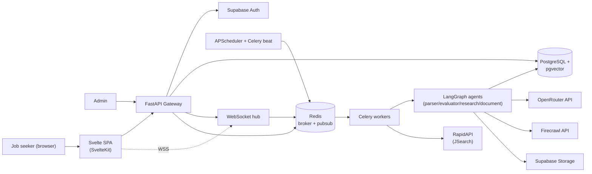

# System Overview

**Status**: Active
**Last updated**: 2026-04-22
**Source**: Section 2 of [`Kaziro_Design_Document.pdf`](../../Kaziro_Design_Document.pdf)
**Related ADRs**: [ADR-0001](../decisions/ADR-0001-agentic-framework-langgraph.md), [ADR-0002](../decisions/ADR-0002-database-postgres-pgvector.md), [ADR-0003](../decisions/ADR-0003-auth-supabase.md), [ADR-0004](../decisions/ADR-0004-task-queue-celery-redis.md), [ADR-0009](../decisions/ADR-0009-monorepo-layout.md)

## 1. Purpose

Kaziro is a **multi-tenant SaaS platform that automates the entire job
application lifecycle**. The system autonomously discovers job postings from
external APIs, evaluates them against individual user profiles using a
multi-pass AI evaluation pipeline, researches target companies, and generates
tailored resumes and cover letters — enabling any professional to compete
effectively in the job market with minimal manual effort.

The platform is **domain-agnostic**: a nurse, lawyer, graphic designer, or
software engineer can all use it by configuring their job-search preferences
and uploading their professional profile documents. **No domain-specific logic
is hardcoded.**

## 2. Architectural style

**Event-driven microservices within a monorepo.** The scheduler drives the
agentic pipeline asynchronously via a Celery task queue, decoupling API
response time from the long-running agent workflows. Each agent is a stateful
LangGraph node-graph.

Four primary layers — Frontend, Backend API, Agentic Pipeline, Data — talk
through well-defined interfaces and are independently deployable. The
monorepo contains:

```
kaziro/
├── backend/   # Python: FastAPI + LangGraph + Celery + SQLAlchemy
├── backend-django/ # Parallel migration: Django + Django Ninja + Celery
├── frontend/  # SvelteKit + Tailwind + DaisyUI + TanStack Query
├── frontend-next/ # Parallel migration: Next.js + React + TypeScript + DaisyUI
├── docs/      # Architecture, design, decisions, reference
├── infra/     # Docker, k8s, monitoring (created in Phase 5)
└── (root)     # Shared config: docker-compose, .env.example, Makefile
```

See [ADR-0009](../decisions/ADR-0009-monorepo-layout.md) for why this layout.
See [ADR-0012](../decisions/ADR-0012-parallel-django-ninja-nextjs-migration.md)
for the parallel Django Ninja + Next.js migration scaffold.

## 3. Component overview

| Component        | Technology                              | Responsibility                                                  | Interfaces                  |
| ---------------- | --------------------------------------- | --------------------------------------------------------------- | --------------------------- |
| Svelte SPA       | SvelteKit + TailwindCSS                 | User dashboard, settings, doc editor, application tracker       | REST API via HTTPS, WS      |
| Next.js scaffold | Next.js + React + DaisyUI               | Parallel migration target for the user-facing frontend          | REST API via HTTPS, WS      |
| API Gateway      | FastAPI + Uvicorn                       | Auth, routing, request validation, WebSocket events             | HTTP/WS → services          |
| Django API scaffold | Django Ninja                         | Parallel migration target for `/api/v1`                         | HTTP/WS → services          |
| Scheduler        | APScheduler + Celery beat               | Trigger per-user job fetches on cron schedule                   | Celery task queue           |
| Message Broker   | Redis                                   | Celery task queue, pub/sub for real-time UI updates             | Celery + FastAPI            |
| Parser Agent     | LangGraph + OpenRouter (`nvidia/nemotron-3-super-120b-a12b:free`) | Normalise raw API responses into DB schema; embed description   | DB write                    |
| Evaluator Agent  | LangGraph + OpenRouter (`nvidia/nemotron-3-super-120b-a12b:free`) | 3-pass fit evaluation per user profile (draft/critic/judge)     | DB read/write               |
| Research Agent   | LangGraph + Firecrawl + OpenRouter            | Scrape company site; generate company brief                     | Firecrawl API + DB          |
| Document Agent   | LangGraph + OpenRouter (`nvidia/nemotron-3-super-120b-a12b:free`) | Generate tailored CV and cover letter; PDF render               | DB read/write + Storage     |
| Database         | PostgreSQL + pgvector                   | All persistent data; vector embeddings for semantic search      | SQL via SQLAlchemy 2.0      |
| Auth             | Supabase Auth                           | JWT-based multi-tenant authentication (RS256)                   | API → Supabase              |
| File Storage     | Supabase Storage                        | CV PDFs, cover letters, profile docs                            | S3-compatible API           |
| Observability    | structlog + Prometheus + Grafana + OTel | Logs, metrics, traces                                           | Sidecar / agent             |

## 4. High-level architecture diagram

See [`diagrams/system-context.md`](diagrams/system-context.md) for the C4
context diagram.



## 5. Deployment matrix

| Service                | Local (dev)                       | Production                                  |
| ---------------------- | --------------------------------- | ------------------------------------------- |
| FastAPI backend        | Docker container `:8000`          | Kubernetes Deployment (≥ 2 replicas)        |
| Celery workers         | Docker container                  | Kubernetes Deployment (HPA, auto-scale)     |
| Celery beat            | Docker container                  | Kubernetes Deployment (1 replica)           |
| Redis                  | Docker container `:6379`          | Managed Redis (Upstash / ElastiCache)       |
| PostgreSQL + pgvector  | Supabase local stack              | Supabase Cloud (managed)                    |
| Svelte frontend        | Vite dev server `:5173`           | Vercel / Netlify CDN                        |
| Firecrawl              | Firecrawl Cloud API               | Firecrawl Cloud API                         |
| Object storage         | Supabase local Storage            | Supabase Cloud Storage                      |
| Metrics / dashboards   | Prometheus + Grafana via compose  | Managed Prometheus + Grafana Cloud          |
| Logs                   | stdout (JSON via structlog)       | Centralised log store (Loki / DataDog)      |

See [`08-deployment.md`](08-deployment.md) for the full deployment runbook.

## 6. Scope at a glance

### MVP (Phase 0–5)

- Scheduled job discovery via RapidAPI job-search endpoints.
- Parser → Evaluator (3-pass) → Research → Document agentic pipeline.
- Svelte user dashboard: review, edit, manage applications.
- Application Tracker: full status lifecycle.
- Observability: structured logs, Prometheus metrics, alerts.

### Out of scope (V2)

- Continuous profile enrichment from work-log entries.
- OAuth-based email sending on behalf of user.
- Mobile native applications.
- Automated LinkedIn profile import.

## 7. Cross-cutting concerns

| Concern             | Where it is enforced                                                                |
| ------------------- | ----------------------------------------------------------------------------------- |
| Multi-tenancy       | Supabase RLS on every table + repository-layer `user_id` scoping                    |
| Authentication      | `Depends(get_current_user)` on every protected route; JWT validated against Supabase |
| Logging             | `structlog` with bound context (`user_id`, `job_posting_id`, `agent_name`, `node`)  |
| Metrics             | Prometheus counters/histograms exposed at `/metrics`                                |
| Tracing             | OpenTelemetry; `trace_id` propagated FastAPI ↔ Celery ↔ agents                      |
| Error handling      | Per-agent try/except with `state.error`; structured API errors `{code, message}`    |
| Rate limiting       | Redis sliding window (100 req/min/user) at the API gateway                          |
| Input validation    | Pydantic v2 on every request body and external payload                              |
| Secrets             | Env vars only — never DB or code (see [`reference/env-vars.md`](../reference/env-vars.md)) |

## 8. Reading order for new contributors

1. This file.
2. [`02-agentic-pipeline.md`](02-agentic-pipeline.md) — how the four agents
   chain together.
3. [`03-data-model.md`](03-data-model.md) — the tables every agent and route
   touches.
4. [`04-api-design.md`](04-api-design.md) — the surface area exposed to the
   frontend.
5. The relevant agent in [`design/agents/`](../design/agents/) before you
   modify it.
