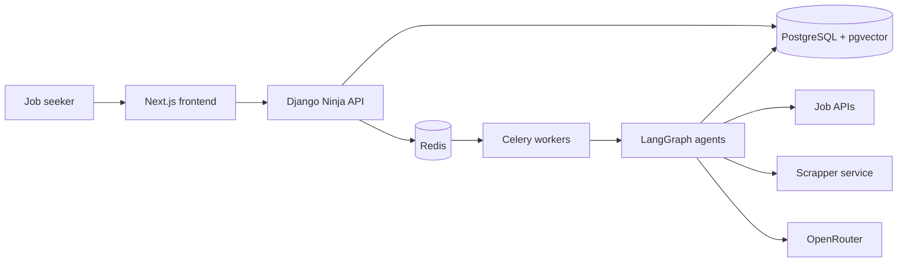

# System Overview

**Status**: Active
**Last updated**: 2026-06-29
**Related ADRs**: [ADR-0001](../decisions/ADR-0001-agentic-framework-langgraph.md), [ADR-0002](../decisions/ADR-0002-database-postgres-pgvector.md), [ADR-0004](../decisions/ADR-0004-task-queue-celery-redis.md), [ADR-0007](../decisions/ADR-0007-nextjs-react-frontend.md), [ADR-0009](../decisions/ADR-0009-monorepo-layout.md), [ADR-0012](../decisions/ADR-0012-canonical-django-ninja-nextjs-architecture.md)

## Purpose

Kaziro is a multi-tenant platform that automates the job application lifecycle.
It discovers job postings, evaluates fit against user profiles, researches
companies, and generates tailored CV and cover-letter documents.

The platform is domain-agnostic. Job-search preferences, uploaded profile
material, and user context drive personalization; professional domains are not
hardcoded in the product architecture.

## Architecture

Kaziro is an event-driven monorepo application with four primary layers:

- **Frontend**: Next.js App Router application for marketing, auth,
  onboarding, dashboard, jobs, applications, and settings.
- **Backend API**: Django project exposing a typed Django Ninja API under
  `/api/v1`.
- **Agentic pipeline**: Celery workers run LangGraph workflows for parsing,
  evaluation, research, and document generation.
- **Data**: PostgreSQL with pgvector plus Redis for queues, cache, and
  realtime/event fan-out.

```text
kaziro/
├── backend/   # Django, Django Ninja, Celery, LangGraph
├── frontend/  # Next.js App Router, React, TypeScript
├── docs/
├── infra/
└── scripts/
```

## Components

| Component | Technology | Responsibility |
| --- | --- | --- |
| Web app | Next.js, React, Tailwind CSS, DaisyUI | User-facing workflows and dashboard |
| API | Django, Django Ninja | Auth, validation, orchestration, API envelope |
| Workers | Celery, Redis | Asynchronous pipeline execution |
| Agents | LangGraph, OpenRouter | Parse jobs, evaluate fit, research companies, generate documents |
| Database | PostgreSQL, pgvector | Persistent data and vector search |
| Broker/cache | Redis | Celery broker, result backend, transient coordination |
| Observability | structlog, OpenTelemetry-ready traces | Logs, request IDs, trace correlation |

## Context Diagram



## Deployment Matrix

| Service | Local | Production |
| --- | --- | --- |
| Backend | Docker container on `:8000` or `manage.py runserver` | Docker Compose service behind the server edge proxy |
| Frontend | Next dev server on `:3000` | Vercel |
| Workers | Docker Compose or host Celery commands | Docker Compose services |
| Beat | Docker Compose or host Celery command | Docker Compose service |
| Database | Local Postgres container | Managed or server-hosted Postgres |
| Redis | Local Redis container | Redis service/container |

See [`08-deployment.md`](08-deployment.md) for deployment details.
