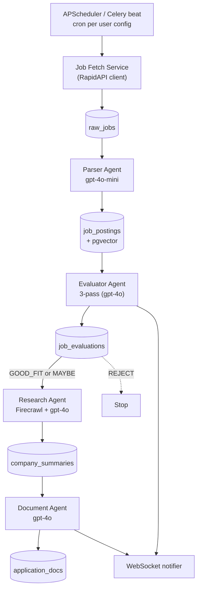

# Agentic Pipeline

**Status**: Active
**Last updated**: 2026-04-22
**Source**: Section 3 of [`Kaziro_Design_Document.pdf`](../../Kaziro_Design_Document.pdf)
**Related ADRs**: [ADR-0001](../decisions/ADR-0001-agentic-framework-langgraph.md), [ADR-0006](../decisions/ADR-0006-evaluator-three-pass.md)
**Code**: [`backend/agents/`](../../backend/agents/) — see also [`design/agents/`](../design/agents/) for per-agent specs.

## 1. Framework choice — LangGraph

LangGraph is the agentic orchestration framework. It provides:

- **Stateful graph-based execution** — critical for multi-pass evaluation
  where each pass enriches a shared `EvaluatorState`.
- **Native conditional branching** — used for retry routes (parser) and
  classification gates (evaluator skip-research-on-REJECT).
- **Built-in checkpointing** — enables resume of long-running pipelines.
- **Human-in-the-loop hooks** — used for the doc-editor flow where a user can
  edit before send.
- **Seamless OpenAI integration** via `langchain-openai`'s `ChatOpenAI` and
  `OpenAIEmbeddings`.

Alternatives considered (CrewAI, raw OpenAI SDK) and the rationale are in
[ADR-0001](../decisions/ADR-0001-agentic-framework-langgraph.md).

## 2. Pipeline overview



Detailed sequence is in
[`diagrams/pipeline-sequence.md`](diagrams/pipeline-sequence.md).

## 3. Stage-by-stage

### Stage 0 — Job Fetch Service

**Type**: Celery periodic task. Not a LangGraph agent — no reasoning required.
**Code**: `backend/services/job_fetcher.py` (Phase 1).

- Triggered by APScheduler / Celery beat using each user's
  `job_search_configs.fetch_schedule_cron` (default `0 */6 * * *`).
- Reads `keywords`, `location`, `remote_only`, `salary_min/max`,
  `employment_types` from the user's config.
- Calls RapidAPI JSearch (or LinkedIn Jobs) endpoint with those parameters.
- **Deduplication**: skips any job whose `external_job_id` already exists in
  `job_postings`.
- Persists raw JSON to `raw_jobs` and emits a Celery task to trigger the
  Parser Agent for each new row.

### Stage 1 — Parser Agent

**Type**: LangGraph 3-node agent with a retry loop on the parse step.
**Model**: `settings.OPENAI_MODEL_PARSER` (default `gpt-4o-mini`).
**Code**: [`backend/agents/parser_agent.py`](../../backend/agents/parser_agent.py).
**Detailed spec**: [`design/agents/parser-agent.md`](../design/agents/parser-agent.md).

```
parse → (route_after_parse) → embed → persist → END
                ↑   |
                └─ retry (max 3)
```

| Node      | Responsibility                                                              |
| --------- | --------------------------------------------------------------------------- |
| `parse`   | LLM (structured output, `temperature=0`) → `JobPostingSchema`               |
| `embed`   | Generate `text-embedding-3-small` (1536-dim) of `title + company + description` |
| `persist` | Insert `JobPosting`; mark `RawJob.parse_status = PARSED` (or `FAILED` after 3 retries) |

### Stage 2 — Evaluator Agent (3-pass)

**Type**: LangGraph multi-node stateful graph.
**Model**: `settings.OPENAI_MODEL_EVALUATOR` (default `gpt-4o`).
**Code**: [`backend/agents/evaluator_agent.py`](../../backend/agents/evaluator_agent.py).
**Detailed spec**: [`design/agents/evaluator-agent.md`](../design/agents/evaluator-agent.md).
**Why 3 passes**: see [ADR-0006](../decisions/ADR-0006-evaluator-three-pass.md).

```
load_data → pass1_draft → pass2_critic → pass3_judge → persist → END
                  ↓error          ↓error      ↓error
                error_end       error_end   error_end
```

| Pass | Role             | Input                                | Output                                                      |
| ---- | ---------------- | ------------------------------------ | ----------------------------------------------------------- |
| 1    | Draft Evaluator  | `job_posting + user_profile`         | `pass1_scores` (skills/seniority/domain/comp 0–10) + `pass1_notes` |
| 2    | Critic Agent     | `pass1_scores + job + profile`       | `pass2_critique` + `pass2_revised_scores`                   |
| 3    | Final Judge      | `pass1 + pass2 + job + profile`      | `final_classification` + `final_feedback` + `overall_score` |

`final_classification` is one of `GOOD_FIT | MAYBE | REJECT`. Score thresholds:

| Classification | Weighted score |
| -------------- | -------------- |
| `GOOD_FIT`     | ≥ 6.5          |
| `MAYBE`        | 4.5 – 6.4      |
| `REJECT`       | < 4.5          |

The full audit trail (all three passes' outputs) is persisted to
`job_evaluations` for every (`user_id`, `job_posting_id`) pair.

### Stage 3 — Research Agent

**Type**: LangGraph agent with tool use.
**Model**: `settings.OPENAI_MODEL_EVALUATOR` (`gpt-4o`).
**Tools**: Firecrawl scrape (`POST /v1/scrape`).
**Code**: [`backend/agents/research_agent.py`](../../backend/agents/research_agent.py).
**Detailed spec**: [`design/agents/research-agent.md`](../design/agents/research-agent.md).

```
check_cache ──fresh?──→ END
     ↓
   scrape (parallel: company website + job page) → generate_brief → persist → END
```

- Runs only for `GOOD_FIT` (and optionally `MAYBE`) classifications.
- **Cache**: if a `company_summaries` row exists for the same `job_posting_id`
  and is younger than 30 days, the agent short-circuits.
- **Fan-in**: the parallel scrape uses `asyncio.gather` so the slowest URL
  bounds total latency.
- Output: `mission`, `values`, `culture`, `tech_stack`, `team_size_approx`,
  `recent_news`, `ai_summary`, plus `raw_scraped_content` truncated to 50 KB.

### Stage 4 — Document Agent

**Type**: LangGraph multi-node agent.
**Model**: `settings.OPENAI_MODEL_EVALUATOR` (`gpt-4o`, `temperature=0.4`).
**Code**: [`backend/agents/document_agent.py`](../../backend/agents/document_agent.py).
**Detailed spec**: [`design/agents/document-agent.md`](../design/agents/document-agent.md).

```
load_context → cv_tailor → cover_letter → quality_check → render_persist → END
```

| Node              | Responsibility                                                                        |
| ----------------- | ------------------------------------------------------------------------------------- |
| `load_context`    | Pull job + company brief + user profile + raw CV text from Supabase Storage           |
| `cv_tailor`       | Reorder & rewrite CV bullets — **never fabricates** experience                         |
| `cover_letter`    | 3–4 paragraph personalised cover letter referencing company values                    |
| `quality_check`   | Validates both docs for hallucinations and consistency; non-blocking                  |
| `render_persist`  | Render PDFs, upload to Supabase Storage, insert `application_docs` row                |

## 4. Pipeline orchestrator

**Code**: [`backend/agents/pipeline_orchestrator.py`](../../backend/agents/pipeline_orchestrator.py).

The orchestrator chains the agents above. It is the **only** layer allowed to
call multiple agents — individual agents must never invoke each other.

Two entry points:

| Function                                                | When called                                                              |
| ------------------------------------------------------- | ------------------------------------------------------------------------ |
| `run_full_pipeline_for_config(config_id, user_id)`      | Celery beat tick — fetch → parse → evaluate → research → document        |
| `run_pipeline_for_single_job(job_posting_id, user_id)`  | Manual trigger from `/api/v1/jobs/{id}/trigger-evaluation` or admin endpoint |

**Concurrency**: stage-2 evaluation runs concurrently across new jobs with
`asyncio.Semaphore(3)` to cap LLM concurrency per pipeline run.

**Error isolation**: each user pipeline runs in its own Celery task; per-user
exceptions never propagate across tenants. Inside a pipeline, each stage
catches and logs its own exceptions; downstream stages run only if the
upstream returned a usable result.

**Notifications**: after evaluation completion and after document generation,
the orchestrator publishes a JSON message to the user's WebSocket channel via
`backend/services/notifications.py` (Redis pub/sub).

```python
await notify_user(user_id, {
    "type": "evaluation_complete",
    "job_posting_id": ...,
    "classification": "GOOD_FIT",
    "score": 7.8,
})
```

Notification types: `evaluation_complete`, `documents_ready`. The frontend
shows a toast for each (see
[`design/frontend/state-and-realtime.md`](../design/frontend/state-and-realtime.md)).

## 5. Pipeline summary contract

`run_full_pipeline_for_config` returns:

```python
{
  "config_id": str,
  "user_id": str,
  "started_at": ISO-8601,
  "completed_at": ISO-8601,
  "jobs_fetched": int,
  "jobs_parsed": int,
  "evaluations_good_fit": int,
  "evaluations_maybe": int,
  "evaluations_rejected": int,
  "documents_generated": int,
  "errors": list[str],
}
```

This payload is logged at INFO and exposed to the admin pipeline dashboard
(`GET /api/v1/admin/pipeline-status`).

## 6. Failure modes & retries

| Failure                                | Behaviour                                                                              |
| -------------------------------------- | -------------------------------------------------------------------------------------- |
| RapidAPI 5xx / timeout                 | Celery `autoretry_for=(Exception,)` with exponential backoff, max 3 retries            |
| Parser LLM error                       | Internal retry loop in graph (max 3); persists `RawJob.parse_status = FAILED`          |
| Embedding API error                    | Non-fatal — job persisted without vector; semantic search ignores rows with NULL vector |
| Evaluator pass-1/3 LLM error           | Routes to `error_end`; no row written to `job_evaluations`                             |
| Evaluator pass-2 critic error          | **Non-fatal** — falls back to pass-1 scores, critique = "Critic failed: …"             |
| Firecrawl scrape failure               | Non-fatal — empty content, brief generated from whatever was scraped                   |
| `company_website` missing              | Scrapes only the application URL                                                       |
| Doc-agent CV missing                   | Falls back to `user_skills` + `user_summary` for the CV draft                          |
| PDF render failure                     | Non-fatal — text persisted, PDF paths empty; user can re-render from UI                |
| WebSocket publish failure              | Logged at WARNING; pipeline continues                                                  |

## 7. Where to extend

| Want to add…                                        | Touch                                                                                |
| --------------------------------------------------- | ------------------------------------------------------------------------------------ |
| A new agent stage (e.g., interview-prep agent)      | New file in `backend/agents/`, register in `pipeline_orchestrator.py`                |
| A new classification bucket                         | `Classification` enum in `evaluator_agent.py` + DB migration + frontend badges       |
| A different LLM model per stage                     | Add a `OPENAI_MODEL_<X>` env var; consume via `settings.OPENAI_MODEL_<X>`            |
| A new external scrape source                        | New service in `backend/services/`, called from `research_agent.scrape_node`         |
| Real-time progress for individual passes            | Publish `notify_user(...)` from each pass node; extend frontend toast types          |
