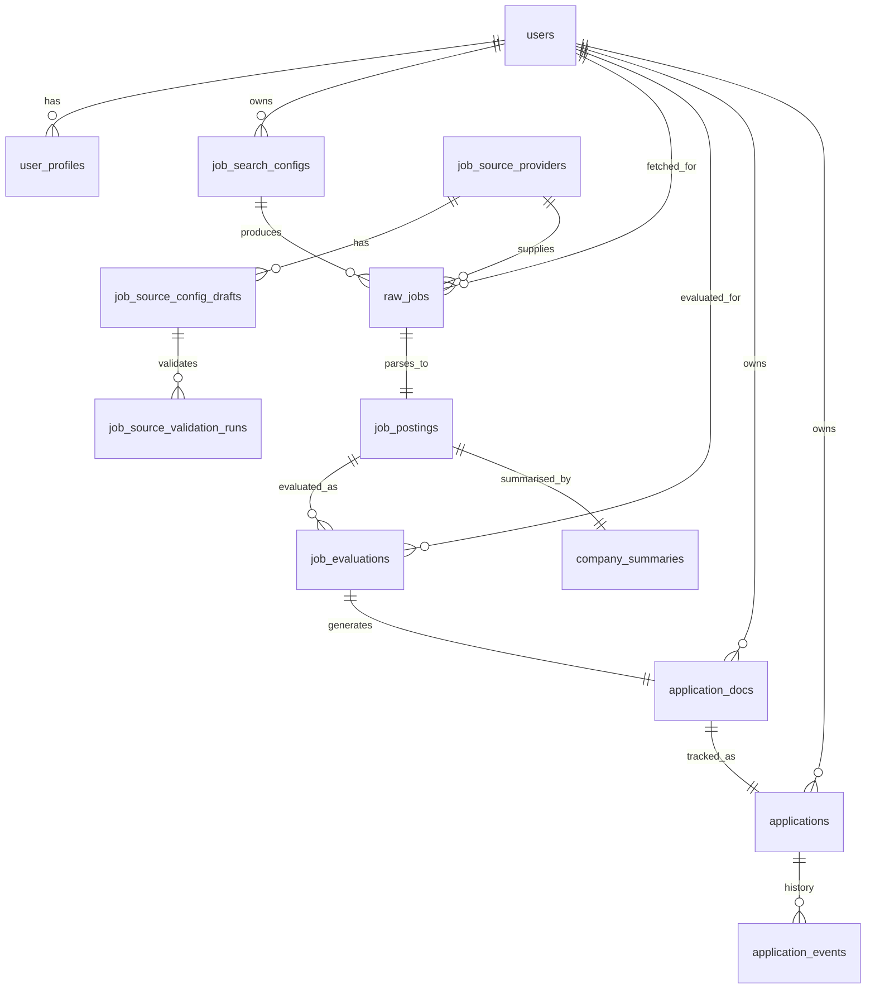

# Data Model

**Status**: Active
**Last updated**: 2026-04-22
**Source**: Section 4 of [`Kaziro_Design_Document.pdf`](../../Kaziro_Design_Document.pdf)
**Related ADRs**: [ADR-0002](../decisions/ADR-0002-database-postgres-pgvector.md), [ADR-0003](../decisions/ADR-0003-auth-supabase.md)
**Diagram**: [`diagrams/erd.md`](diagrams/erd.md)
**Code**: Django apps under `backend/apps/`, with models and migrations per domain.

## 1. Database choice rationale

PostgreSQL with the pgvector extension is selected. It provides:

- **ACID-compliant relational storage** for users, jobs, evaluations,
  applications.
- **Vector similarity search** for semantic job-profile matching via
  pgvector.
- **Full-text search** for keyword filtering.
- **Row-level security (RLS)** for multi-tenant data isolation — supplied by
  Supabase.

All in a single database engine. Alternatives considered (MongoDB,
Pinecone+Postgres) and rationale are in
[ADR-0002](../decisions/ADR-0002-database-postgres-pgvector.md).

## 2. Entity relationship overview



Key cardinalities:

- `raw_jobs (1) → (1) job_postings` — each raw payload normalises to one
  posting (or fails to parse).
- `job_postings (1) → (N) job_evaluations` — one job is evaluated once **per
  user** (fan-out).
- `job_postings (1) → (1) company_summaries` — one company brief per posting,
  cached for 30 days.
- `applications (1) → (N) application_events` — full status history log.

## 3. Table schemas

All tables include the base fields enforced by [`004-database`](../../.cursor/rules/004-database.mdc):

```python
id:         Mapped[uuid.UUID] = mapped_column(primary_key=True, default=uuid.uuid4)
created_at: Mapped[datetime]  = mapped_column(default=lambda: datetime.now(timezone.utc))
updated_at: Mapped[datetime]  = mapped_column(
    default=lambda: datetime.now(timezone.utc),
    onupdate=lambda: datetime.now(timezone.utc),
)
```

The columns below are in **addition** to the base fields above.

### 3.1 `users`

| Column              | Type            | Nullable | Description                  |
| ------------------- | --------------- | -------- | ---------------------------- |
| `id`                | UUID PK         | NOT NULL | Supabase Auth UID            |
| `email`             | TEXT UNIQUE     | NOT NULL | User email                   |
| `is_active`         | BOOLEAN         | NOT NULL | Soft-delete flag             |
| `subscription_tier` | TEXT            | NOT NULL | `free \| pro \| enterprise`  |

`id` matches the Supabase Auth user UUID — there is no separate auth table.

### 3.2 `user_profiles`

| Column                 | Type           | Nullable | Description                                    |
| ---------------------- | -------------- | -------- | ---------------------------------------------- |
| `user_id`              | UUID FK→users  | NOT NULL | One row per user                               |
| `full_name`            | TEXT           | NOT NULL |                                                |
| `professional_summary` | TEXT           | NULL     | AI-generated or user-written summary           |
| `skills`               | TEXT[]         | NOT NULL | Array of skill strings                         |
| `experience_years`     | INTEGER        | NULL     |                                                |
| `domain`               | TEXT           | NULL     | e.g. `software`, `healthcare`, `legal`         |
| `values_statement`     | TEXT           | NULL     | User-described values & hobbies                |
| `cv_storage_path`      | TEXT           | NULL     | Supabase Storage path to uploaded CV           |
| `linkedin_url`         | TEXT           | NULL     |                                                |
| `profile_embedding`    | VECTOR(2048)   | NULL     | Embedding of full profile for similarity search |

### 3.3 `job_search_configs`

| Column                | Type           | Nullable                     | Description                            |
| --------------------- | -------------- | ---------------------------- | -------------------------------------- |
| `user_id`             | UUID FK→users  | NOT NULL                     |                                        |
| `keywords`            | TEXT[]         | NOT NULL                     | Search keywords / job titles           |
| `location`            | TEXT           | NULL                         | City, country, or remote               |
| `remote_only`         | BOOLEAN        | NOT NULL DEFAULT false       |                                        |
| `salary_min`          | INTEGER        | NULL                         | USD per year                           |
| `salary_max`          | INTEGER        | NULL                         |                                        |
| `employment_types`    | TEXT[]         | NOT NULL                     | `full-time \| part-time \| contract`   |
| `fetch_schedule_cron` | TEXT           | NOT NULL                     | Preset only: `0 6 * * *` (daily) or `0 6 * * 1` (weekly), UTC |
| `is_active`           | BOOLEAN        | NOT NULL DEFAULT true        |                                        |

A user may have multiple active configs (e.g., `senior backend remote` and
`engineering manager hybrid`).

### 3.4 `raw_jobs`

| Column          | Type                      | Nullable | Description                            |
| --------------- | ------------------------- | -------- | -------------------------------------- |
| `user_id`       | UUID FK→users             | NOT NULL |                                        |
| `config_id`     | UUID FK→job_search_configs | NOT NULL |                                        |
| `provider_id`   | UUID FK→job_source_providers | NOT NULL | Approved source provider             |
| `external_job_id` | TEXT                    | NOT NULL | Provider-specific dedupe key           |
| `source_api`    | TEXT                      | NOT NULL | Provider slug snapshot                 |
| `raw_payload`   | JSONB                     | NOT NULL | Full upstream payload                  |
| `fetched_at`    | TIMESTAMPTZ               | NOT NULL |                                        |
| `parse_status`  | parse_status_enum         | NOT NULL | `PENDING \| PARSED \| FAILED`          |
| `retry_count`   | INTEGER                   | NOT NULL | Default 0                              |

**Enum** `parse_status_enum` is defined in the relevant Django model module as a Python
`enum.Enum` subclass:

```python
class ParseStatus(str, enum.Enum):
    PENDING = "PENDING"
    PARSED  = "PARSED"
    FAILED  = "FAILED"
```

### 3.5 `job_source_providers`

| Column               | Type        | Nullable | Description                                  |
| -------------------- | ----------- | -------- | -------------------------------------------- |
| `slug`               | TEXT UNIQUE | NOT NULL | Stable provider identifier                    |
| `display_name`       | TEXT        | NOT NULL | Admin-facing name                             |
| `docs_url`           | TEXT        | NOT NULL | Public API documentation URL                  |
| `status`             | TEXT        | NOT NULL | `draft \| active \| disabled`                 |
| `robots_notes`       | TEXT        | NULL     | Manual compliance notes                       |
| `terms_notes`        | TEXT        | NULL     | Manual terms-of-service notes                 |
| `last_discovered_at` | TIMESTAMPTZ | NULL     | Last successful discovery task timestamp      |

### 3.6 `job_source_config_drafts`

| Column              | Type       | Nullable | Description                                      |
| ------------------- | ---------- | -------- | ------------------------------------------------ |
| `provider_id`       | UUID FK    | NOT NULL | Source provider                                  |
| `config`            | JSONB      | NOT NULL | Validated provider endpoint config; no secrets   |
| `status`            | TEXT       | NOT NULL | `generated \| validation_failed \| validated \| approved \| rejected` |
| `confidence_score`  | FLOAT      | NOT NULL | Discovery confidence from 0 to 1                 |
| `evidence_urls`     | JSONB      | NOT NULL | Docs/spec URLs used during generation            |
| `validation_errors` | JSONB      | NOT NULL | Smoke-test or schema-validation errors           |
| `approved_at`       | TIMESTAMPTZ | NULL    | Set when an admin activates the draft            |

### 3.7 `job_source_validation_runs`

| Column              | Type       | Nullable | Description                                      |
| ------------------- | ---------- | -------- | ------------------------------------------------ |
| `draft_id`          | UUID FK    | NOT NULL | Config draft being validated                     |
| `status`            | TEXT       | NOT NULL | Validation result                                |
| `request_url`       | TEXT       | NOT NULL | Smoke-test URL with no secrets persisted         |
| `response_status`   | INTEGER    | NULL     | Provider HTTP status                             |
| `response_metadata` | JSONB      | NOT NULL | Safe response metadata such as jobs seen         |
| `errors`            | JSONB      | NOT NULL | User-safe validation errors                      |

### 3.8 `job_postings`

| Column                  | Type             | Nullable | Description                              |
| ----------------------- | ---------------- | -------- | ---------------------------------------- |
| `raw_job_id`            | UUID FK→raw_jobs | NOT NULL |                                          |
| `external_job_id`       | TEXT UNIQUE      | NOT NULL | De-duplication key from upstream         |
| `title`                 | TEXT             | NOT NULL |                                          |
| `company_name`          | TEXT             | NOT NULL |                                          |
| `company_website`       | TEXT             | NULL     |                                          |
| `location`              | TEXT             | NULL     |                                          |
| `remote_flag`           | BOOLEAN          | NOT NULL |                                          |
| `salary_min`            | INTEGER          | NULL     |                                          |
| `salary_max`            | INTEGER          | NULL     |                                          |
| `employment_type`       | TEXT             | NULL     |                                          |
| `description`           | TEXT             | NOT NULL | Cleaned full description                 |
| `requirements`          | TEXT[]           | NULL     | Parsed requirement bullets               |
| `application_url`       | TEXT             | NOT NULL |                                          |
| `posted_date`           | DATE             | NULL     |                                          |
| `description_embedding` | VECTOR(2048)     | NULL     | For semantic search                      |
| `parsed_at`             | TIMESTAMPTZ      | NOT NULL |                                          |

### 3.9 `job_evaluations`

| Column                  | Type                | Nullable | Description                                |
| ----------------------- | ------------------- | -------- | ------------------------------------------ |
| `job_posting_id`        | UUID FK→job_postings | NOT NULL |                                            |
| `user_id`               | UUID FK→users       | NOT NULL |                                            |
| `pass1_scores`          | JSONB               | NOT NULL | `{skills_match, seniority_fit, domain_alignment, compensation_fit}` |
| `pass1_notes`           | TEXT                | NOT NULL | Draft evaluator reasoning                  |
| `pass2_critique`        | TEXT                | NOT NULL | Critic agent notes                         |
| `pass2_revised_scores`  | JSONB               | NOT NULL | Same shape as `pass1_scores`               |
| `final_classification`  | TEXT                | NOT NULL | `GOOD_FIT \| MAYBE \| REJECT`              |
| `final_feedback`        | TEXT                | NOT NULL | User-facing evaluation summary             |
| `overall_score`         | NUMERIC(4,2)        | NOT NULL | Weighted average 0–10                      |
| `evaluated_at`          | TIMESTAMPTZ         | NOT NULL |                                            |

**Unique constraint**: `(job_posting_id, user_id)` — one evaluation per
job-user pair. Re-evaluation overwrites in place via `INSERT ... ON CONFLICT`
or a delete-then-insert in `JobEvaluationRepository.upsert(...)`.

The ``dimension_scores`` JSONB may include a reserved object ``_kaziro`` with
``rejection_source: "user"`` when the candidate marked the job not interested
(the row stays ``REJECT`` so it appears in the reject filter). Choosing
**Generate documents** on an evaluator ``REJECT`` promotes the evaluation to
``MAYBE`` and clears ``_kaziro`` rejection metadata.

### 3.10 `company_summaries`

| Column                  | Type                | Nullable | Description                                |
| ----------------------- | ------------------- | -------- | ------------------------------------------ |
| `job_posting_id`        | UUID FK→job_postings | NOT NULL |                                            |
| `company_name`          | TEXT                | NOT NULL |                                            |
| `mission`               | TEXT                | NULL     |                                            |
| `values`                | TEXT                | NULL     |                                            |
| `culture`               | TEXT                | NULL     |                                            |
| `tech_stack`            | TEXT                | NULL     |                                            |
| `team_size_approx`      | TEXT                | NULL     |                                            |
| `recent_news`           | TEXT                | NULL     |                                            |
| `raw_scraped_content`   | TEXT                | NULL     | **Truncated at 50 KB max**                 |
| `ai_summary`            | TEXT                | NULL     | 4-5 sentence narrative for the user        |
| `summary_generated_at`  | TIMESTAMPTZ         | NOT NULL | Used for the 30-day cache check            |

### 3.11 `application_docs`

| Column                   | Type                  | Nullable | Description                              |
| ------------------------ | --------------------- | -------- | ---------------------------------------- |
| `job_evaluation_id`      | UUID FK→job_evaluations | NOT NULL |                                          |
| `user_id`                | UUID FK→users         | NOT NULL |                                          |
| `tailored_cv_text`       | TEXT                  | NOT NULL | Editable plain-text CV                   |
| `cover_letter_text`      | TEXT                  | NOT NULL | Editable plain-text cover letter         |
| `cv_pdf_path`            | TEXT                  | NULL     | Supabase Storage path                    |
| `cover_letter_pdf_path`  | TEXT                  | NULL     |                                          |
| `generation_model`       | TEXT                  | NOT NULL | Model used (e.g., `LLM_MODEL_DOCUMENT`)  |
| `quality_passed`         | BOOLEAN               | NOT NULL | From quality-check node                  |
| `quality_notes`          | TEXT                  | NULL     | Issues flagged by quality check          |
| `last_edited_at`         | TIMESTAMPTZ           | NOT NULL |                                          |

### 3.12 `applications`

| Column                | Type                       | Nullable | Description                            |
| --------------------- | -------------------------- | -------- | -------------------------------------- |
| `application_doc_id`  | UUID FK→application_docs   | NOT NULL |                                        |
| `user_id`             | UUID FK→users              | NOT NULL |                                        |
| `job_posting_id`      | UUID FK→job_postings       | NOT NULL |                                        |
| `status`              | application_status_enum    | NOT NULL | `DRAFT \| SENT \| INTERVIEWING \| OFFERED \| REJECTED \| WITHDRAWN` |
| `applied_at`          | TIMESTAMPTZ                | NULL     | Set when transitioning to `SENT`       |
| `notes`               | TEXT                       | NULL     | User notes                             |

**Lifecycle**: A `DRAFT` row is created automatically after successful tailored
document generation (`ensure_draft_application_after_documents` in the pipeline
or document Celery task): for **GOOD_FIT** this follows the scheduled document
stage; for **MAYBE** only after user-initiated generation. `POST /api/v1/applications`
returns the existing row when an application is already linked (idempotent).

### 3.13 `application_events`

| Column           | Type                  | Nullable | Description                              |
| ---------------- | --------------------- | -------- | ---------------------------------------- |
| `application_id` | UUID FK→applications  | NOT NULL |                                          |
| `event_type`     | TEXT                  | NOT NULL | `CREATED \| STATUS_CHANGED \| NOTE_ADDED` |
| `event_date`     | TIMESTAMPTZ           | NOT NULL |                                          |
| `notes`          | TEXT                  | NULL     | Free-form event metadata                 |

Inserted automatically by the application status service on every status
change to provide an immutable audit trail (used by the timeline UI).

## 4. Indexes

All `Mapped` columns used in `.where()` clauses have explicit indexes
declared in `__table_args__`. Critical indexes:

| Table              | Index                                                     | Purpose                                |
| ------------------ | --------------------------------------------------------- | -------------------------------------- |
| `job_postings`     | `UNIQUE (external_job_id)`                                | Deduplication                          |
| `job_evaluations`  | `(user_id, final_classification)`                         | Dashboard filtering                    |
| `job_evaluations`  | `UNIQUE (user_id, job_posting_id)`                        | One evaluation per pair                |
| `applications`     | `(user_id, status)`                                       | Application tracker queries            |
| `raw_jobs`         | `(user_id, parse_status)`                                 | Worker queue polling                   |
| `raw_jobs`         | `UNIQUE (provider_id, external_job_id)`                   | Provider-level deduplication           |
| `job_source_config_drafts` | `(provider_id, status)`                          | Active draft lookup                     |
| `application_events` | `(application_id, event_date DESC)`                     | Timeline render order                  |

**pgvector index gotcha**: the current embedding model emits 2048-dimensional
vectors. pgvector ANN indexes for the `vector` type cannot index dimensions
above 2000, so semantic search currently uses exact cosine-distance scans over
rows with embeddings. If query volume grows enough to need ANN indexing, use a
deliberate half-precision expression index or reduced-dimension embedding
strategy and keep the repository query casts aligned with that index.

## 5. Row-Level Security (RLS)

RLS is enabled on **every** table in Supabase. The application-layer
`user_id` scoping is a defence-in-depth second layer, not a replacement.

```sql
-- Example RLS policy (applied to every user-scoped table)
ALTER TABLE job_evaluations ENABLE ROW LEVEL SECURITY;

CREATE POLICY "users read own evaluations"
  ON job_evaluations FOR SELECT
  USING (auth.uid() = user_id);

CREATE POLICY "users insert own evaluations"
  ON job_evaluations FOR INSERT
  WITH CHECK (auth.uid() = user_id);
```

- Application connections use the `anon` key with a JWT — RLS applies.
- Migrations and Celery workers use the `service_role` key — RLS bypassed.
- **Never disable RLS on any table**, even for debugging. Use the
  `service_role` key when you legitimately need to bypass it.

## 6. Session management

```python
# In a route or service:
async with get_async_session() as session:
    posting = await job_repository.get_by_id(session, posting_id, user_id=current_user.id)
```

- Sessions are created at the **route or service** layer and passed down to
  repositories — never created inside an agent node.
- Always `await session.commit()` explicitly. Never rely on auto-commit.
- After commit, `await session.refresh(instance)` to reload server-side
  defaults (e.g., DB-generated `updated_at`).

## 7. Querying rules

- Use explicit, scoped ORM queries; do not load broad datasets and filter in Python.
- **Always** scope user-owned queries by `user_id`:

  ```python
  # Correct
  stmt = select(JobEvaluation).where(
      JobEvaluation.user_id == user_id,
      JobEvaluation.id == evaluation_id,
  )

  # Wrong — bypasses tenant scoping
  evaluation = await session.get(JobEvaluation, evaluation_id)
  ```

- Use `.limit()` on every query that could return unbounded rows.
- Cursor-pagination pattern:

  ```python
  stmt = (
      select(Application)
      .where(Application.user_id == user_id)
      .where(Application.created_at < cursor)
      .order_by(Application.created_at.desc())
      .limit(limit)
  )
  ```

## 8. Migrations

- All schema changes go through Django migrations:
  `uv run python manage.py makemigrations`.
- Migration filenames are generated by Django and should be reviewed before commit.
- Never modify a committed migration — create a new one.
- Always test with `uv run python manage.py migrate`.
- pgvector indexes should be added deliberately in migrations when needed.

## 9. Backups & file storage

- **Never** store user-uploaded files in the database — always in Supabase
  Storage. Only the storage path (`cv_storage_path`, `cv_pdf_path`,
  `cover_letter_pdf_path`) is persisted in PostgreSQL.
- `raw_scraped_content` in `company_summaries` is hard-capped at **50 KB**
  to prevent runaway storage growth from large pages.
- CV text extracted from uploaded files may be cached in the DB
  (`raw_cv_text` is read by the document agent's `load_context_node`) but
  the original PDF remains the source of truth in Storage.

## 10. Seed data

Development seed data should be loaded through Django management commands or
idempotent setup scripts
covering at least three professional domains (software, healthcare, design)
to exercise the domain-agnostic agent prompts.

- Seed scripts are **dev-only**. Never run in production.
- Every insert checks existence first (`SELECT ... LIMIT 1` before insert).
