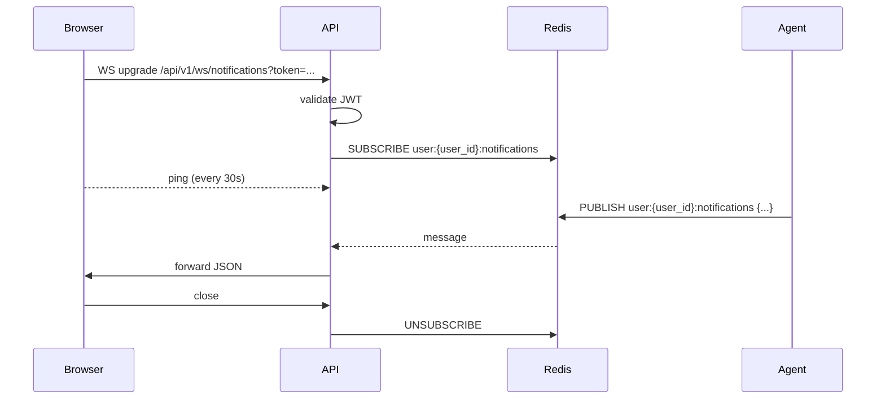

# API Design

**Status**: Active
**Last updated**: 2026-04-22
**Source**: Section 5 of [`Kaziro_Design_Document.pdf`](../../Kaziro_Design_Document.pdf)
**Related ADRs**: [ADR-0003](../decisions/ADR-0003-auth-supabase.md)
**Code (target)**: `backend/api/routes/`, `backend/api/schemas/`, `backend/api/router.py`

## 1. Conventions

| Concern               | Convention                                                                                  |
| --------------------- | ------------------------------------------------------------------------------------------- |
| Base URL              | `/api/v1/`                                                                                  |
| Authentication        | `Authorization: Bearer <Supabase JWT>` on every protected endpoint                          |
| Content type          | `application/json` (request) / `application/json` (response). Multipart only for file uploads |
| Response envelope     | `{ "data": <payload>, "meta": <optional>, "error": null }` on success                       |
| Error envelope        | `{ "data": null, "error": { "code": <slug>, "message": <human readable> } }`                |
| Pagination            | Cursor-based (`cursor`, `limit`); response includes `next_cursor` and optional `total`      |
| Rate limiting         | Redis sliding window — **100 req/min per user**                                             |
| Time format           | ISO-8601 UTC with `Z` suffix                                                                |
| IDs                   | UUID v4, lowercase hyphenated                                                               |

## 2. Common patterns

### 2.1 Authentication

Every protected route uses the dependency:

```python
@router.get("/jobs")
async def list_jobs(
    current_user: User = Depends(get_current_user),
    cursor: str | None = None,
    limit: int = Query(default=20, le=100),
) -> JobListResponse:
    ...
```

`get_current_user` validates the Supabase JWT signature, expiry, and `aud`
claim, then loads the User from `users`. Routes **never** trust a
user-provided `user_id` in the request body — they always use
`current_user.id`.

Admin routes also depend on `Depends(require_admin_role)` which checks the
`role` claim in the JWT.

### 2.2 Error response shape

```json
{
  "data": null,
  "error": {
    "code": "JOB_NOT_FOUND",
    "message": "No job posting with id 9d8b… exists for this user."
  }
}
```

Standard HTTP status mapping:

| Status | When                                                                       |
| ------ | -------------------------------------------------------------------------- |
| 400    | Bad request / business validation error                                    |
| 401    | Missing or invalid JWT                                                     |
| 403    | Authenticated but accessing another user's resource, or insufficient role  |
| 404    | Resource does not exist for this user                                      |
| 409    | Conflict (e.g., duplicate `external_job_id`, status transition not allowed) |
| 422    | Pydantic validation failure (FastAPI automatic)                            |
| 429    | Rate limit exceeded                                                        |
| 500    | Internal error — message is generic; full detail logged server-side only   |

500 responses **never** expose internal error messages or stack traces.

### 2.3 Pagination

```
GET /api/v1/jobs?cursor=eyJjcmVhdGVkIjoiMjAyNi0wNC0wMSJ9&limit=20
```

```json
{
  "data": [ { "id": "...", "title": "...", ... } ],
  "meta": {
    "next_cursor": "eyJjcmVhdGVkIjoiMjAyNi0wMy0yOSJ9",
    "total": null
  },
  "error": null
}
```

Cursor is base64-encoded JSON of the last `(created_at, id)` pair. `total`
is optional and may be `null` for performance.

### 2.4 Request / response schemas

Every route has a corresponding schema file in
`backend/api/schemas/<resource>.py`:

- Request: `<Resource>CreateRequest`, `<Resource>UpdateRequest`
- Response: `<Resource>Response`, `<Resource>ListResponse`

All response schemas include `id: uuid.UUID` and `created_at: datetime`, and
declare `model_config = ConfigDict(from_attributes=True)` for ORM
serialisation.

### 2.5 Routes are thin

Every route is **at most 20 lines**: validate input → call service or
repository → return response. Business logic lives in
`backend/services/`. Database queries live in `backend/db/repositories/`.

## 3. Endpoint reference

### 3.1 Auth

| Method | Path                | Auth   | Description                          |
| ------ | ------------------- | ------ | ------------------------------------ |
| POST   | `/auth/register`    | Public | Register a new user                  |
| POST   | `/auth/login`       | Public | Login; returns Supabase JWT          |
| POST   | `/auth/refresh`     | Public | Refresh JWT                          |

Auth routes proxy directly to Supabase Auth — Kaziro does not store
passwords.

### 3.2 Profile

| Method | Path                  | Auth     | Description                              |
| ------ | --------------------- | -------- | ---------------------------------------- |
| GET    | `/profile`            | Required | Get current user profile                 |
| PUT    | `/profile`            | Required | Update profile fields                    |
| POST   | `/profile/upload-cv`  | Required | Upload CV file (PDF / DOCX) — multipart  |

`POST /profile/upload-cv` accepts `multipart/form-data` with a `file` field,
stores the file in Supabase Storage under `cv/{user_id}/{uuid}.pdf`, and
sets `user_profiles.cv_storage_path`. The endpoint also kicks off an
async text-extraction Celery task that backfills `professional_summary` if
empty.

### 3.3 Job search configs

| Method | Path                      | Auth     | Description                                    |
| ------ | ------------------------- | -------- | ---------------------------------------------- |
| GET    | `/job-configs`            | Required | List all configs for current user              |
| POST   | `/job-configs`            | Required | Create a new config                            |
| PUT    | `/job-configs/{id}`       | Required | Update keywords, schedule, etc.                |
| DELETE | `/job-configs/{id}`       | Required | Soft-disable (sets `is_active = false`)        |

### 3.4 Jobs

| Method | Path                                | Auth     | Description                              |
| ------ | ----------------------------------- | -------- | ---------------------------------------- |
| GET    | `/jobs`                             | Required | List job postings with filters & pagination |
| GET    | `/jobs/{id}`                        | Required | Get a single job posting                 |
| GET    | `/jobs/{id}/evaluation`             | Required | Get the user's evaluation for a job      |
| GET    | `/jobs/{id}/cv.pdf`                 | Required | Redirect to signed CV PDF (when generated) |
| GET    | `/jobs/{id}/cover-letter.pdf`       | Required | Redirect to signed cover letter PDF       |
| POST   | `/jobs/{id}/trigger-evaluation`     | Required | Manually re-trigger the evaluation pipeline |
| POST   | `/jobs/{id}/regenerate-documents`   | Required | Regenerate when `application_docs` exists (`202`, same envelope as trigger-evaluation). Optional JSON body `{ "part": "cv" \| "cover_letter" }` regenerates only that side (skips research); omit `part` for full research + both documents. `404` if no doc row yet |
| POST   | `/jobs/{id}/mark-not-interested`    | Required | Sets evaluation to `REJECT` with user rejection metadata, deletes tailored docs + application row, best-effort storage cleanup. `409` if the job is already an evaluator `REJECT` |

`GET /jobs/{id}/evaluation` may include optional `application_doc` with
`tailored_cv_text` and `cover_letter_text` when the document agent has
persisted an `application_docs` row for that evaluation (job detail UI).
Nested `evaluation` objects on `GET /applications` omit full document
text (`application_doc` is null there) to keep list payloads small.
Evaluations may include `rejection_source: "user"` when the candidate
dismissed the job (see `dimension_scores._kaziro` in the data model).

`GET /jobs` filter query params:

| Param              | Type            | Default | Description                          |
| ------------------ | --------------- | ------- | ------------------------------------ |
| `classification`   | `GOOD_FIT \| MAYBE \| REJECT` (multi) | — | Filter by evaluation classification  |
| `min_score`        | float (0–10)    | —       | Minimum overall score                |
| `remote_only`      | bool            | false   |                                      |
| `q`                | string          | —       | Full-text + semantic search (uses pgvector) |
| `cursor`           | string          | —       | Pagination cursor                    |
| `limit`            | int (≤ 100)     | 20      |                                      |

### 3.5 Applications

| Method | Path                                | Auth     | Description                              |
| ------ | ----------------------------------- | -------- | ---------------------------------------- |
| GET    | `/applications`                     | Required | List all applications with status filters |
| GET    | `/applications/{id}`                | Required | Get application + docs + event history   |
| PUT    | `/applications/{id}/docs`           | Required | Update CV / cover letter text            |
| POST   | `/applications/{id}/mark-sent`      | Required | Transition status to `SENT`              |
| PUT    | `/applications/{id}/status`         | Required | Update status (state machine validated)  |
| GET    | `/applications/{id}/cv.pdf`         | Required | Download the CV PDF (signed URL redirect) |
| GET    | `/applications/{id}/cover-letter.pdf` | Required | Download the cover letter PDF           |

State transitions enforced by the state machine in
[`diagrams/application-state-machine.md`](diagrams/application-state-machine.md).
Invalid transitions (e.g., `REJECTED → INTERVIEWING`) return **409 Conflict**.

### 3.6 Notifications (WebSocket)

| Endpoint                     | Description                                                       |
| ---------------------------- | ----------------------------------------------------------------- |
| `WS /api/v1/ws/notifications` | Authenticated WebSocket for real-time pipeline events             |

Authentication: query string token `?token=<JWT>` on the upgrade request
(browsers cannot set headers for WS upgrades).

Inbound messages: none (server → client only). Outbound message shapes:

```json
{ "type": "evaluation_complete", "job_posting_id": "...", "classification": "GOOD_FIT", "score": 7.8 }
{ "type": "documents_ready",     "job_posting_id": "...", "job_evaluation_id": "...", "application_doc_id": "...", "quality_passed": true }
{ "type": "research_complete",   "job_posting_id": "..." }
{ "type": "fetch_complete",      "config_id": "...", "new_jobs": 4 }
```

The WS hub subscribes to a Redis channel `user:{user_id}:notifications`
(the same channel ``notify_user`` in ``backend/services/notifications.py``
publishes to).

### 3.7 Health

| Method | Path                | Auth   | Description                                  |
| ------ | ------------------- | ------ | -------------------------------------------- |
| GET    | `/health`           | Public | Liveness — returns 200 if app is running     |
| GET    | `/health/ready`     | Public | Readiness — checks DB + Redis connections    |
| GET    | `/health/detailed`  | Public | Per-component status                         |
| GET    | `/metrics`          | Public | Prometheus exposition                        |

`/metrics` is publicly reachable inside the cluster only — restricted at the
ingress / network policy level.

### 3.8 Admin

| Method | Path                          | Auth  | Description                                  |
| ------ | ----------------------------- | ----- | -------------------------------------------- |
| POST   | `/admin/trigger-fetch`        | Admin | Manually trigger a job fetch for a user      |
| GET    | `/admin/pipeline-status`      | Admin | View pipeline queue depth & recent errors    |
| GET    | `/admin/users`                | Admin | List users (paginated, no PII beyond email)  |
| POST   | `/admin/users/{id}/disable`   | Admin | Soft-delete a user (sets `is_active = false`) |

## 4. Versioning

- All routes live under `/api/v1/`. Breaking changes require a new prefix
  (`/api/v2/`) with both prefixes co-served during the deprecation window.
- Additive changes (new optional fields) do **not** require a version bump.
- The version is also written into request logs as `api_version=v1` for
  long-term traffic-share analysis.

## 5. WebSocket lifecycle



The frontend store `lib/stores/notifications.ts` owns exactly one connection
per session and re-uses it across components.

## 6. OpenAPI

FastAPI auto-generates OpenAPI 3.1 at `/openapi.json` and Swagger UI at
`/docs`. Both are exposed only when `ENVIRONMENT=development` or `staging`;
in production they are gated behind admin auth.

## 7. Adding a new endpoint — checklist

1. Add the request/response schemas in `backend/api/schemas/<resource>.py`.
2. Add the route in `backend/api/routes/<resource>.py` — keep it < 20 lines.
3. Implement the business logic in `backend/services/<service>.py`.
4. Implement DB access in `backend/db/repositories/<repository>.py`.
5. Register the router in `backend/api/router.py`.
6. Add tests:
   - Happy path with valid auth.
   - 401 (no token), 403 (wrong user), 404 (missing), 422 (invalid body).
7. Run `pytest backend/tests/api/test_<resource>.py -v`.
8. If the route is user-facing, update the frontend client in
   `frontend/src/lib/api/<resource>.ts` and the corresponding
   TanStack Query hook.
