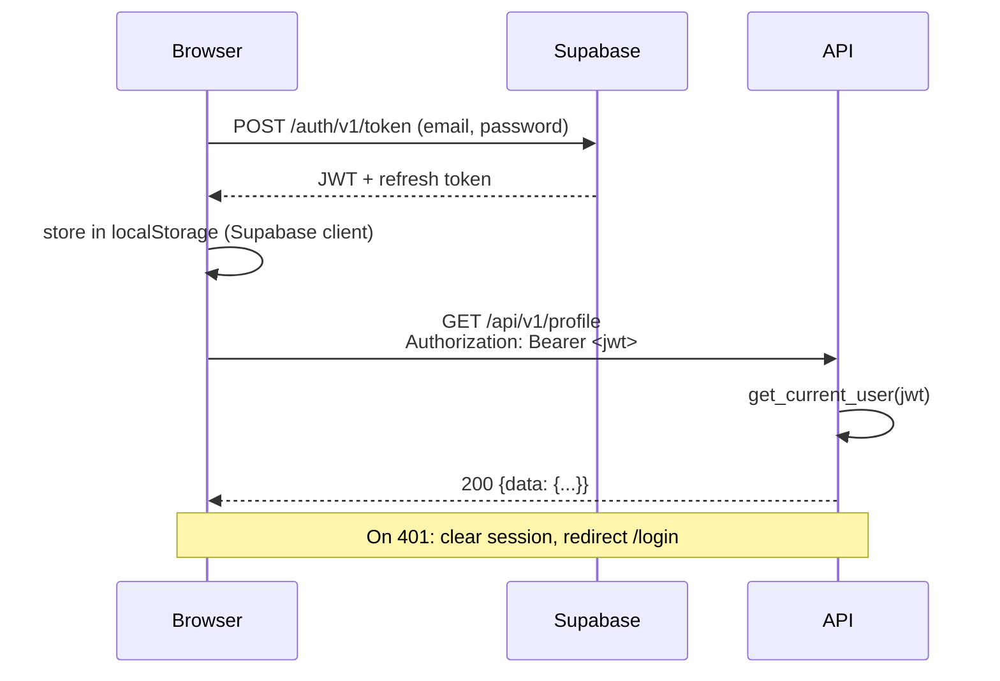

# Frontend Architecture

**Status**: Active
**Last updated**: 2026-04-22
**Source**: Section 7 of [`Kaziro_Design_Document.pdf`](../../Kaziro_Design_Document.pdf)
**Related ADRs**: [ADR-0007](../decisions/ADR-0007-frontend-sveltekit.md)
**Code (target)**: [`frontend/`](../../frontend/)
**See also**: [`design/frontend/routes.md`](../design/frontend/routes.md), [`design/frontend/components.md`](../design/frontend/components.md), [`design/frontend/state-and-realtime.md`](../design/frontend/state-and-realtime.md)

## 1. Tech stack

| Layer            | Choice                                                          |
| ---------------- | --------------------------------------------------------------- |
| Framework        | **SvelteKit 2** (file-based routing, optional SSR)              |
| Language         | TypeScript (`<script lang="ts">`)                               |
| Reactivity       | **Svelte 5 runes** (`$state`, `$derived`, `$effect`, `$props`) — never Svelte 4 stores |
| Styling          | TailwindCSS + DaisyUI                                           |
| Server state     | **TanStack Query** (`@tanstack/svelte-query`)                   |
| Forms            | Native `<form>` + `use:enhance` + Zod schemas                   |
| Real-time        | Native `WebSocket` (managed by `lib/stores/notifications.ts`)   |
| PDF rendering    | `pdfjs-dist`                                                    |
| Rich-text editor | TipTap                                                          |
| Icons            | `lucide-svelte`                                                 |
| Auth client      | `@supabase/supabase-js`                                         |
| Build / dev      | Vite                                                            |

## 2. Folder structure

```
frontend/src/
├── routes/                       # SvelteKit pages
│   ├── +layout.svelte            # Root layout (auth guard, nav)
│   ├── +layout.ts                # Root load (auth check)
│   ├── onboarding/
│   ├── dashboard/
│   ├── jobs/
│   │   ├── +page.svelte          # Job list
│   │   └── [id]/
│   │       ├── +page.svelte      # Job detail
│   │       └── apply/
│   ├── applications/
│   └── settings/
├── lib/
│   ├── components/               # Reusable UI components (PascalCase)
│   │   ├── jobs/                 # Job-specific components
│   │   ├── applications/         # Application-specific
│   │   └── ui/                   # Generic UI primitives (Button, Badge, Modal)
│   ├── api/                      # API client functions
│   │   ├── client.ts             # Base fetch wrapper with auth headers
│   │   ├── jobs.ts
│   │   ├── applications.ts
│   │   └── profile.ts
│   ├── stores/                   # Svelte 5 rune-based state (auth, notifications)
│   ├── types/                    # TypeScript interfaces matching API schemas
│   └── utils/                    # Pure utility functions
├── app.html
├── app.css                       # Tailwind layer + DaisyUI theme
└── hooks.client.ts               # Auth bootstrap, WS connect on mount
```

## 3. Page structure

| Page / Route             | Key features                                                   | Components                                       |
| ------------------------ | -------------------------------------------------------------- | ------------------------------------------------ |
| `/onboarding`            | Profile setup wizard, CV upload, job preferences               | `ProfileWizard`, `FileUpload`, `JobConfigForm`   |
| `/dashboard`             | KPI cards (new jobs, good fits, sent), activity feed           | `StatsBar`, `ActivityFeed`, `PipelineStatus`     |
| `/jobs`                  | Filterable list of recommended jobs with fit-score badges       | `JobCard`, `FitBadge`, `FilterPanel`, `SearchBar` |
| `/jobs/[id]`             | Full job detail, evaluation breakdown, company summary         | `EvaluationPanel`, `ScoreRadar`, `CompanyBrief`  |
| `/jobs/[id]/apply`       | Side-by-side editor: CV + cover letter, preview                | `DocEditor`, `PDFPreview`, `ActionBar`           |
| `/applications`          | Kanban board or list view of applications by status            | `KanbanBoard`, `ApplicationCard`, `StatusPill`   |
| `/applications/[id]`     | Application detail, status history timeline, doc download      | `Timeline`, `DocDownload`, `StatusUpdater`       |
| `/settings`              | Job search configs, schedule, notification preferences         | `ConfigManager`, `SchedulePicker`, `ProfileEdit` |

Detailed routing & component contracts live in
[`design/frontend/routes.md`](../design/frontend/routes.md) and
[`design/frontend/components.md`](../design/frontend/components.md).

## 4. Server state — TanStack Query

All server state goes through TanStack Query — never raw `fetch` in
components. Each resource has a `lib/api/<resource>.ts` module exporting
plain async functions, and a co-located `useXxx` hook factory.

```typescript
// lib/api/jobs.ts
import { apiClient } from './client';
import type { JobPosting, JobListResponse } from '$lib/types/jobs';

export async function listJobs(params: ListJobsParams): Promise<JobListResponse> {
  return apiClient.get('/jobs', { searchParams: params });
}

export async function getJob(id: string): Promise<JobPosting> {
  const { data } = await apiClient.get<{ data: JobPosting }>(`/jobs/${id}`);
  return data;
}
```

```svelte
<!-- routes/jobs/+page.svelte -->
<script lang="ts">
  import { createQuery } from '@tanstack/svelte-query';
  import { listJobs } from '$lib/api/jobs';

  let filters = $state({ classification: ['GOOD_FIT', 'MAYBE'] });

  const jobs = createQuery({
    queryKey: ['jobs', filters],
    queryFn: () => listJobs(filters),
  });
</script>
```

Mutations use `createMutation` with `onSuccess: () => queryClient.invalidateQueries(...)`
— **never** `form.reset()` or manual cache mutation.

## 5. API client (`lib/api/client.ts`)

The base client:

1. Reads the Supabase session and attaches `Authorization: Bearer <jwt>`.
2. Handles `401` by clearing the session and redirecting to `/login`.
3. Throws a typed `ApiError { code, message, status }` on non-2xx responses.
4. Unwraps the `{ data, error }` envelope.

```typescript
export class ApiError extends Error {
  constructor(public code: string, message: string, public status: number) {
    super(message);
  }
}
```

## 6. TypeScript types (`lib/types/`)

- Every API response shape has a corresponding interface that mirrors the
  Pydantic response schema in `backend/api/schemas/`.
- Shared enums (e.g., `Classification`, `ApplicationStatus`) live once in
  `lib/types/enums.ts` and are imported everywhere.
- **Never** use `any`. Use `unknown` and narrow.

```typescript
// lib/types/enums.ts
export type Classification = 'GOOD_FIT' | 'MAYBE' | 'REJECT';

export type ApplicationStatus =
  | 'DRAFT' | 'SENT' | 'INTERVIEWING' | 'OFFERED' | 'REJECTED' | 'WITHDRAWN';
```

The applications Kanban omits a **WITHDRAWN** column (status may still exist on legacy rows from the API).

## 7. Real-time pipeline notifications

Users receive live updates as their jobs progress through the pipeline via a
WebSocket channel per session.

| Notification type      | Trigger                                              | UI behaviour                              |
| ---------------------- | ---------------------------------------------------- | ----------------------------------------- |
| `fetch_complete`       | Job Fetch Service completes for a config             | Activity feed entry                       |
| `evaluation_complete`  | Evaluator Agent persists a row                       | Toast + optimistic dashboard counter bump |
| `research_complete`    | Research Agent persists a `company_summaries` row    | Activity feed entry                       |
| `documents_ready`      | Document Agent persists `application_docs` row       | **Toast** (CTA: "Open editor")            |

Connection lifecycle:

- One `WebSocket` per session, owned by `lib/stores/notifications.ts`.
- Components subscribe to events via the store — they never open their own
  WebSocket.
- Always disconnect on component destroy (`$effect` cleanup).
- See [`design/frontend/state-and-realtime.md`](../design/frontend/state-and-realtime.md)
  for the full reconnection strategy.

```typescript
// lib/stores/notifications.ts (sketch)
let socket = $state<WebSocket | null>(null);
let messages = $state<NotificationMessage[]>([]);

export function connect(token: string) { ... }
export function subscribe(handler: (msg: NotificationMessage) => void) { ... }
```

## 8. Styling rules

- **TailwindCSS utility classes only.** No `<style>` blocks unless
  unavoidable. No per-component CSS files.
- DaisyUI component classes for forms, modals, alerts.
- Semantic colour names (defined in `tailwind.config.ts`):
  - `primary` — main brand colour
  - `secondary` — accent
  - `success` — good-fit / confirmed actions
  - `warning` — maybe / pending
  - `error` — rejected / errors
- Classification badges:
  - `GOOD_FIT` → `badge-success`
  - `MAYBE`    → `badge-warning`
  - `REJECT`   → `badge-error`
- **Never** use arbitrary Tailwind values (`w-[347px]`); use the spacing scale.

## 9. Forms

- Native `<form>` + SvelteKit `use:enhance` for progressive enhancement.
- Client-side validation with **Zod schemas** mirroring backend Pydantic
  schemas. Co-locate the Zod schema next to the API client function.
- Field-level error messages next to the relevant input — not a single global
  banner.
- Submit buttons disabled while the mutation is `pending`.
- Cache invalidation through TanStack Query, **never** `form.reset()`.

## 10. Performance

- Use `+page.ts` `load` functions for initial page data — avoid
  client-side-only fetching for above-the-fold content.
- Lazy-load heavy components (PDF viewer, TipTap editor) via dynamic
  `import()`.
- Paginated lists must use virtual scrolling (e.g., `svelte-virtual`) once
  items exceed 100.
- All `` elements include `width`, `height`, and `alt`.

## 11. Accessibility

- All interactive elements keyboard-accessible (`<button>` for actions,
  `<a>` for navigation — never click-handlers on `<div>`).
- Every input has an associated `<label>`.
- Pipeline status panes use `aria-live="polite"` so screen readers announce
  classification updates.
- Colour is never the sole signal — every classification badge also carries
  the text label.

## 12. Auth flow



Session refresh is handled automatically by the Supabase JS client.

## 13. Build & deploy

- Local dev: `pnpm dev` (Vite) on `:5173`. Backend proxied via
  `vite.config.ts` to `http://localhost:8000`.
- Production build: `pnpm build` (SvelteKit adapter — Vercel by default).
- Deployed to Vercel / Netlify CDN. The `VITE_API_URL` and
  `VITE_SUPABASE_*` env vars are baked at build time.
- See [`08-deployment.md`](08-deployment.md) for the full deployment story.
