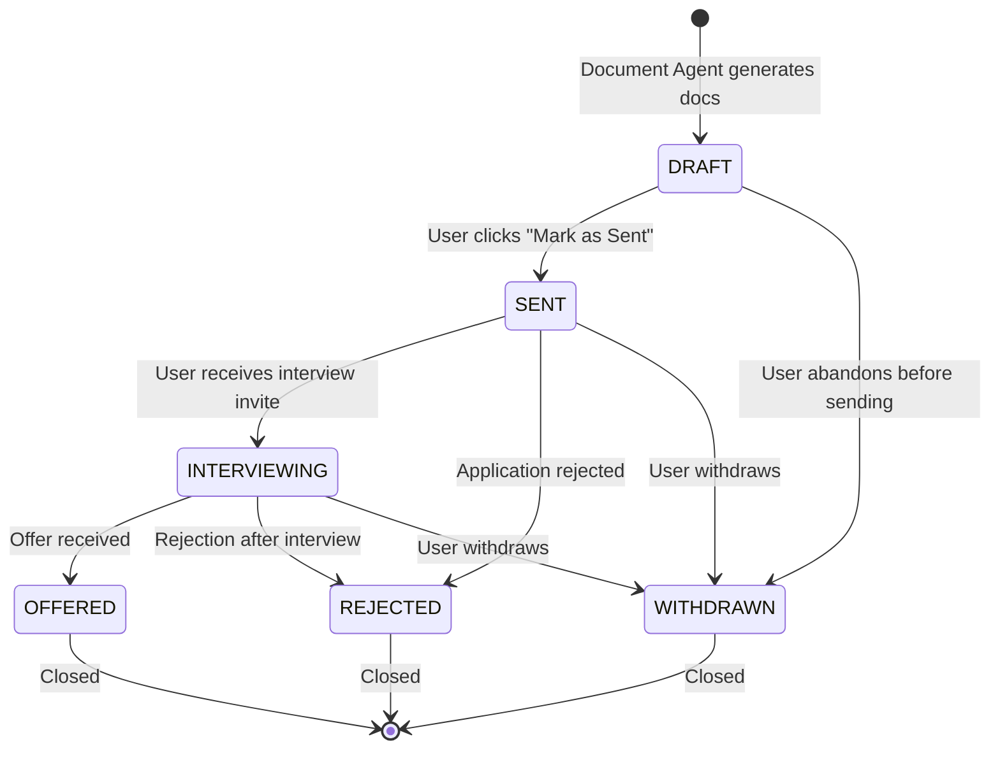

# Application State Machine

**Status**: Active
**Last updated**: 2026-04-22
**Source**: Section 6.3 of [`Kaziro_Design_Document.pdf`](../../../Kaziro_Design_Document.pdf)
**Referenced from**: [`../04-api-design.md`](../04-api-design.md), [`../03-data-model.md`](../03-data-model.md)

State of an `applications` row over its lifetime.

## Allowed transitions matrix

|              | DRAFT | SENT | INTERVIEWING | OFFERED | REJECTED | WITHDRAWN |
| ------------ | ----- | ---- | ------------ | ------- | -------- | --------- |
| **DRAFT**    | —     | ✓    | ✗            | ✗       | ✗        | ✓         |
| **SENT**     | ✗     | —    | ✓            | ✗       | ✓        | ✓         |
| **INTERVIEWING** | ✗ | ✗    | —            | ✓       | ✓        | ✓         |
| **OFFERED**  | ✗     | ✗    | ✗            | —       | ✗        | ✗         |
| **REJECTED** | ✗     | ✗    | ✗            | ✗       | —        | ✗         |
| **WITHDRAWN**| ✗     | ✗    | ✗            | ✗       | ✗        | —         |

Rejected, Offered, and Withdrawn are terminal states — no further
transitions allowed. The validation lives in
`backend/services/application_state.py`; routes return **409 Conflict** on
invalid transitions.

## Side effects per transition

| Transition                  | Side effects                                                              |
| --------------------------- | ------------------------------------------------------------------------- |
| `→ SENT`                    | Set `applied_at = now()`; insert `application_events(STATUS_CHANGED)`     |
| `→ INTERVIEWING`            | Insert `application_events(STATUS_CHANGED)` with optional notes          |
| `→ OFFERED`                 | Insert `application_events(STATUS_CHANGED)`; emit `application.offered` log event for analytics |
| `→ REJECTED`                | Insert `application_events(STATUS_CHANGED)`                              |
| `→ WITHDRAWN`               | Insert `application_events(STATUS_CHANGED)`                              |

`application_events` is append-only — never updated or deleted. The
timeline UI on the application detail page renders these events in
chronological order.
