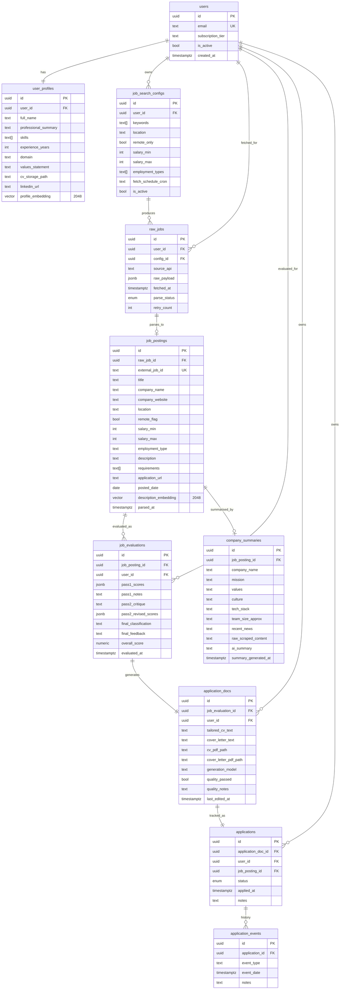

# Entity Relationship Diagram

**Status**: Active
**Last updated**: 2026-04-22
**Source**: Section 4 of [`Kaziro_Design_Document.pdf`](../../../Kaziro_Design_Document.pdf)
**Referenced from**: [`../03-data-model.md`](../03-data-model.md)

## Foreign-key cascade rules

| FK                                                | On delete       |
| ------------------------------------------------- | --------------- |
| Any `user_id` →  `users.id`                       | `CASCADE`       |
| `raw_jobs.config_id` → `job_search_configs.id`    | `CASCADE`       |
| `job_postings.raw_job_id` → `raw_jobs.id`         | `RESTRICT`      |
| `job_evaluations.job_posting_id` → `job_postings.id` | `CASCADE`    |
| `company_summaries.job_posting_id` → `job_postings.id` | `CASCADE`  |
| `application_docs.job_evaluation_id` → `job_evaluations.id` | `CASCADE` |
| `applications.application_doc_id` → `application_docs.id` | `RESTRICT` |
| `application_events.application_id` → `applications.id`  | `CASCADE`  |

`RESTRICT` is used where deletion would lose audit-quality data; cascading
deletes propagate from `users` (account deletion) and from upstream
pipeline rows. Account deletion runs through the dedicated soft-delete +
async-purge flow described in
[`../07-security.md`](../07-security.md#3-data-privacy).
