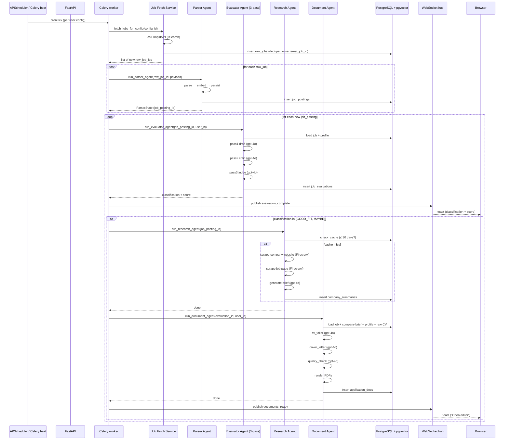

# Pipeline Sequence Diagram

**Status**: Active
**Last updated**: 2026-04-22
**Source**: Section 6.2 of [`Kaziro_Design_Document.pdf`](../../../Kaziro_Design_Document.pdf)
**Referenced from**: [`../02-agentic-pipeline.md`](../02-agentic-pipeline.md)

End-to-end sequence: from a scheduler tick to the moment a user sees a
ready-to-edit job application in their dashboard.

## Key timing characteristics

| Stage             | Typical p50 latency       | Bounded by                              |
| ----------------- | ------------------------- | --------------------------------------- |
| Fetch (one user)  | 2 – 5 s                   | RapidAPI response                       |
| Parse (one job)   | 3 – 8 s                   | OpenRouter `openai/gpt-4o-mini` call    |
| Evaluate (one job × one user) | 25 – 60 s     | 3 sequential gpt-4o calls               |
| Research (one job)| 10 – 30 s (cache miss)    | 2 parallel Firecrawl scrapes + gpt-4o   |
| Document          | 30 – 60 s                 | 2 generative gpt-4o calls + quality check |
| **Full pipeline per job** | **~70 – 160 s**   | Dominated by evaluator + document       |

The orchestrator runs evaluator stage with `asyncio.Semaphore(3)` to cap LLM
concurrency. Research and document stages run sequentially per job to
preserve context.
