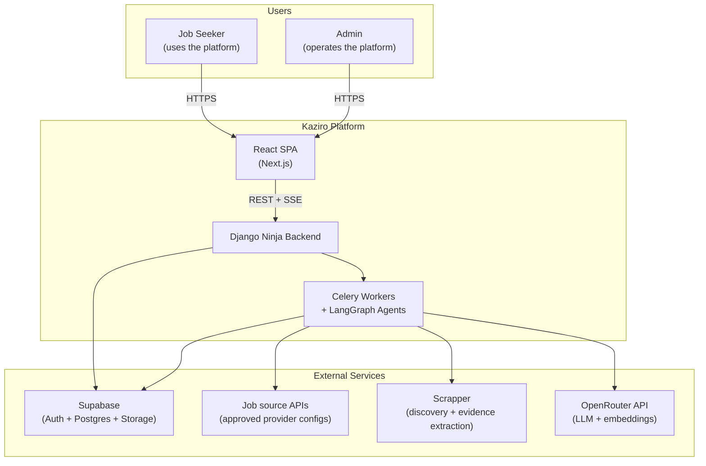

# System Context Diagram (C4 Level 1)

**Status**: Active
**Last updated**: 2026-04-22
**Source**: Section 2 of [`Kaziro_Design_Document.pdf`](../../../Kaziro_Design_Document.pdf)
**Referenced from**: [`../01-system-overview.md`](../01-system-overview.md)

This is a [C4 Level 1](https://c4model.com/) context diagram showing Kaziro's
external actors and systems.

## Diagram

## Actors

| Actor          | Description                                                    |
| -------------- | -------------------------------------------------------------- |
| **Job Seeker** | Configures profile and search preferences; reviews evaluations and applies. |
| **Admin**      | Operator: triggers manual fetches, monitors pipeline health, manages subscriptions. |

## External systems

| System         | Purpose                                                              |
| -------------- | -------------------------------------------------------------------- |
| **Supabase**   | Hosted Postgres + pgvector + Auth (JWT) + Storage (object store).    |
| **Job source APIs** | Source of raw job postings through approved provider configs. |
| **Scrapper**   | Secured JS-rendered discovery and provenance-preserving extraction.  |
| **OpenRouter** | All LLM and embedding calls (default chat `nvidia/nemotron-3-super-120b-a12b:free`; default embeddings `nvidia/llama-nemotron-embed-vl-1b-v2:free`). |
