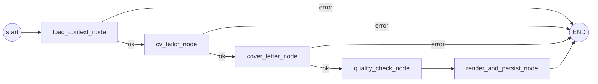

# Document Agent

**Status**: Active
**Last updated**: 2026-05-27
**Source**: Section 3.5 of [`Kaziro_Design_Document.pdf`](../../../Kaziro_Design_Document.pdf)
**Code**: [`backend/apps/pipeline/tasks.py`](../../../backend/apps/pipeline/tasks.py)
**Pipeline position**: Stage 4 (final stage; gated by Research success)

## Purpose

Generates a tailored CV and a personalised cover letter for a specific
(job, user) pair, plus a non-blocking quality check. PDFs are rendered and
uploaded to Supabase Storage; the editable plain-text versions and PDF
paths are persisted to `application_docs`.

## Framework & model

| Aspect          | Value                                                  |
| --------------- | ------------------------------------------------------ |
| Framework       | LangGraph (5 functional nodes + error sink)            |
| LLM             | `settings.LLM_MODEL_DOCUMENT` (default `nvidia/nemotron-3-super-120b-a12b:free`) |
| Temperature     | 0.4 (more creative for cover letter copy)              |
| PDF renderer    | Domain service under `backend/apps/documents/` (WeasyPrint or similar) |
| Storage         | Supabase Storage bucket `documents/{user_id}/...`       |

## State (abbreviated)

```python
class DocumentState(BaseModel):
    job_evaluation_id: str
    user_id: str

    # Loaded
    job_title, job_description, job_requirements
    company_name, company_mission, company_values, company_culture, company_summary
    user_full_name, user_skills, user_experience_years, user_domain, user_summary
    user_values, user_linkedin_url
    raw_cv_text                       # Full parsed master CV text from user_profiles

    # Generated
    tailored_cv_text: str
    cover_letter_text: str

    # Quality check
    quality_passed: bool
    quality_notes: str

    # Storage paths (set after PDF render)
    cv_pdf_path: str
    cover_letter_pdf_path: str

    error: str | None
```

## Graph



### `load_context_node`

Joins:
- `job_evaluations` → `job_postings` for job context.
- `user_profiles` for full name, skills, experience years, domain, summary,
  values, LinkedIn URL, and full parsed master CV text.
- Most recent `company_summaries` for the same `job_posting_id`.

Prompts always receive one explicit user-owned context block with
`USER_PROFILE` and `MASTER_CV` sections. Missing fields render as
`Not provided`; the agent does not substitute a smaller skills/summary
fallback. External job text remains capped before prompt use.

### `cv_tailor_node`

Generates a fully reordered, professionally rewritten CV. **Hard rules
encoded in the prompt**:

> 1. DO NOT fabricate experience, skills, or achievements that are not in
>    the original CV.
> 2. DO reorder sections and bullet points to prioritise the most relevant
>    experience FIRST.
> 3. DO rewrite bullet points to use stronger action verbs and highlight
>    relevant outcomes.
> 4. DO naturally incorporate keywords from the job requirements where
>    truthfully applicable.
> 5. Keep the same factual information — only improve presentation and
>    relevance ordering.
> 6. Use clean, professional formatting with clear sections.

Output is plain text with section headers (`EXPERIENCE`, `SKILLS`,
`EDUCATION`). Markdown bold/italic are explicitly disallowed in the prompt.

### `cover_letter_node`

Writes a 3-4 paragraph (~300-350 words) personalised cover letter using
the company brief from the Research Agent. Structure mandated by the
prompt:

1. **Opening** — genuine enthusiasm hook referencing something specific
   about the company.
2. **Body** (2 paragraphs) — relevant experience + values alignment.
3. **Closing** — clear call to action and professional sign-off.

### `quality_check_node`

Independent QC pass that checks:

1. CV claims that look fabricated or inconsistent with the user profile.
2. Cover letter references the right company and role.
3. Tone consistency.
4. Factual contradictions between CV and cover letter.
5. Errors, placeholders, or template artifacts.

Output:

```json
{
  "passed": true,
  "issues": ["..."],
  "summary": "<1-2 sentence quality summary>"
}
```

This step is **non-blocking** — even on `passed=false`, the docs are
still rendered and persisted, and the `quality_notes` are surfaced in the
UI for the user to review. QC failure of the LLM call itself defaults to
`quality_passed = True` with a note explaining the QC error.

### `render_and_persist_node`

- Renders both documents to PDF via `services/pdf_renderer.render_pdf`.
- Uploads to Supabase Storage at `documents/{user_id}/cv_{evaluation_id}.pdf`
  and `documents/{user_id}/cover_letter_{evaluation_id}.pdf`.
- PDF render failure is **non-fatal** — text is persisted, paths are empty,
  the user can re-render from the UI.
- Inserts a single `application_docs` row with both texts, both paths,
  `quality_passed`, `quality_notes`, and `generation_model`.

## Public entry point

```python
async def run_document_agent(job_evaluation_id: str, user_id: str) -> DocumentState:
    initial = DocumentState(job_evaluation_id=job_evaluation_id, user_id=user_id)
    return await document_graph.ainvoke(initial)
```

Called by `pipeline_orchestrator.run_document_stage` after Research has
persisted (or skipped because of cache).

## Failure modes

| Scenario                          | Behaviour                                                          |
| --------------------------------- | ------------------------------------------------------------------ |
| Evaluation/job/profile missing    | `error_end`, no doc row written                                    |
| Master CV missing                 | `MASTER_CV` renders as `Not provided`; full profile context remains |
| `cv_tailor` LLM error             | `error_end`, no row written                                        |
| `cover_letter` LLM error          | `error_end`, no row written                                        |
| Quality check LLM error           | Non-fatal; `quality_passed = True`, note explains QC error         |
| PDF render failure                | Non-fatal; text persisted, PDF paths empty                         |
| Storage upload failure            | Same as PDF render failure                                         |

## Logging

| Event                              | Fields                              |
| ---------------------------------- | ----------------------------------- |
| `document_agent.load_start`        | `job_evaluation_id`                 |
| `document_agent.cv_tailor_start`   | `job_title`                         |
| `document_agent.cv_tailored`       | `chars`                             |
| `document_agent.cv_tailor_failed`  | `error`                             |
| `document_agent.cover_letter_start`|                                     |
| `document_agent.cover_letter_generated` | `chars`                        |
| `document_agent.cover_letter_failed` | `error`                           |
| `document_agent.quality_check_start` |                                   |
| `document_agent.quality_check_complete` | `passed`                       |
| `document_agent.quality_check_failed` | `error`                          |
| `document_agent.render_start`      |                                     |
| `document_agent.pdf_render_failed` | `error`                             |
| `document_agent.persisted`         | `doc_id`                            |

## Testing

- Unit tests for each node with mocked LLM (`LLM_MODEL_DOCUMENT` cassettes via VCR).
- Integration test for `run_document_agent` against fixture profiles
  spanning multiple domains.
- "No fabrication" assertion: regex check that no skills appearing in
  `tailored_cv_text` are absent from `user_skills` (heuristic — flagged but
  not blocking).
- PDF render integration test against a known-good template.
