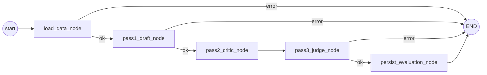

# Evaluator Agent (3-Pass)

**Status**: Active
**Last updated**: 2026-04-22
**Source**: Sections 3.3 and 11.6 of [`Kaziro_Design_Document.pdf`](../../../Kaziro_Design_Document.pdf)
**Code**: [`backend/agents/evaluator_agent.py`](../../../backend/agents/evaluator_agent.py)
**Pipeline position**: Stage 2 (after Parser, gates Research/Document)
**Why 3 passes**: see [ADR-0006](../../decisions/ADR-0006-evaluator-three-pass.md)

## Purpose

Evaluates a `JobPosting` against a `UserProfile` using a 3-pass pipeline
that improves rigour over a single-shot evaluation. Produces a final
classification (`GOOD_FIT | MAYBE | REJECT`), a weighted overall score, and
user-facing feedback.

## Framework & model

| Aspect       | Value                                                  |
| ------------ | ------------------------------------------------------ |
| Framework    | LangGraph (5 functional nodes + error sink)            |
| LLM          | `settings.OPENAI_MODEL_EVALUATOR` (default `gpt-4o`)   |
| Temperature  | 0.2 (deterministic but not robotic)                    |

## State

```python
class EvaluatorState(BaseModel):
    job_posting_id: str
    user_id: str

    # Loaded data
    job_title: str
    job_description: str
    job_requirements: list[str]
    job_salary_min: int | None
    job_salary_max: int | None
    user_skills: list[str]
    user_experience_years: int | None
    user_domain: str | None
    user_values: str | None
    user_summary: str | None

    # Pass outputs
    pass1_scores: DimensionScores | None
    pass1_notes: str
    pass2_critique: str
    pass2_revised_scores: DimensionScores | None
    final_classification: Classification | None
    final_feedback: str
    overall_score: float

    error: str | None
```

## Scoring dimensions

```python
class DimensionScores(BaseModel):
    skills_match:      float  # 0–10
    seniority_fit:     float  # 0–10
    domain_alignment:  float  # 0–10
    compensation_fit:  float  # 0–10
```

Weighted average uses the following weights (skills + domain dominate):

| Dimension          | Weight |
| ------------------ | ------ |
| `skills_match`     | 0.35   |
| `seniority_fit`    | 0.25   |
| `domain_alignment` | 0.25   |
| `compensation_fit` | 0.15   |

## Classification thresholds

| Classification | Weighted score |
| -------------- | -------------- |
| `GOOD_FIT`     | ≥ 6.5          |
| `MAYBE`        | 4.5 – 6.4      |
| `REJECT`       | < 4.5          |

## Graph



### `load_data_node`

Joins the `job_posting` and `user_profile` rows into the state. Required:
both must exist or the agent terminates with `error="Job or profile not found"`.

### Pass 1 — Draft Evaluator (`pass1_draft_node`)

Initial scoring across 4 dimensions. The model is instructed:

> "Be honest and critical. A score of 7+ means genuinely good for that
> dimension."

Output JSON:

```json
{
  "skills_match": 7,
  "seniority_fit": 6,
  "domain_alignment": 8,
  "compensation_fit": 5,
  "notes": "<2-3 sentences explaining your scores>"
}
```

### Pass 2 — Critic Agent (`pass2_critic_node`)

Devil's-advocate review. The critic looks for:

- Hidden requirements the candidate clearly lacks.
- Seniority mismatches the draft missed.
- Red flags in the job description (unrealistic expectations, poor culture
  signals).
- Over-generosity or over-harshness in the first pass.

The critic produces **revised scores** (may match the draft if it agrees)
plus a `critique`. **Critic failure is non-fatal** — the agent falls back
to pass-1 scores with `pass2_critique = "Critic failed: …"`.

### Pass 3 — Final Judge (`pass3_judge_node`)

Synthesises both prior passes plus the candidate profile and produces:

- `final_classification` ∈ `GOOD_FIT | MAYBE | REJECT`
- `overall_score` (weighted 0–10)
- `final_feedback` (3-4 sentences, user-facing, plain language)

The judge prompt explicitly references the score-threshold table above to
keep classification calibrated.

### `persist_evaluation_node`

Inserts a row into `job_evaluations` with the **full audit trail** — both
sets of scores, both pass notes, the final classification, the score, and
the user-facing feedback. Skipped if `state.error` is set or
`final_classification` is None.

## Public entry point

```python
async def run_evaluator_agent(job_posting_id: str, user_id: str) -> EvaluatorState:
    initial = EvaluatorState(job_posting_id=job_posting_id, user_id=user_id)
    return await evaluator_graph.ainvoke(initial)
```

## Why three passes (summary — see ADR-0006 for full context)

A single LLM evaluation tends to:

- Be over-optimistic about borderline candidates.
- Miss subtle seniority mismatches.
- Penalise candidates inconsistently across runs.

The draft / critic / judge pattern (also called "self-critique") improves
calibration measurably and produces a much better audit trail for the user
("here's why we said MAYBE — here's what concerned the critic"). Cost
roughly triples vs. single-shot, mitigated by:

- Limiting evaluator runs to fresh-from-parser jobs (deduplicated upstream).
- Using a per-user cache that re-uses the eval row if profile + job
  haven't changed.

## Logging

| Event                                   | Fields                               |
| --------------------------------------- | ------------------------------------ |
| `evaluator_agent.load_start`            | `job_posting_id`, `user_id`          |
| `evaluator_agent.load_failed`           | `job_found`, `profile_found`         |
| `evaluator_agent.pass1_start`           |                                      |
| `evaluator_agent.pass1_complete`        | `weighted_avg`                       |
| `evaluator_agent.pass1_failed`          | `error`                              |
| `evaluator_agent.pass2_start`           |                                      |
| `evaluator_agent.pass2_complete`        | `revised_avg`                        |
| `evaluator_agent.pass2_failed`          | `error`                              |
| `evaluator_agent.pass3_start`           |                                      |
| `evaluator_agent.pass3_complete`        | `classification`, `score`            |
| `evaluator_agent.pass3_failed`          | `error`                              |
| `evaluator_agent.persisted`             | `evaluation_id`, `classification`    |

## Failure modes

| Scenario                          | Behaviour                                              |
| --------------------------------- | ------------------------------------------------------ |
| Job or profile missing            | `error_end`, no row written                            |
| Pass-1 LLM error                  | `error_end`, no row written                            |
| Pass-2 (critic) error             | **Non-fatal**, fall back to pass-1 scores              |
| Pass-3 LLM error                  | `error_end`, no row written                            |
| Malformed JSON                    | Caught and logged at ERROR; same as pass error         |
| `Classification` enum mismatch    | Pydantic ValueError → `error_end`                      |

## Testing

- Unit tests with VCR-recorded LLM responses for each pass (prompt-stable
  fixtures).
- Integration tests for `run_evaluator_agent` against fixture profiles
  spanning multiple domains (software, healthcare, design) to verify
  domain-agnostic behaviour.
- Calibration test: 50 hand-labelled (`job`, `profile`) pairs; passing
  threshold ≥ 80% agreement on classification bucket.
