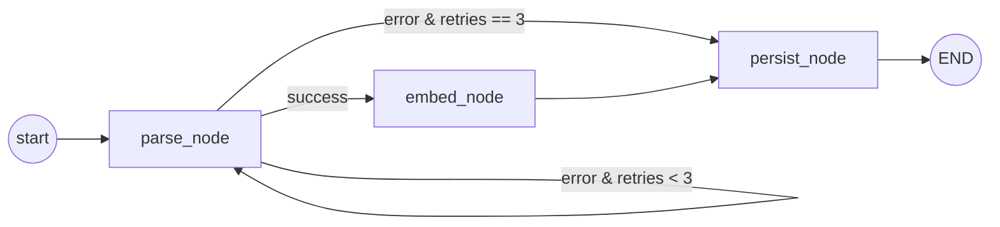

# Parser Agent

**Status**: Active
**Last updated**: 2026-04-22
**Source**: Section 3.2 of [`Kaziro_Design_Document.pdf`](../../../Kaziro_Design_Document.pdf)
**Code**: [`backend/agents/parser_agent.py`](../../../backend/agents/parser_agent.py)
**Pipeline position**: Stage 1 (after Job Fetch, before Evaluator)

## Purpose

Normalises raw RapidAPI job payloads into the structured `JobPosting` table
format and generates a 2048-dim text embedding for semantic search.

## Framework & model

| Aspect             | Value                                                     |
| ------------------ | --------------------------------------------------------- |
| Framework          | LangGraph (3-node graph with retry loop)                  |
| LLM                | `settings.LLM_MODEL_PARSER` (default `nvidia/nemotron-3-super-120b-a12b:free`) |
| Embedding model    | `nvidia/llama-nemotron-embed-vl-1b-v2:free` (2048-dim)    |
| Temperature        | 0 (deterministic structured extraction)                   |
| Structured output  | `with_structured_output(JobPostingSchema)`                |

## State

```python
class ParserState(BaseModel):
    raw_job_id: str
    raw_payload: dict[str, Any]
    parsed: JobPostingSchema | None = None
    embedding: list[float] | None = None
    error: str | None = None
    retries: int = 0
```

## JobPostingSchema (structured-output target)

| Field              | Type           | Notes                                  |
| ------------------ | -------------- | -------------------------------------- |
| `title`            | str            | Required                               |
| `company_name`     | str            | Required                               |
| `company_website`  | str ∣ None     |                                        |
| `location`         | str ∣ None     | "Remote" allowed                       |
| `remote_flag`      | bool           | Required                               |
| `salary_min`       | int ∣ None     | USD/year                               |
| `salary_max`       | int ∣ None     | USD/year                               |
| `employment_type`  | str ∣ None     | full-time / part-time / contract / internship |
| `description`      | str            | Required, cleaned full text            |
| `requirements`     | list[str]      | Bullet-extracted                       |
| `application_url`  | str            | Required                               |
| `posted_date`      | str ∣ None     | YYYY-MM-DD                             |

The model is instructed: **"Do not invent data that is not present."**

## Graph



| Node          | Responsibility                                                                                  |
| ------------- | ----------------------------------------------------------------------------------------------- |
| `parse_node`  | Send `raw_payload` to `LLM_MODEL_PARSER` with structured output → `JobPostingSchema`             |
| `embed_node`  | Generate a 2048-dim embedding of `f"{title}\n{company_name}\n{description}"`                    |
| `persist_node`| Insert `JobPosting` row; set `RawJob.parse_status = PARSED` (or `FAILED` if exhausted)          |

## Routing logic — `route_after_parse`

```python
def route_after_parse(state: ParserState) -> str:
    if state.error and state.retries >= 3:
        return "persist"   # Give up — persist as FAILED
    if state.error:
        return "parse"     # Retry
    return "embed"
```

Max 3 parse retries. Embed failures are **non-fatal** — the row persists
without `description_embedding` (NULL). Vector search ignores rows with
NULL embeddings.

## Persistence

- Inserts `job_postings` row including `description_embedding` (or NULL).
- Updates `raw_jobs.parse_status` to `PARSED` or `FAILED`.
- Increments `raw_jobs.retry_count` on each failed parse attempt.
- All inside a single transaction per agent run.

## Public entry point

```python
async def run_parser_agent(raw_job_id: str, raw_payload: dict) -> ParserState:
    initial_state = ParserState(raw_job_id=raw_job_id, raw_payload=raw_payload)
    return await parser_graph.ainvoke(initial_state)
```

Called by the pipeline orchestrator's `run_fetch_and_parse` for each new
raw job.

## Logging

Every node binds `raw_job_id` and `node`. Key events:

| Event                                 | Fields                              |
| ------------------------------------- | ----------------------------------- |
| `parser_agent.parse_start`            | `raw_job_id`                        |
| `parser_agent.parse_success`          | `title`, `company`                  |
| `parser_agent.parse_failed`           | `error`                             |
| `parser_agent.embed_start`            |                                     |
| `parser_agent.embed_success`          | `dims`                              |
| `parser_agent.embed_failed`           | `error`                             |
| `parser_agent.persisted`              | `job_posting_id`                    |
| `parser_agent.persisted_as_failed`    | `retries`                           |
| `parser_agent.raw_job_not_found`      |                                     |

## Failure modes

| Scenario                              | Behaviour                                                |
| ------------------------------------- | -------------------------------------------------------- |
| OpenRouter 429 / 5xx                | Caught in `parse_node`; retry up to 3 times              |
| LLM returns malformed JSON            | Pydantic validation error caught; retry                  |
| Embedding API failure                 | Non-fatal; persist with NULL embedding                   |
| `raw_job_id` not found                | Logged at ERROR; state.error set; no row written         |
| DB insert failure                     | Bubbles up to orchestrator; pipeline logs and continues  |

## Testing

- Unit tests for `parse_node`, `embed_node`, `persist_node` with mocked LLM
  via VCR or pytest fixtures.
- Integration tests for `run_parser_agent` against a real Postgres test DB.
- See [`backend/tests/agents/test_parser_agent.py`](../../../backend/tests/agents/test_parser_agent.py).
