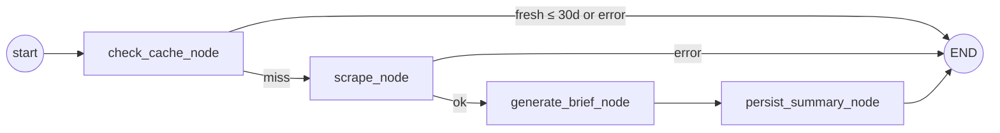

# Research Agent

**Status**: Active
**Last updated**: 2026-04-22
**Source**: Section 3.4 of [`Kaziro_Design_Document.pdf`](../../../Kaziro_Design_Document.pdf)
**Code**: [`backend/agents/research_agent.py`](../../../backend/agents/research_agent.py)
**Pipeline position**: Stage 3 — **batch / scheduled**: after `GOOD_FIT` only.
**Manual** `POST /jobs/{id}/trigger-evaluation`: also runs for `MAYBE` (research
only; no auto document stage).
**Related ADR**: [ADR-0005](../../decisions/ADR-0005-web-scraping-firecrawl.md)

## Purpose

For jobs that reach the research stage (`GOOD_FIT` in batch; `GOOD_FIT` or
`MAYBE` on a manual single-job re-run), gathers structured intelligence about the
hiring company so the Document Agent can write a personalised cover letter
and the user gets a useful pre-application brief.

Output is a `company_summaries` row with: `mission`, `values`, `culture`,
`tech_stack`, `team_size_approx`, `recent_news`, `ai_summary`, plus the
truncated raw scraped content.

## Framework & model

| Aspect             | Value                                                  |
| ------------------ | ------------------------------------------------------ |
| Framework          | LangGraph (4-node graph with cache short-circuit)      |
| LLM                | `settings.LLM_MODEL_RESEARCH` (default `nvidia/nemotron-3-super-120b-a12b:free`) |
| Temperature        | 0.3                                                    |
| Scraping           | Firecrawl Cloud API (`POST /v1/scrape`, fallback `POST /v1/search`) |
| Cache TTL          | 30 days                                                |

## State

```python
class ResearchState(BaseModel):
    job_posting_id: str
    company_name: str = ""
    company_website: str | None = None
    application_url: str = ""
    job_title: str = ""
    website_content: str = ""
    job_page_content: str = ""

    mission: str = ""
    values: str = ""
    culture: str = ""
    tech_stack: str = ""
    team_size_approx: str = ""
    recent_news: str = ""
    ai_summary: str = ""

    error: str | None = None
    skipped: bool = False
```

## Graph



### `check_cache_node`

- Loads the `JobPosting` to populate `company_name`, `company_website`,
  `application_url`, `job_title`.
- Checks `company_summaries` for the most recent row tied to this
  `job_posting_id`.
- If a row exists and `summary_generated_at` is < 30 days old, sets
  `skipped = True` and the graph terminates without a write.

### `scrape_node`

First resolves a trustworthy company website:

- If `job_postings.company_website` is present, the agent checks whether the
  company name matches the URL's domain root and rejects known job-board /
  application-hosting domains such as Greenhouse, Himalayas, Lever, Ashby, and
  Workday.
- If the stored website is missing or looks like a job-board URL, the agent
  runs Firecrawl web search for `"<company>" official website` and picks the
  first result whose domain matches the company name.

Then two parallel Firecrawl scrapes run — resolved company website (if found)
and the job posting page — via `asyncio.gather`. Each call is wrapped in a
try/except so a failure on one URL doesn't stop the other.

```python
async def firecrawl_scrape(url: str, max_chars: int = 8000) -> str:
    """Returns markdown content (truncated to max_chars) or '' on failure."""
```

Each scrape is hard-capped at 8 000 characters. Combined input to the
brief generator is capped at 10 000 characters.

### `generate_brief_node`

Single `LLM_MODEL_RESEARCH` call with a structured-output prompt. Output JSON:

```json
{
  "mission": "...",
  "values": "...",
  "culture": "...",
  "tech_stack": "...",
  "team_size_approx": "...",
  "recent_news": "...",
  "ai_summary": "<4-5 sentence pre-application brief>"
}
```

Missing information is explicitly returned as `"Not available"` rather than
guessed — protects against hallucinated company facts.

### `persist_summary_node`

Inserts a `company_summaries` row. `raw_scraped_content` stores the
combined raw markdown for diagnostics and future re-summarisation.

## Public entry point

```python
async def run_research_agent(job_posting_id: str) -> ResearchState:
    initial = ResearchState(job_posting_id=job_posting_id)
    return await research_graph.ainvoke(initial)
```

Called by `pipeline_orchestrator.run_research_stage` for `GOOD_FIT` (and
optionally `MAYBE`) jobs only.

## Failure modes

| Scenario                                | Behaviour                                                                  |
| --------------------------------------- | -------------------------------------------------------------------------- |
| Cache hit (≤ 30 days)                   | Short-circuits at `check_cache_node`; no DB write; `skipped = True`        |
| `JobPosting` missing                    | `error = "Job posting not found"`; terminates                              |
| `company_website` missing               | Firecrawl web search attempts to discover the official website             |
| `company_website` is a job-board URL     | Rejects it, searches for the official company website, then scrapes that   |
| Both Firecrawl scrapes fail             | Logged WARNING; brief generated from empty input ("Not available" everywhere) |
| Brief generation LLM error              | `error_end`; no row persisted                                              |
| Firecrawl 429 / 5xx                     | Caught in `firecrawl_scrape`; returns empty string                         |

## Logging

| Event                                  | Fields                  |
| -------------------------------------- | ----------------------- |
| `research_agent.cache_check_start`     | `job_posting_id`        |
| `research_agent.cache_hit`             | `age_days`              |
| `research_agent.scrape_start`          | `company`               |
| `research_agent.scrape_success`        | `chars`                 |
| `research_agent.scrape_failed`         | `url`, `error`          |
| `research_agent.no_content_scraped`    |                         |
| `research_agent.brief_generation_start`|                         |
| `research_agent.brief_generated`       |                         |
| `research_agent.brief_generation_failed`| `error`                |
| `research_agent.persisted`             | `summary_id`            |

## Testing

- Unit tests with mocked Firecrawl responses (HTTPX `respx` fixtures).
- LLM mocked via VCR cassette for `generate_brief_node`.
- Cache test: insert a row dated 5 days ago → assert `skipped = True`.
- Failure test: inject 5xx → assert empty `website_content` and an
  `ai_summary` of "Not available".
