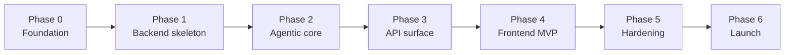

# Roadmap

**Status**: Active
**Last updated**: 2026-04-22
**Source**: Section 12 of [`Kaziro_Design_Document.pdf`](../../Kaziro_Design_Document.pdf)

The Kaziro MVP is delivered in seven phases (0 → 6). Each phase is
self-contained and produces a runnable, valuable increment. Phases gate
each other only where there is a hard dependency.

## Phase 0 — Foundation

**Goal**: A repo where every contributor can boot the stack in one command
and start writing code.

| Deliverable                                              | Done when                                                                  |
| -------------------------------------------------------- | -------------------------------------------------------------------------- |
| Monorepo skeleton (`backend/`, `frontend/`, `docs/`)     | Folders exist, `AGENTS.md` files in place                                  |
| Documentation suite (this folder)                        | All docs in `docs/` published                                              |
| `.cursor/rules/` aligned to monorepo paths               | All rules reference `backend/` not `kaziro/`                               |
| `pyproject.toml` + `uv.lock` for `backend/`              | `uv sync` installs cleanly                                                 |
| Docker Compose stack (`postgres`, `redis`, `backend`, `worker`, `beat`, `frontend`) | `make dev` boots everything; healthchecks green   |
| Pydantic `Settings` in `backend/config.py`               | App fails fast on missing env vars                                         |
| `structlog` + Prometheus instrumentation scaffolding     | `/metrics` returns counters; logs are JSON in prod, console in dev          |
| CI pipeline (lint + unit tests)                          | Green on a noop PR                                                         |

**Dependencies**: none.

## Phase 1 — Backend skeleton & data layer

**Goal**: A functioning FastAPI app with the full DB schema and auth in
place.

| Deliverable                                              | Done when                                                                  |
| -------------------------------------------------------- | -------------------------------------------------------------------------- |
| All SQLAlchemy models from [`docs/architecture/03-data-model.md`](../architecture/03-data-model.md) | Tables exist; `pgvector` extension enabled                |
| Initial Alembic migration                                | `alembic upgrade head` works on an empty DB                                |
| Repository layer per resource                            | Repositories exist with `user_id` scoping                                  |
| Supabase Auth integration (`get_current_user`)           | JWT validated; protected route returns 401 without token                   |
| `/auth/*` proxy routes                                   | Signup + login flow works end-to-end                                       |
| Profile + job-config CRUD endpoints                      | Tests pass for happy + 401/403/404/422                                     |
| RLS policies on every table                              | `psql` test confirms cross-tenant SELECT returns 0 rows                    |

**Dependencies**: Phase 0.

## Phase 2 — Agentic core

**Goal**: The four LangGraph agents wired up and run-able from a Celery
task.

| Deliverable                                              | Done when                                                                  |
| -------------------------------------------------------- | -------------------------------------------------------------------------- |
| Move `backend/agents/*.py` imports from `kaziro.*` to `backend.*` | `python -m backend.agents.parser_agent` imports cleanly         |
| `backend/services/job_fetcher.py` (RapidAPI client)      | Mocked test fetches and dedupes raw jobs                                   |
| Parser agent integration test (VCR cassette)             | New raw_job → posting + embedding written                                  |
| Evaluator agent calibration test (50 fixtures)           | ≥ 80% classification accuracy                                              |
| Research agent integration test                          | Cache miss → company brief; cache hit → skipped                            |
| Document agent integration test                          | CV + cover letter + PDFs persisted                                         |
| Pipeline orchestrator full-stack test                    | Single user config → ≥ 1 application_doc row                               |
| Celery beat schedule + worker deployment                 | Cron triggers pipeline at the configured cadence                           |

**Dependencies**: Phase 1.

## Phase 3 — API surface for the frontend

**Goal**: All endpoints in [`docs/architecture/04-api-design.md`](../architecture/04-api-design.md)
implemented and documented.

| Deliverable                                              | Done when                                                                  |
| -------------------------------------------------------- | -------------------------------------------------------------------------- |
| `/jobs`, `/jobs/{id}`, `/jobs/{id}/evaluation` GETs      | Returns paginated, filtered, scoped results                                |
| `/jobs/{id}/trigger-evaluation`                          | Enqueues a single-job pipeline                                             |
| `/applications/*`                                        | Full CRUD + state-machine validation                                       |
| `/applications/{id}/cv.pdf`, `cover-letter.pdf`          | Returns 302 to a Supabase Storage signed URL                               |
| WebSocket `/ws/notifications`                            | Connect with JWT; receive `evaluation_complete` and `documents_ready`      |
| Admin endpoints + role check                             | Non-admin returns 403                                                      |
| Rate limiting (Redis sliding window)                     | 101st request in a minute → 429                                            |
| OpenAPI doc generation gated to dev/staging              | `/docs` 404s in prod                                                       |

**Dependencies**: Phase 2.

## Phase 4 — Frontend MVP

**Goal**: A working SvelteKit app that exercises every backend route a
user needs.

| Deliverable                                              | Done when                                                                  |
| -------------------------------------------------------- | -------------------------------------------------------------------------- |
| SvelteKit project bootstrapped with `pnpm`               | `pnpm dev` serves on `:5173`                                               |
| Auth pages (`/login`, `/signup`)                         | Round-trip with Supabase Auth                                              |
| Onboarding wizard                                        | Profile + CV + first config flow                                           |
| Dashboard with KPIs and activity feed                    | Reads `/jobs` + `/applications`; counters update via WS                    |
| `/jobs` list with filters and infinite scroll            | Cursor pagination round-trip                                               |
| `/jobs/[id]` with evaluation panel and company brief     | Renders `pass1`, `pass2_critique`, `final_feedback`, `company_summary`     |
| `/jobs/[id]/apply` editor with PDF preview               | Save persists; "Mark as sent" transitions status                           |
| `/applications` Kanban + detail timeline                 | Drag-drop transitions validated; illegal moves toast 409                   |
| Toast + WS notifications wired up                        | Sending a manual eval triggers a toast within 60 s                         |

**Dependencies**: Phase 3.

## Phase 5 — Production hardening

**Goal**: The product is ready for paying users — observable, secured,
load-tested, deployed.

| Deliverable                                              | Done when                                                                  |
| -------------------------------------------------------- | -------------------------------------------------------------------------- |
| Grafana dashboards (pipeline, API, queue, cost)          | All metrics from [`06-observability.md`](../architecture/06-observability.md) panelled |
| Alertmanager rules + on-call runbooks                    | Each alert has a `runbook_url` linking to a `docs/runbooks/<alert>.md`     |
| Distributed tracing (OTel + Tempo / Jaeger)              | `trace_id` propagated FE → API → Celery → agents                           |
| `infra/k8s/` manifests + ArgoCD                          | Staging + production environments deploy from main                         |
| `external-secrets-operator`                              | No literal secrets in any manifest                                         |
| pgvector index tuning                                    | p95 semantic-search query < 200 ms at 100 k postings                       |
| Load tests passing SLOs                                  | All targets in [`testing-strategy.md`](testing-strategy.md#8-load-tests-locust) hit |
| Security review                                          | RLS verified, secrets scanned, dep audit clean                             |
| Backup + DR drill                                        | Restore-to-clone succeeds; RPO ≤ 1 h, RTO ≤ 4 h documented                 |

**Dependencies**: Phases 1–4.

## Phase 6 — Public launch

**Goal**: Real users on the platform; first feedback loop closed.

| Deliverable                                              | Done when                                                                  |
| -------------------------------------------------------- | -------------------------------------------------------------------------- |
| Marketing landing page                                   | Live at `https://kaziro.io`                                                |
| Pricing + Stripe billing                                 | Subscription tier reflected in `users.subscription_tier`                   |
| Onboarding email sequence                                | New signups receive welcome + tips on D0/D1/D7                             |
| In-app feedback widget                                   | Posts to a Linear / GitHub queue                                           |
| Status page                                              | Pings critical endpoints; surfaces incidents publicly                      |
| First 100 paying users                                   | KPI dashboard for retention, conversion, NPS                                |

**Dependencies**: Phase 5.

## Out-of-scope for MVP (V2 candidates)

| Item                                                      | Why deferred                                            |
| --------------------------------------------------------- | ------------------------------------------------------- |
| Continuous profile enrichment from work-log entries       | Requires a journal feature + extra agent                |
| Auto-send applications via OAuth Gmail / Outlook          | Email deliverability + provider trust + ToS complexity (see [ADR-0008](../decisions/ADR-0008-email-sending-mvp-draft-only.md)) |
| Mobile native apps                                        | SvelteKit PWA covers initial demand                     |
| LinkedIn profile auto-import                              | LinkedIn API access is restricted                       |
| Interview-prep agent                                      | Adds another LangGraph agent + new UI surface           |
| Multi-language support                                    | English-only at launch                                  |

## Roadmap dependency graph

Phases 4 and 5 may overlap once the API surface (Phase 3) is stable —
frontend development does not block backend hardening.
