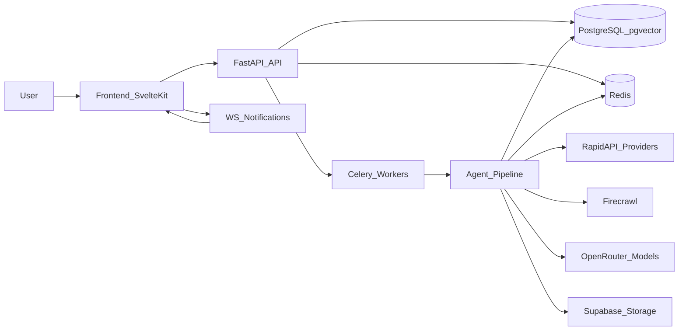
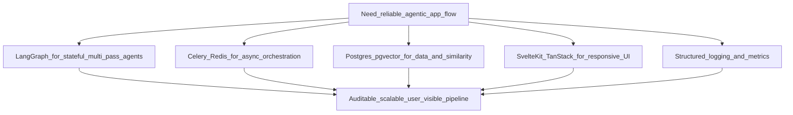
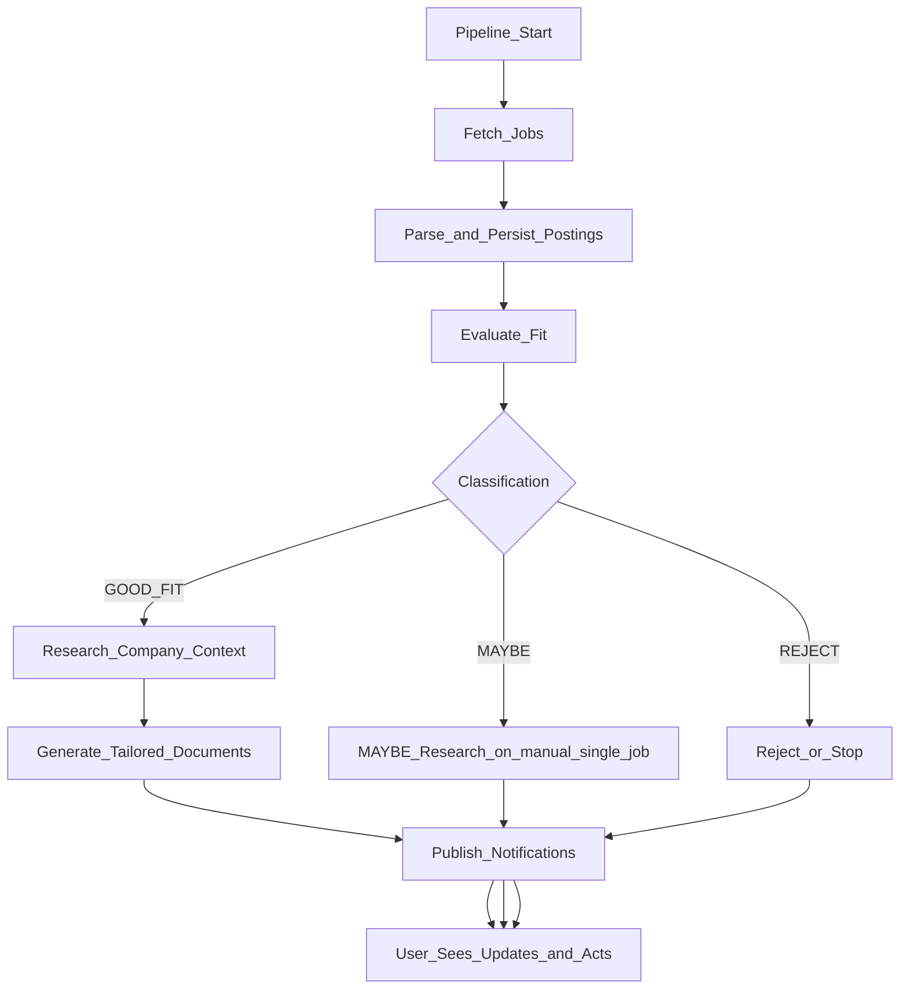
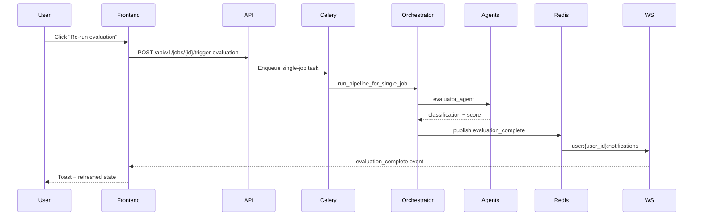

# Kaziro - 5-10 Minute Presentation (Screen Version)

## Slide 1 - Title

- **Kaziro**: AI-powered job recommendation and application pipeline
- Presenter: [Your Name]
- Focus: design, key decisions, and end-to-end flow

---

## Slide 2 - Problem and Goal

- Job searching is noisy and repetitive.
- Generic applications reduce fit and response rate.
- Teams need speed **and** control, not black-box automation.
- Kaziro goal: fetch -> evaluate -> tailor -> help user apply faster.

---

## Slide 3 - System Design (High Level)

---

## Slide 4 - Why This Design

- **LangGraph + orchestrator** for explicit staged AI flow.
- **Celery + Redis** for retries, scheduling, and async reliability.
- **PostgreSQL + pgvector** for transactional + semantic data in one place.
- **SvelteKit + TanStack Query** for fast, consistent user experience.
- **Structured observability** for traceability and operations.

---

## Slide 5 - Decision Map

---

## Slide 6 - End-to-End Pipeline

---

## Slide 7 - Runtime Sequence (Manual Trigger)

---

## Slide 8 - Current-State Updates

- CV upload route: `POST /profile/cv`
- Jobs support:
  - `POST /jobs/{id}/mark-not-interested`
  - `POST /jobs/{id}/regenerate-documents`
- Regeneration supports `part = cv | cover_letter | full`
- Single-job runtime branch:
  - `GOOD_FIT`: research + documents
  - `MAYBE`: research only
  - `REJECT`: stop after evaluation
- Notifications route: `WS /api/v1/ws/notifications?token=...`

---

## Slide 9 - Value and Close

- Faster pipeline from discovery to application draft
- Better fit quality through multi-pass evaluation
- Human control preserved at final decision/edit/send steps
- Architecture is production-ready and extensible for next phases

---

## Slide 10 - Q&A

- Scaling and throughput?
- Evaluation quality and calibration?
- Deployment and reliability roadmap?
- Product expansion opportunities?

