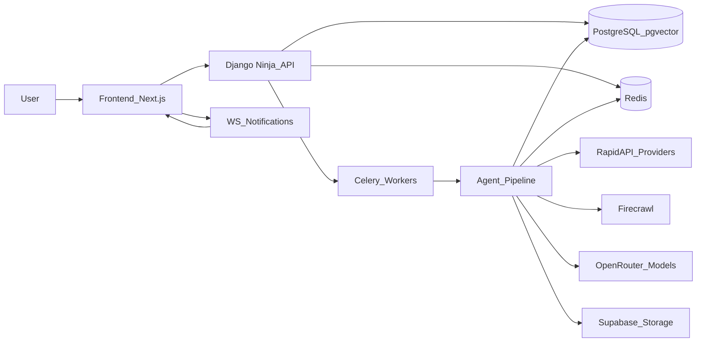
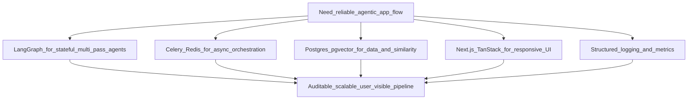
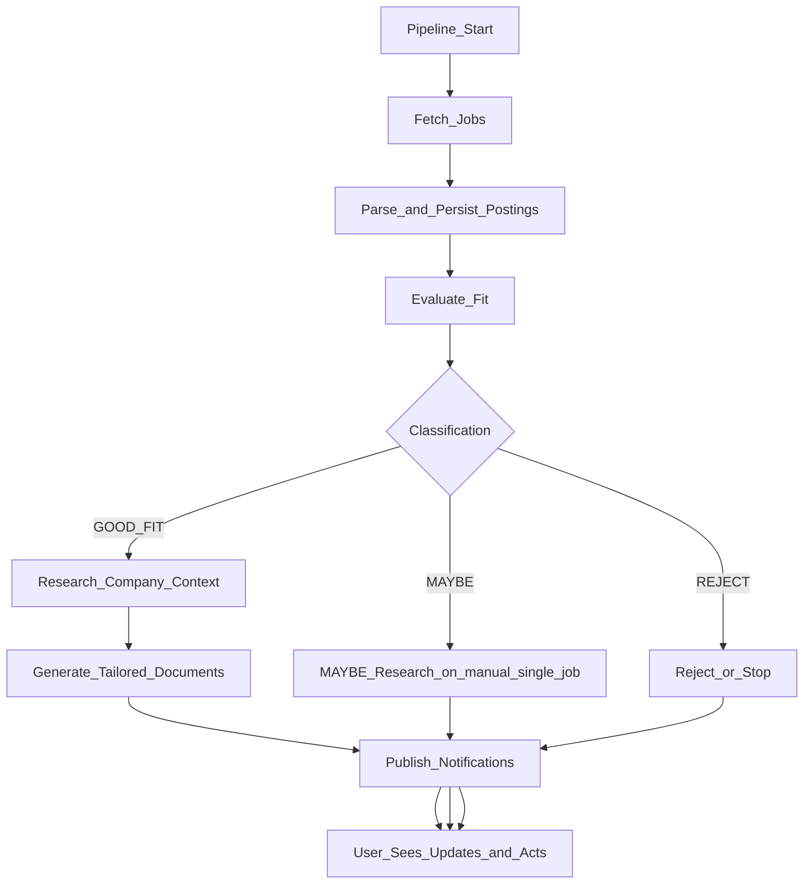
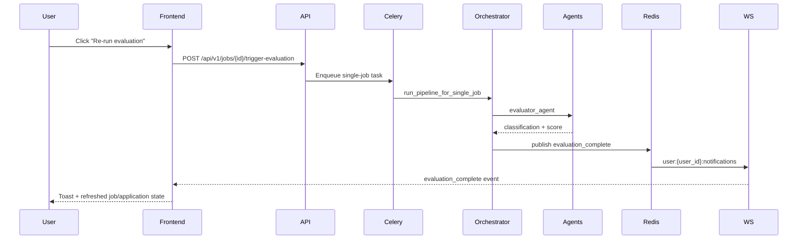

# Kaziro 5-10 Minute Presentation Guide

Use this as a hybrid deck helper: each section has **slide bullets** and **speaker notes**.

## Timing Plan

- **Core 7-minute path**: Sections 1-5.
- **Stretch to 10 minutes**: Add Sections 6-7 details and Q&A prompts.

| Time | Section | Goal |
| --- | --- | --- |
| 0:00-0:45 | 1) Problem and outcome | Set context for mixed audience |
| 0:45-2:15 | 2) System design | Show platform shape and responsibilities |
| 2:15-3:45 | 3) Design decisions | Explain why key choices were made |
| 3:45-6:30 | 4) End-to-end flow | Walk through runtime from trigger to user value |
| 6:30-7:00 | 5) What changed recently | Prove the story is current |
| 7:00-10:00 | 6-7) Deep dives + risks | Optional expansion and close |

## 1) Problem and Outcome

### Slide bullets

- Kaziro automates job discovery, fit evaluation, and tailored application drafting.
- It combines deterministic backend services with agentic reasoning stages.
- Goal: reduce manual effort while keeping candidate control and auditability.

### Speaker notes

Kaziro is not only a job board view. It is a pipeline: fetch jobs, evaluate them per user profile, enrich with company context, then generate tailored documents when appropriate. The user remains in control of final edits and sending.

## 2) Application Design (Architecture)

### Slide bullets

- Frontend: Next.js + TanStack Query + single WebSocket notification channel.
- API: Django Ninja with `/api/v1` resource routes and root `/auth/*` proxy routes.
- Async execution: Celery tasks orchestrate multi-stage agent workflows.
- Data layer: PostgreSQL + pgvector; Redis for queueing, pub/sub, and rate limiting.
- External integrations: RapidAPI (job fetch), Firecrawl (research), OpenRouter models.

### Diagram: System context

### Speaker notes

Keep this simple for mixed audience: web app and API are synchronous entry points; the heavy AI work runs asynchronously in workers. Redis is the coordination backbone, and PostgreSQL is the long-term system of record.

## 3) Design Decisions (and why)

### Slide bullets

- **LangGraph agents + orchestrator**: explicit stage boundaries and recoverable flow.
- **Celery + Redis**: reliable background execution with retries and scheduled runs.
- **PostgreSQL + pgvector**: transactional data plus semantic capabilities in one store.
- **Next.js + TanStack Query**: reactive UI with consistent server-state management.
- **Structured observability**: request IDs, stage logs, and notifications for user feedback.

### Diagram: Decision map

### Speaker notes

The key message: choices were made to balance AI flexibility with production reliability. The system is intentionally not a single monolithic "agent call"; it is a staged pipeline with clear contracts.

## 4) End-to-End Flow

### Slide bullets

- A run starts either from schedule (config-based) or manual trigger on a job.
- Fetch and parse produce normalized postings.
- Evaluator classifies each job as `GOOD_FIT`, `MAYBE`, or `REJECT`.
- Research and documents run by policy branch (auto only for `GOOD_FIT` in scheduled runs).
- User receives real-time notifications and can continue from the UI.

### Diagram: Pipeline branch flow

### Diagram: Runtime sequence (manual job action)

### Speaker notes

For mixed audience, emphasize that the user gets immediate acknowledgment (`202 Accepted`) and then asynchronous completion signals through WebSocket toasts and refreshed data.

## 5) What Changed Recently (Current-State Alignment)

### Slide bullets

- Profile CV endpoint is `POST /profile/cv` (not older upload naming).
- Jobs now support `mark-not-interested` and `regenerate-documents`.
- Document regeneration can be full or partial (`cv` or `cover_letter` only).
- Manual single-job behavior differs by class:
  - `GOOD_FIT`: research + documents
  - `MAYBE`: research only
  - `REJECT`: stop after evaluation
- WebSocket endpoint is `/api/v1/ws/notifications?token=...`, backed by Redis pub/sub.

### Speaker notes

This section prevents stale architecture storytelling. Mention that the roadmap (`PLAN.md`) tracks intent and progress, while these specifics are validated against current route/task/orchestrator code.

## 6) Optional Deep Dive (Use if you have extra time)

### Slide bullets

- Reliability controls: retries, queue separation, idempotent document paths.
- Product safety: explicit state transitions for applications.
- UX responsiveness: query invalidation + notification-driven refresh.

### Speaker notes

If asked about reliability: highlight Celery retry policy, branch-safe orchestrator behavior, and user-visible notifications after each meaningful milestone.

## 7) Closing and Q&A

### Slide bullets

- Kaziro is designed as a production pipeline, not just a prompt wrapper.
- Architecture supports fast iteration while preserving operational control.
- Current implementation already reflects core MVP flow with extensibility points.

### Speaker notes

Close by reinforcing business value: faster, more consistent job application workflows with human oversight. Invite questions on scaling, evaluation quality, and deployment hardening.

## Presenter Quick Tips

- If limited to 5 minutes: cover Sections 1-4 and the top 2 bullets in Section 5.
- If audience is more technical: expand Section 3 decisions and Section 4 sequence details.
- If audience is less technical: stay on system context + user-visible outcomes.
